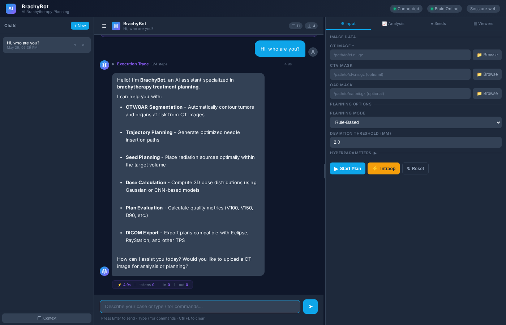

# BrachyBot: Self-Evolving AI Agent for Brachytherapy Treatment Planning

<div align="center">


**An autonomous, self-improving AI agent for prostate and pancreatic brachytherapy treatment planning — powered by LLM function calling, layered memory, trajectory-based reflection, and crystallized skills.**

</div>

---

## 📋 Table of Contents

- [Overview](#-overview)
- [Architecture](#-architecture)
- [Self-Evolving Mechanisms](#-self-evolving-mechanisms)
- [Key Features](#-key-features)
- [Installation](#-installation)
- [Quick Start](#-quick-start)
- [Usage Guide](#-usage-guide)
- [Complete Workflow](#-complete-workflow)
- [Memory System Deep Dive](#-memory-system-deep-dive)
- [Tool Factory](#-tool-factory)
- [Brain System](#-brain-system)
- [Skills Library](#-skills-library)
- [API Reference](#-api-reference)
- [Configuration](#-configuration)
- [Web Interface](#-web-interface)
- [Testing](#-testing)
- [Research & Citations](#-research--citations)
- [Acknowledgements](#-acknowledgements)
- [License](#-license)

---

## 🌟 Overview

BrachyBot is a **closed-loop, self-evolving AI agent** for brachytherapy (近距离放射治疗) treatment planning. It combines:

- **LLM-driven decision making** with function calling across 14+ LLM providers
- **Layered memory system** (L0-L4) for contextual information density maximization
- **Trajectory-based self-reflection** (Reflexion pattern) for continuous learning
- **Skill crystallization pipeline** that converts successful trajectories into reusable SOPs
- **Multi-agent clinical critique** for safety review of treatment plans
- **Tree-search exploration** (LATS) for complex planning optimization
- **Dialectic user profiling** that learns doctor preferences over time

The system grows smarter with every use — automatically extracting patterns from successful plans, learning from failures, and crystallizing reusable workflows.

### 🎯 Clinical Application

BrachyBot automates the complete brachytherapy planning workflow:

```
CT Scan → CTV Segmentation → OAR Segmentation → Trajectory Planning → 
Seed Placement → Dose Calculation → Dose Evaluation → DICOM Export
```

Supporting:
- **Prostate** brachytherapy (前列腺癌近距离治疗)
- **Pancreas** brachytherapy (胰腺癌近距离治疗)
- **Intra-operative replanning** (术中重规划)
- **Plan quality optimization** (计划质量优化)

---

## 📸 Screenshot



---

## 🏗️ Architecture

### System Overview

```
┌─────────────────────────────────────────────────────────────────────────┐
│                          BrachyBot Agent                                │
│                                                                         │
│  ┌─────────────┐    ┌──────────────┐    ┌──────────────────────────┐   │
│  │  LLM Brain  │───▶│ Tool Factory │───▶│  Medical AI Tools        │   │
│  │  (14 prov.) │    │  (40+ tools) │    │  CT/CTV/OAR/Dose/Plan    │   │
│  └──────┬──────┘    └──────┬───────┘    └──────────────────────────┘   │
│         │                  │                                           │
│         ▼                  ▼                                           │
│  ┌──────────────────────────────────────────────────────────────┐      │
│  │                 Self-Evolving Memory Layer                    │      │
│  │                                                              │      │
│  │  ┌──────────┐ ┌──────────┐ ┌──────────┐ ┌──────────┐        │      │
│  │  │ L0 Rules │ │ L1 Index │ │ L2 Facts │ │ L3 SOPs  │        │      │
│  │  │ (Meta)   │ │ (Fast)   │ │ (Stable) │ │ (Skills) │        │      │
│  │  └──────────┘ └──────────┘ └──────────┘ └──────────┘        │      │
│  │  ┌──────────────────────────────────────────────────┐       │      │
│  │  │              L4 Session Archive                   │       │      │
│  │  └──────────────────────────────────────────────────┘       │      │
│  └──────────────────────────────────────────────────────────────┘      │
│         │                  │                  │                        │
│         ▼                  ▼                  ▼                        │
│  ┌─────────────┐  ┌──────────────┐  ┌──────────────────────┐         │
│  │ Reflexion   │  │ Skill        │  │ Multi-Agent Critic   │         │
│  │ Engine      │  │ Crystallizer │  │ (4 Expert Personas)  │         │
│  └─────────────┘  └──────────────┘  └──────────────────────┘         │
│                                                                       │
│  ┌─────────────┐  ┌──────────────┐  ┌──────────────────────┐         │
│  │ User Profile│  │ Context      │  │ Tree Search Planner  │         │
│  │ (Dialectic) │  │ Optimizer    │  │ (LATS/MCTS)          │         │
│  └─────────────┘  └──────────────┘  └──────────────────────┘         │
└─────────────────────────────────────────────────────────────────────────┘
```

### Component Diagram

```
┌─────────────────────────────────────────────────────────────────────┐
│                        User Interface                               │
│  ┌──────────┐  ┌──────────┐  ┌──────────┐                          │
│  │ CLI      │  │ Web UI   │  │ API      │                          │
│  │ brachybot│  │ Flask    │  │ REST     │                          │
│  └────┬─────┘  └────┬─────┘  └────┬─────┘                          │
│       └──────────────┼──────────────┘                                │
│                      ▼                                                │
│  ┌───────────────────────────────────────────────────────────────┐   │
│  │                    BrachyAgent Core                            │   │
│  │                                                               │   │
│  │  ┌─────────────────┐  ┌─────────────────┐                    │   │
│  │  │ AgentMemory     │  │ ToolRegistry    │                    │   │
│  │  │ - patient_data  │  │ - 40+ tools     │                    │   │
│  │  │ - planning_res  │  │ - name-based    │                    │   │
│  │  │ - conversation  │  │ - auto-inject   │                    │   │
│  │  └────────┬────────┘  └────────┬────────┘                    │   │
│  │           │                    │                              │   │
│  │  ┌────────▼────────────────────▼────────┐                    │   │
│  │  │         Execution Engine              │                    │   │
│  │  │  ┌─────────────────────────────────┐ │                    │   │
│  │  │  │ LLM Function Calling Loop       │ │                    │   │
│  │  │  │ - Parse tool_call blocks        │ │                    │   │
│  │  │  │ - Auto-inject memory data       │ │                    │   │
│  │  │  │ - Enhanced context injection    │ │                    │   │
│  │  │  │ - Post-task auto-evolution      │ │                    │   │
│  │  │  └─────────────────────────────────┘ │                    │   │
│  │  │  ┌─────────────────────────────────┐ │                    │   │
│  │  │  │ Rule-Based Fallback             │ │                    │   │
│  │  │  │ - Keyword matching              │ │                    │   │
│  │  │  │ - Hardcoded pipelines           │ │                    │   │
│  │  │  └─────────────────────────────────┘ │                    │   │
│  │  └──────────────────────────────────────┘                    │   │
│  └───────────────────────────────────────────────────────────────┘   │
└─────────────────────────────────────────────────────────────────────┘
```

---

## 🧬 Self-Evolving Mechanisms

BrachyBot implements **six self-evolving mechanisms** inspired by state-of-the-art agent frameworks:

### 1. Layered Memory (L0-L4) — GenericAgent Pattern

```
┌─────────────────────────────────────────────────────────────────┐
│                    Context Window (8K tokens)                   │
│                                                                 │
│  ┌──────────────┐  Always loaded (hot memory)                  │
│  │  L0: Rules   │  8 meta-rules: safety, clinical, privacy     │
│  │  (Meta)      │  "Always validate inputs"                     │
│  │  ~200 tokens │  "Check past successful chains"               │
│  └──────────────┘                                              │
│                                                                 │
│  ┌──────────────┐  Fast routing index (warm memory)            │
│  │  L1: Index   │  Keywords → target layer mapping             │
│  │  (Fast)      │  "pancreas" → L3:SOP_Pancreas_COS            │
│  │  ~100 tokens │                                              │
│  └──────────────┘                                              │
│                                                                 │
│  ┌──────────────┐  Retrieved on-demand (warm memory)           │
│  │  L2: Facts   │  "CTV→Seed→Dose chain is effective"          │
│  │  (Stable)    │  Confidence-scored, evidence-backed           │
│  │  ~500 tokens │                                              │
│  └──────────────┘                                              │
│                                                                 │
│  ┌──────────────┐  Retrieved on-demand (warm memory)           │
│  │  L3: SOPs    │  Reusable workflows with success rates       │
│  │  (Skills)    │  SOP_Pancreas_COS: CTV→OAR→Seed→Dose (92%)   │
│  │  ~800 tokens │                                              │
│  └──────────────┘                                              │
│                                                                 │
│  ┌──────────────┐  Retrieved on-demand (cold memory)           │
│  │  L4: Archive │  Past session summaries with lessons         │
│  │  (Sessions)  │  "Prostate plan: D90=115%, V100=95%"         │
│  │  ~1000 tokens│                                              │
│  └──────────────┘                                              │
└─────────────────────────────────────────────────────────────────┘
```

**Key principle**: Only L0 is always in context. L1-L4 are retrieved on-demand based on the current task, maximizing contextual information density.

### 2. Reflexion Engine — Shinn et al. Pattern

```
Task: "Generate prostate plan"
    │
    ▼
┌──────────────────────────────────────┐
│         Execute Trajectory            │
│  CTV Seg → OAR Seg → Seed → Dose     │
└──────────────┬───────────────────────┘
               │
               ▼
┌──────────────────────────────────────┐
│     Self-Reflection (3 modes)        │
│                                      │
│  Mode 1: Self-Reflection (LLM)       │
│  "What went wrong? Root cause?"      │
│                                      │
│  Mode 2: Multi-Agent Reflexion (MAR) │
│  - Clinical Safety Reviewer          │
│  - Technical Efficiency Reviewer     │
│  - Error Analysis Specialist          │
│                                      │
│  Mode 3: Heuristic Reflection        │
│  Rule-based pattern detection        │
│  (repeated actions, failed tools)    │
└──────────────┬───────────────────────┘
               │
               ▼
┌──────────────────────────────────────┐
│    Store in Episodic Memory          │
│  - Critique                          │
│  - Root cause                        │
│  - Lesson learned                    │
│  - Alternative approach              │
└──────────────┬───────────────────────┘
               │
               ▼
┌──────────────────────────────────────┐
│    Next time: Auto-inject warnings   │
│  "Past failure: dose_evaluation      │
│   Lesson: Verify preconditions"      │
└──────────────────────────────────────┘
```

### 3. Skill Crystallization Pipeline — GenericAgent + EvoSkills Pattern

```
┌──────────────────────────────────────────────────────────────┐
│                    Skill Crystallization                      │
│                                                              │
│  [Successful Trajectory]                                     │
│  Task: "Generate prostate plan"                              │
│  Chain: CTV→OAR→Seed→Dose (success!)                         │
│                                                              │
│         │                                                    │
│         ▼                                                    │
│  ┌──────────────────┐                                        │
│  │ Extract Pattern  │  Extract keywords, tool chain, params  │
│  └────────┬─────────┘                                        │
│           │                                                  │
│           ▼                                                  │
│  ┌──────────────────┐                                        │
│  │ Create SOP       │  Auto_Prostate_COS                     │
│  │                  │  Triggers: [prostate, plan]            │
│  │                  │  Steps: [CTV, OAR, Seed, Dose]         │
│  └────────┬─────────┘                                        │
│           │                                                  │
│           ▼                                                  │
│  ┌──────────────────┐                                        │
│  │ Co-Evolutionary  │  LLM verifier checks:                  │
│  │ Verification     │  - Is chain appropriate?               │
│  │                  │  - Are triggers sufficient?            │
│  └────────┬─────────┘                                        │
│           │                                                  │
│           ▼                                                  │
│  ┌──────────────────┐                                        │
│  │ Register Skill   │  verified=True, success_rate=1.0       │
│  └────────┬─────────┘                                        │
│           │                                                  │
│           ▼                                                  │
│  ┌──────────────────┐                                        │
│  │ Auto-Apply       │  Next time user says "prostate plan"   │
│  │                  │  → SOP auto-matched and suggested      │
│  └──────────────────┘                                        │
└──────────────────────────────────────────────────────────────┘
```

### 4. Context Density Optimization — GenericAgent Pattern

```
┌──────────────────────────────────────────────────────────────┐
│              Context Density Optimizer                        │
│                                                              │
│  Problem: Context window fills with irrelevant content       │
│  Solution: Maximize decision-relevant token density          │
│                                                              │
│  Strategies:                                                 │
│  ┌─────────────────────────────────────────────────────┐    │
│  │ 1. Tiered Retention                                  │    │
│  │    - Critical: always kept (system prompt, task)     │    │
│  │    - Optional: pruned by density score               │    │
│  └─────────────────────────────────────────────────────┘    │
│  ┌─────────────────────────────────────────────────────┐    │
│  │ 2. Smart Compression                                 │    │
│  │    - Tool descriptions: name + short summary         │    │
│  │    - Conversation: first 2 + last 2 + "[N omitted]"  │    │
│  │    - Memory: important facts first, others trimmed   │    │
│  └─────────────────────────────────────────────────────┘    │
│  ┌─────────────────────────────────────────────────────┐    │
│  │ 3. Token Budgeting                                   │    │
│  │    System: 1500 | Tools: 2000 | Memory: 1500        │    │
│  │    Conversation: 3000 | Total: 8000 tokens          │    │
│  └─────────────────────────────────────────────────────┘    │
│                                                              │
│  Density Score = relevance×0.4 + recency×0.3 + importance×0.3│
└──────────────────────────────────────────────────────────────┘
```

### 5. Multi-Agent Clinical Critique — MAR + MedAgent-Pro Pattern

```
┌──────────────────────────────────────────────────────────────┐
│              Multi-Agent Clinical Review                      │
│                                                              │
│  Treatment Plan → 4 Expert Personas Review Independently     │
│                                                              │
│  ┌─────────────────────┐  ┌─────────────────────┐           │
│  │ Dosimetry Safety    │  │ Clinical Protocol   │           │
│  │ Expert (weight 1.5) │  │ Reviewer (1.3)      │           │
│  │                     │  │                     │           │
│  │ - D90, V100, V150   │  │ - Seed placement    │           │
│  │ - OAR dose limits   │  │ - CTV coverage      │           │
│  │ - QUANTEC/TG-43     │  │ - Standard practice │           │
│  └─────────┬───────────┘  └─────────┬───────────┘           │
│            │                        │                        │
│  ┌─────────▼───────────┐  ┌─────────▼───────────┐           │
│  │ Risk Assessment     │  │ Quality Assurance   │           │
│  │ Specialist (1.2)    │  │ Auditor (1.0)       │           │
│  │                     │  │                     │           │
│  │ - Seed migration    │  │ - Step completion   │           │
│  │ - Edema robustness  │  │ - Consistency check │           │
│  │ - Contouring errors │  │ - Missing evals     │           │
│  └─────────┬───────────┘  └─────────┬───────────┘           │
│            │                        │                        │
│            └───────────┬────────────┘                        │
│                        ▼                                     │
│              ┌───────────────────┐                           │
│              │ Weighted Consensus│                           │
│              │ APPROVE/CONDITION │                           │
│              │ /REJECT           │                           │
│              └───────────────────┘                           │
└──────────────────────────────────────────────────────────────┘
```

### 6. Auto-Evolution Trigger — Hermes Agent Pattern

```
┌──────────────────────────────────────────────────────────────┐
│                    Auto-Evolution Loop                        │
│                                                              │
│  Every interaction → interaction_count++                     │
│                                                              │
│  interaction_count - last_evolution_time >= threshold (5)    │
│         │                                                    │
│         ▼                                                    │
│  ┌──────────────────────────────────────┐                    │
│  │  Auto-Evolution Cycle                │                    │
│  │                                      │                    │
│  │  1. Analyze all experiences          │                    │
│  │  2. Create skills from new chains    │                    │
│  │  3. Update existing skill metrics    │                    │
│  │  4. Optimize parameters from data    │                    │
│  │  5. Analyze failures for insights    │                    │
│  │  6. Update user profile              │                    │
│  │                                      │                    │
│  │  Output: EvolutionCycle report       │                    │
│  └──────────────────────────────────────┘                    │
│                                                              │
│  No manual trigger needed — happens automatically!           │
└──────────────────────────────────────────────────────────────┘
```

---

## ✨ Key Features

### 🧠 LLM-Driven Decision Making
- **14 LLM providers**: OpenAI, Anthropic, OpenRouter, Qwen, Kimi, MiniMax, GLM, Gemini, Groq, Grok, Mimo, DeepSeek, Tencent, Ollama, vLLM
- **Function calling**: LLM discovers and invokes tools via `tool_call` blocks
- **Fallback mode**: Rule-based keyword matching when LLM unavailable

### 📚 Layered Memory System
- **L0 Meta Rules**: 8 core behavioral rules always in context
- **L1 Insight Index**: Fast keyword-based routing to relevant knowledge
- **L2 Global Facts**: Confidence-scored stable knowledge
- **L3 SOPs**: Reusable workflows with success rates
- **L4 Session Archive**: Cross-session experience recall

### 🔄 Self-Evolution
- **Reflexion**: Automatic trajectory critique after every task
- **Skill Crystallization**: Successful chains → verified SOPs
- **Auto-Evolution**: Triggers every 5 interactions automatically
- **User Profiling**: Learns doctor preferences over time

### 🏥 Clinical Safety
- **Multi-Agent Critique**: 4 expert personas review every plan
- **Dose Constraints**: QUANTEC/TG-43 limits via RAG
- **Plan Quality Scoring**: V100, D90, V150, V200 metrics

### 🔧 Tool Factory
- **50+ medical tools**: CTV/OAR segmentation, trajectory, seed planning, dose calculation/evaluation
- **nnU-Net + VoCo**: Deep learning segmentation models
- **TotalSegmentator**: 104 anatomical structures segmentation
- **Rule-based + RL**: Dual seed planning modes
- **DICOM Export**: RT Structure, RT Plan, RT Dose
- **Autonomous Tool Creation**: LLM can create new tools on-demand via `code_writer`

### 🎮 Interactive Viewer Control (NEW)
- **viewer_command**: Direct LLM control of CT viewer (navigate, window/level, presets, overlays)
- **auto_navigate**: Automatic navigation to tumor/organ locations from segmentation
- **query_metrics**: Query dose metrics, plan quality, organ volumes via conversation
- **Smart Commands**: "Go to the tumor", "Show me slice 50", "What is the V100?"

### 🌐 Web Interface
- **Real-time CT Viewer**: 3D Slicer-level slice interaction with volume rendering
- **Streaming Output**: Real-time LLM text streaming with SSE
- **Tool Progress**: Live progress bars during long-running tasks
- **Slash Commands**: `/help`, `/plan`, `/segment`, `/evaluate`, `/export`, `/viewer`, `/clear`
- **Keyboard Shortcuts**: `Ctrl+L` clear chat, `Ctrl+K` focus input

### 📝 Skills System (Markdown)
- **Claude Code Style**: SKILL.md format with YAML frontmatter
- **Trigger Matching**: Auto-match user requests to skills
- **10 Built-in Skills**: Planning, segmentation, evaluation, export workflows

---

## 📦 Installation

### Prerequisites

```
Python 3.10+
GPU (recommended for nnU-Net/VoCo segmentation)
SimpleITK, numpy, torch
```

### Step 1: Clone and Install Dependencies

```bash
git clone https://github.com/Haitao-Lee/BrachyBot.git
cd BrachyBot

# Install core dependencies
pip install -r requirements.txt

# Install optional dependencies for deep learning
pip install torch torchvision torchaudio
pip install nibabel SimpleITK
```

### Step 2: Configure LLM Provider (Optional)

BrachyBot works without an LLM (rule-based mode), but for full self-evolving capabilities:

```bash
# Option A: OpenRouter (recommended, 200+ models)
export OPENROUTER_API_KEY="your-key"
export BRACHY_LLM_PROVIDER="openrouter"

# Option B: OpenAI
export OPENAI_API_KEY="your-key"
export BRACHY_LLM_PROVIDER="openai"

# Option C: Qwen
export QWEN_API_KEY="your-key"
export BRACHY_LLM_PROVIDER="qwen"

# Option D: Ollama (local)
export BRACHY_LLM_PROVIDER="ollama"
```

### Step 3: Download Pre-trained Models (Optional)

VoCo segmentation model weights are not included in the repository due to size (~18GB). To use VoCo models:

1. Download weights from [Large-Scale-Medical](https://github.com/Luffy03/Large-Scale-Medical)
2. Place them in the corresponding `VoCo/<dataset>/` directories

Without VoCo weights, the system falls back to nnU-Net or HU-threshold-based segmentation.

The myDoseNet CNN dose prediction model weight (`dose_pre/dose_model.pth`, ~24MB) is included in the repository.

---

## 🚀 Quick Start

### Method 1: Python API

```python
from AgenticSys import BrachyAgent

# Create agent (self-evolving components auto-initialize)
agent = BrachyAgent(session_id="patient_001")

# Pre-operative planning (full pipeline)
result = agent.run_preoperative_plan(
    ct_path="/path/to/ct.nii.gz",
    ctv_path="/path/to/ctv_label.nii.gz",  # optional
    oar_path="/path/to/oar_label.nii.gz",  # optional
    mode="rule_based",  # or "rl" for reinforcement learning
    output_dir="./output/patient_001",
)

print(f"Seeds planned: {result['total_seeds']}")
print(f"D90: {result['metrics']['d90']:.2f}Gy")
print(f"V100: {result['metrics']['v100']:.1%}")

# Natural language chat (auto-triggers self-evolution)
response = agent.chat("为胰腺癌患者生成治疗计划")
print(response)

# Chat with execution trace
trace = agent.chat_with_trace("分割CTV和OAR，然后评估剂量")
for step in trace["steps"]:
    print(f"[{step['status']}] {step['title']}: {step['content'][:100]}")

# Check agent status (includes self-evolution metrics)
status = agent.get_status()
print(status["enhanced"]["layered_memory"])
print(status["enhanced"]["skill_crystallizer"])
```

### Method 2: CLI

```bash
# Interactive chat mode
python brachybot.py --chat

# Direct planning
python brachybot.py --ct /path/to/ct.nii.gz --ctv /path/to/ctv.nii.gz --mode rule_based

# Start web server
python brachybot.py --server --port 8080
```

### Method 3: Web Interface

```bash
python brachybot.py --server --port 8080
# Open http://localhost:8080 in browser
```

---

## 📖 Usage Guide

### Natural Language Commands

| Command | Action | Auto-Triggers |
|---------|--------|---------------|
| `分割CTV` | CTV segmentation | Experience recording, SOP matching |
| `分割OAR` | OAR segmentation | Experience recording, SOP matching |
| `生成治疗计划` | Full planning pipeline | Reflexion, skill crystallization |
| `RL规划` | RL-based seed planning | Parameter optimization |
| `评估剂量` | Dose evaluation | Fact extraction, user profiling |
| `优化计划` | Plan optimization suggestions | Failure pattern analysis |
| `总结经验` | Manual evolution trigger | Full evolution cycle |
| `写工具` | Create new tool via LLM | Tool code generation |
| `状态` | Agent status report | Memory stats display |

### Automatic Self-Evolution Flow

**No manual intervention needed.** After every interaction:

1. **Pre-task**: Agent retrieves past experiences, matched SOPs, crystallized skills, and user preferences
2. **During task**: Context optimizer ensures relevant information is in the prompt
3. **Post-task**: Agent automatically:
   - Records the experience
   - Reflects on the trajectory (Reflexion)
   - Crystallizes new skills if successful
   - Updates user profile
   - Archives the session
   - Triggers auto-evolution if threshold reached

### Example Session

```
User: 分割CTV和OAR
Agent: [Memory] Matched SOP: PancreasFull (85% success): CTV→OAR→Seed→Dose
       [Memory] Crystallized skill: Auto_Pancreas_COS (92%): CTV→OAR→Seed→Dose
       [Tool] CTV segmentation completed. CTV voxels: 15,234
       [Tool] OAR segmentation completed. Organs: stomach, duodenum, kidneys

User: 生成治疗计划
Agent: [Memory] Past failure warning: dose_evaluation - D90 too low
       [Memory] Lesson: Verify preconditions before calling dose_evaluation
       [Tool] Trajectory planning: 12 candidates generated
       [Tool] Seed planning (rule_based): 85 seeds placed
       [Tool] Dose evaluation: D90=115%, V100=95%, Score=88.5
       [Critique] Multi-Agent Review: APPROVE (score: 9.2/10)
       [Evolution] Auto-evolution triggered: 1 new skill created

User: 总结经验
Agent: Self-evolution cycle complete:
       - New skills: 2 (Auto_Prostate_Quick, Auto_Pancreas_Detailed)
       - Lessons learned: 3
       - Parameter optimizations: 5
       - Failure insights: 2
```

---

## 🔄 Complete Workflow

### Pre-Operative Planning Pipeline

```
┌─────────────────────────────────────────────────────────────────────────────┐
│                     Pre-Operative Planning Workflow                          │
│                                                                             │
│  Step 1: Load CT Image                                                      │
│  ┌─────────────────────────────────────────────────────────────────────┐   │
│  │  Input: ct_path (DICOM/NIfTI)                                       │   │
│  │  Output: ct_image (SimpleITK Image)                                 │   │
│  │  Tool: sitk.ReadImage()                                             │   │
│  └─────────────────────────────────────────────────────────────────────┘   │
│                                    │                                        │
│                                    ▼                                        │
│  Step 2: CTV Segmentation                                                   │
│  ┌─────────────────────────────────────────────────────────────────────┐   │
│  │  Input: ct_image, optional ctv_path (ground truth)                  │   │
│  │  Models: nnU-Net (6 tumor types) + VoCo (8 tumor types)             │   │
│  │  Output: ctv_array (numpy mask)                                     │   │
│  │  Tool: CTVSegmentationTool                                          │   │
│  └─────────────────────────────────────────────────────────────────────┘   │
│                                    │                                        │
│                                    ▼                                        │
│  Step 3: OAR Segmentation                                                   │
│  ┌─────────────────────────────────────────────────────────────────────┐   │
│  │  Input: ct_image, optional oar_path                                 │   │
│  │  Models: TotalSegmentator, VoCo OAR, Pancreatic OAR, Aorta          │   │
│  │  Output: oar_array (numpy mask with organ labels)                   │   │
│  │  Tool: OARSegmentationTool                                          │   │
│  └─────────────────────────────────────────────────────────────────────┘   │
│                                    │                                        │
│                                    ▼                                        │
│  Step 4: Build Radiation Volume                                             │
│  ┌─────────────────────────────────────────────────────────────────────┐   │
│  │  Input: ctv_array, oar_array                                        │   │
│  │  Logic: CTV=1.0, OAR=3.0 (obstacle), Background=0.0                 │   │
│  │  Output: radiation_volume (numpy array)                             │   │
│  └─────────────────────────────────────────────────────────────────────┘   │
│                                    │                                        │
│                                    ▼                                        │
│  Step 5: Trajectory Planning                                                │
│  ┌─────────────────────────────────────────────────────────────────────┐   │
│  │  Input: ct_image, radiation_volume                                  │   │
│  │  Methods: Directional sampling + quality filtering                  │   │
│  │  Output: trajectories (list of candidate needle paths)              │   │
│  │  Tool: TrajectoryPlanningTool                                       │   │
│  └─────────────────────────────────────────────────────────────────────┘   │
│                                    │                                        │
│                                    ▼                                        │
│  Step 6: Seed Planning                                                      │
│  ┌─────────────────────────────────────────────────────────────────────┐   │
│  │  Input: trajectories, radiation_volume, ct_image                    │   │
│  │  Modes: rule_based (greedy+CNN) or RL (REINFORCE)                   │   │
│  │  Output: optimal_plan (seed positions), total_seeds                 │   │
│  │  Tool: SeedPlanningTool                                             │   │
│  └─────────────────────────────────────────────────────────────────────┘   │
│                                    │                                        │
│                                    ▼                                        │
│  Step 7: Dose Evaluation                                                    │
│  ┌─────────────────────────────────────────────────────────────────────┐   │
│  │  Input: dose_distribution, ctv_mask, oar_mask                       │   │
│  │  Metrics: D90, V100, V150, V200, OAR violations, plan_score         │   │
│  │  Output: eval_metrics (dict)                                        │   │
│  │  Tool: DoseEvaluationTool                                           │   │
│  └─────────────────────────────────────────────────────────────────────┘   │
│                                                                             │
│  Final Output: {success, total_seeds, metrics, optimal_plan, dose}          │
└─────────────────────────────────────────────────────────────────────────────┘
```

### Intra-Operative Replanning Pipeline

```
┌─────────────────────────────────────────────────────────────────────────────┐
│                    Intra-Operative Replanning Workflow                       │
│                                                                             │
│  Step 1: Load Intra-Op CT                                                   │
│  ┌─────────────────────────────────────────────────────────────────────┐   │
│  │  Input: intra_op_ct_path                                            │   │
│  │  Output: intra_op_image                                             │   │
│  └─────────────────────────────────────────────────────────────────────┘   │
│                                    │                                        │
│                                    ▼                                        │
│  Step 2: Seed Detection                                                     │
│  ┌─────────────────────────────────────────────────────────────────────┐   │
│  │  Input: intra_op_image, planned_seeds                               │   │
│  │  Method: Intensity threshold + connected component analysis         │   │
│  │  Output: detected_seeds, deviation_stats                            │   │
│  │  Tool: SeedSegmentationTool                                         │   │
│  └─────────────────────────────────────────────────────────────────────┘   │
│                                    │                                        │
│                                    ▼                                        │
│  Step 3: Deviation Check                                                    │
│  ┌─────────────────────────────────────────────────────────────────────┐   │
│  │  Compare: max_deviation_mm vs threshold (default: 2.0mm)            │   │
│  │  Decision:                                                          │   │
│  │    - Within threshold → Accept plan                                 │   │
│  │    - Exceeds threshold → Trigger replanning                         │   │
│  └─────────────────────────────────────────────────────────────────────┘   │
│                                    │                                        │
│                          ┌─────────┴─────────┐                             │
│                          ▼                   ▼                             │
│              ┌──────────────────┐  ┌──────────────────┐                    │
│              │   Accept Plan    │  │  Trigger Replan  │                    │
│              │                  │  │                  │                    │
│              │ Return success   │  │ 1. Adjust volume │                    │
│              │ with stats       │  │ 2. New trajectory│                    │
│              └──────────────────┘  │ 3. New seed plan │                    │
│                                    │ 4. New dose eval │                    │
│                                    └──────────────────┘                    │
└─────────────────────────────────────────────────────────────────────────────┘
```

---

## 🧠 Memory System Deep Dive

### Layered Memory Architecture

```
┌─────────────────────────────────────────────────────────────────────┐
│                        Memory Layers                                 │
│                                                                      │
│  L0: Meta Rules (Always Active)                                      │
│  ┌──────────────────────────────────────────────────────────────┐   │
│  │ r001: Always validate tool inputs before execution           │   │
│  │ r002: Never execute destructive operations without confirm   │   │
│  │ r003: Record every interaction as experience                 │   │
│  │ r004: When uncertain, prefer conservative clinical decisions │   │
│  │ r005: Check past successful tool chains before planning      │   │
│  │ r006: After 3 consecutive failures, suggest alternative      │   │
│  │ r007: Always include dose evaluation after seed placement    │   │
│  │ r008: Preserve patient data privacy                          │   │
│  └──────────────────────────────────────────────────────────────┘   │
│  Storage: memory/data/l0_rules.json                                  │
│                                                                      │
│  L1: Insight Index (Fast Routing)                                    │
│  ┌──────────────────────────────────────────────────────────────┐   │
│  │ "pancreas" → l3_sops:SOP_Pancreas_COS (relevance: 0.8)      │   │
│  │ "prostate" → l3_sops:SOP_Prostate_Full (relevance: 0.9)     │   │
│  │ "dose" → l2_facts:f_dose_chain (relevance: 0.7)             │   │
│  └──────────────────────────────────────────────────────────────┘   │
│  Storage: memory/data/l1_index.json                                  │
│                                                                      │
│  L2: Global Facts (Stable Knowledge)                                 │
│  ┌──────────────────────────────────────────────────────────────┐   │
│  │ f_abc123: "CTV→OAR→Seed→Dose chain is effective" (conf:0.85)│   │
│  │ f_def456: "Tool 'dose_evaluation' produces reliable results" │   │
│  │ f_ghi789: "Tool 'seed_planning' may fail with poor CTV"      │   │
│  └──────────────────────────────────────────────────────────────┘   │
│  Storage: memory/data/l2_facts.json                                  │
│                                                                      │
│  L3: SOPs (Reusable Workflows)                                       │
│  ┌──────────────────────────────────────────────────────────────┐   │
│  │ SOP_Pancreas_COS: CTV→OAR→Seed→Dose (success: 92%, used: 15) │   │
│  │ SOP_Prostate_Full: CTV→OAR→Traj→Seed→Dose (success: 88%)     │   │
│  │ SOP_Quick_Plan: CTV→Seed→Dose (success: 95%, used: 8)        │   │
│  └──────────────────────────────────────────────────────────────┘   │
│  Storage: memory/data/l3_sops.json                                   │
│                                                                      │
│  L4: Session Archive (Cross-Session Recall)                          │
│  ┌──────────────────────────────────────────────────────────────┐   │
│  │ arch_001: "Prostate plan" → success, D90=115%, V100=95%     │   │
│  │ arch_002: "Pancreas plan" → failed, CTV too small            │   │
│  │ arch_003: "Quick plan" → success, 3-step workflow            │   │
│  └──────────────────────────────────────────────────────────────┘   │
│  Storage: memory/data/l4_archives.json                               │
└─────────────────────────────────────────────────────────────────────┘
```

### Reflexion Memory

```
┌─────────────────────────────────────────────────────────────────────┐
│                     Reflexion Memory                                 │
│                                                                      │
│  Episodic Memory (Last 10 reflections)                               │
│  ┌──────────────────────────────────────────────────────────────┐   │
│  │ ref_001: "Prostate plan - D90 too low"                       │   │
│  │   Critique: Dose evaluation failed due to insufficient CTV   │   │
│  │   Root cause: CTV mask was empty                             │   │
│  │   Lesson: Verify CTV mask before dose evaluation             │   │
│  │   Alternative: Check segmentation quality first              │   │
│  │   Applied: 3 times                                           │   │
│  └──────────────────────────────────────────────────────────────┘   │
│                                                                      │
│  Failure Patterns                                                    │
│  ┌──────────────────────────────────────────────────────────────┐   │
│  │ dose_evaluation: 5 failures                                  │   │
│  │   Root causes: ["CTV mask empty", "Dose array mismatch"]     │   │
│  │   Last seen: 2026-05-15T10:30:00                             │   │
│  └──────────────────────────────────────────────────────────────┘   │
│                                                                      │
│  Success Patterns                                                    │
│  ┌──────────────────────────────────────────────────────────────┐   │
│  │ CTV→OAR→Seed→Dose: 12 successes                              │   │
│  │   Tasks: ["prostate plan", "pancreas plan", ...]             │   │
│  │   Last used: 2026-05-15T11:00:00                             │   │
│  └──────────────────────────────────────────────────────────────┘   │
│                                                                      │
│  Storage: memory/data/reflexion_memory.json                          │
└─────────────────────────────────────────────────────────────────────┘
```

### User Profile (Dialectic)

```
┌─────────────────────────────────────────────────────────────────────┐
│                      User Profile                                    │
│                                                                      │
│  Explicit Preferences (User stated directly)                         │
│  ┌──────────────────────────────────────────────────────────────┐   │
│  │ planning_mode: "rl" (confidence: 1.0, source: explicit)      │   │
│  │ dose_method: "cnn" (confidence: 1.0, source: explicit)       │   │
│  └──────────────────────────────────────────────────────────────┘   │
│                                                                      │
│  Inferred Preferences (Agent observed)                               │
│  ┌──────────────────────────────────────────────────────────────┐   │
│  │ prefers_quick_planning: confidence 0.6 (2 observations)      │   │
│  │ prefers_voco_seg: confidence 0.7 (3 observations)            │   │
│  └──────────────────────────────────────────────────────────────┘   │
│                                                                      │
│  Validated Preferences (Inferred + confirmed)                        │
│  ┌──────────────────────────────────────────────────────────────┐   │
│  │ prefers_detailed_eval: confidence 0.85 (5 observations)      │   │
│  └──────────────────────────────────────────────────────────────┘   │
│                                                                      │
│  Interaction Patterns                                                │
│  ┌──────────────────────────────────────────────────────────────┐   │
│  │ planning: frequency 25, last seen: 2026-05-15                │   │
│  │ segmentation: frequency 18, last seen: 2026-05-14            │   │
│  │ evaluation: frequency 12, last seen: 2026-05-15              │   │
│  └──────────────────────────────────────────────────────────────┘   │
│                                                                      │
│  Storage: memory/data/user_profiles/{user_id}.json                   │
└─────────────────────────────────────────────────────────────────────┘
```

---

## 🔧 Tool Factory

### Tool Categories

```
tool_factory/
├── CTV_seg/              # Tumor segmentation (14 tools)
│   ├── ctv_segmentation.py   # Unified entry point
│   ├── pancreatic_tumor.py   # nnU-Net pancreas CTV
│   ├── prostate_tumor.py     # nnU-Net prostate CTV
│   ├── liver_tumor.py        # nnU-Net liver tumor
│   ├── lung_tumor.py         # nnU-Net lung tumor
│   ├── head_neck.py          # nnU-Net head & neck
│   ├── kidney_tumor.py       # nnU-Net kidney tumor
│   ├── voco_pancreas.py      # VoCo pancreas
│   ├── voco_prostate.py      # VoCo prostate (MRI)
│   ├── voco_liver.py         # VoCo liver
│   ├── voco_lung.py          # VoCo lung
│   ├── voco_brain.py         # VoCo brain
│   ├── voco_kidney.py        # VoCo kidney
│   └── ...                   # Additional VoCo models
│
├── OAR_seg/              # Organ-at-risk segmentation (4 tools)
│   ├── oar_segmentation.py      # Unified entry point
│   ├── totalsegmentator_oar.py  # TotalSegmentator (104 organs)
│   ├── voco_total_segmentation.py
│   ├── pancreatic_oar.py
│   └── aorta_vessel_voco.py
│
├── traj_plan/            # Trajectory planning (2 tools)
│   ├── trajectory_init.py     # Directional sampling
│   └── trajectory_refine.py   # Quality filtering
│
├── seed_plan/            # Seed placement (3 tools)
│   ├── seed_planning_rule_based.py  # Greedy + CNN dose prediction
│   └── seed_planning_rl.py        # REINFORCE RL optimization
│
├── dose_engine/          # Dose calculation (2 tools)
│   ├── gaussian_dose_engine.py    # Gaussian analytical model
│   └── cnn_dose_engine.py         # CNN dose prediction (myDoseNet)
│
├── dose_eval/            # Dose evaluation (5 tools)
│   ├── vx_metrics.py              # Vx metrics (V100, V150, V200)
│   ├── dx_metrics.py              # Dx metrics (D90, D100)
│   ├── absolute_dose_metrics.py   # Absolute dose calculation
│   ├── dvh_calculation.py         # DVH curve analysis
│   └── comprehensive_dose_evaluation.py
│
├── seed_seg/             # Intra-operative seed detection
│   └── seed_segmentation.py
│
├── plan_quality/         # Plan quality tools
│   ├── plan_quality_scorer.py
│   ├── oar_constraint_checker.py
│   └── plan_refinement.py
│
├── image_processing/     # Image utilities
│   ├── image_loader.py
│   └── image_preprocessor.py
│
└── output/               # Export tools
    ├── dicom_rt_exporter.py
    ├── dose_exporter.py
    └── report_generator.py
```

### Tool Interface

All tools follow the `BaseTool` interface:

```python
class BaseTool(ABC):
    name: str
    description: str
    input_schema: dict
    output_schema: dict
    
    def validate_input(self, **kwargs) -> bool
    def execute(self, **kwargs) -> ToolResult  # Wrapper with timing
    def _execute(self, **kwargs) -> ToolResult  # Abstract, implemented by subclass

class ToolResult:
    success: bool
    data: Any
    message: str
    metadata: dict
    error: str
    execution_time: float
```

---

## 🧠 Brain System

### LLM Providers (14 supported)

| Provider | Environment Variable | Model Options |
|----------|---------------------|---------------|
| OpenAI | `OPENAI_API_KEY` | gpt-4, gpt-4o, gpt-3.5-turbo |
| Anthropic | `ANTHROPIC_API_KEY` | claude-sonnet-4, claude-opus-4 |
| OpenRouter | `OPENROUTER_API_KEY` | 200+ models |
| Qwen | `QWEN_API_KEY` | qwen-plus, qwen-max |
| Kimi | `KIMI_API_KEY` | moonshot-v1 |
| MiniMax | `MINIMAX_API_KEY` | minimax-01 |
| GLM | `GLM_API_KEY` | glm-4 |
| Gemini | `GEMINI_API_KEY` | gemini-2.0-flash |
| Groq | `GROQ_API_KEY` | llama-3, mixtral |
| Grok | `GROK_API_KEY` | grok-2 |
| Mimo | `MIMO_API_KEY` | mimo-v2 |
| DeepSeek | `DEEPSEEK_API_KEY` | deepseek-chat |
| Tencent | `TENCENT_API_KEY` | hunyuan |
| Ollama | (local) | any local model |
| vLLM/LMDeploy | (local) | any served model |

### Deciders

| Decider | Role | Output |
|---------|------|--------|
| `PlannerDecider` | Generates JSON execution plans | Plan with step IDs, tool IDs, dependencies |
| `ClinicalDecider` | Clinical accept/reject | Accept + reason, or reject + concerns |
| `QualityDecider` | Plan quality scoring | Score 0-100 + improvement suggestions |

### RAG Knowledge

- **DoseRAG**: Dose constraints for pancreas, prostate, lung (QUANTEC/TG-43)
- **SimpleRAG**: Keyword-based retrieval from static knowledge base

---

## 📚 Skills Library

### Markdown Skills (Recommended)

Skills are now defined in Markdown files with YAML frontmatter (Claude Code style):

```
skills/markdown/
├── standard_planning.md      # 标准治疗计划
├── rl_planning.md            # 强化学习计划
├── pancreas_segmentation.md  # 胰腺分割
├── prostate_segmentation.md  # 前列腺分割
├── generic_segmentation.md   # 通用分割
├── dose_evaluation.md        # 剂量评估
├── viewer_control.md         # 查看器控制
├── dicom_export.md           # DICOM导出
├── report_generation.md      # 报告生成
└── intraop_replan.md         # 术中重新计划
```

**Skill Format Example**:
```yaml
---
name: standard_planning
description: Standard brachytherapy treatment planning workflow
category: planning
triggers:
  - 规划
  - 标准计划
  - treatment plan
tool_sequence:
  - ctv_segmentation
  - oar_segmentation
  - trajectory_planning
  - seed_planning
  - dose_engine
  - dose_evaluation
parameters:
  tumor_type: null
  organ_type: general
success_threshold: 0.7
version: "1.0.0"
---

# Standard Brachytherapy Planning

Execute the complete brachytherapy treatment planning workflow.

## Steps
1. **CTV Segmentation**: Segment the clinical target volume from CT
2. **OAR Segmentation**: Segment organs at risk
...
```

### Built-in Skills (28 Python skills)

| Category | Skills |
|----------|--------|
| **Planning** | StandardPlanningSkill, RLPlanningSkill, QuickPlanningSkill, FullAutoPlanningSkill, QuickPlanSkill, RLPlanSkill |
| **Segmentation** | PancreasSegmentationSkill, ProstateSegmentationSkill, GenericSegmentationSkill, MultiOrganSegSkill, VoCoSegSkill |
| **Workflow** | PancreasFullSkill, ProstateFullSkill |
| **Evaluation** | StandardEvaluationSkill, DetailedEvaluationSkill, DoseEvalSkill, QualityCheckSkill, DVHAnalysisSkill |
| **Optimization** | PlanOptimizationSkill |
| **Intraoperative** | IntraOpReplanSkill |
| **Export** | DICOMExportSkill, ReportGenerationSkill |
| **Meta** | SelfEvolveSkill, CodeWriterSkill |

### Crystallized Skills (Auto-generated)

Skills automatically created from successful trajectories:
- Named `Auto_{Type}_{Tools}` (e.g., `Auto_Prostate_COS`)
- Include trigger keywords, tool chain, success rate
- Verified by LLM before registration
- Auto-applied when matching user input

### Autonomous Tool Creation

When existing tools are insufficient, the LLM can create new tools:
1. Check available tools: `self.registry.tool_names`
2. Use `code_writer` tool to generate new tool code
3. Tool is automatically validated and registered
4. Available immediately for use

---

## 📡 API Reference

### BrachyAgent

```python
class BrachyAgent:
    def __init__(self, session_id: str = "default", config: dict = None)
    
    # Core planning
    def run_preoperative_plan(ct_path, ctv_path=None, oar_path=None, 
                              mode="rule_based", output_dir="./output") -> dict
    def run_intraoperative_replan(intra_op_ct_path, original_plan, 
                                   deviation_threshold_mm=2.0) -> dict
    
    # Natural language interface
    def chat(message: str) -> str
    def chat_with_trace(message: str) -> dict  # {response, steps}
    
    # Status and evolution
    def get_status() -> dict
    def evolve_from_interactions() -> dict
    def get_recommended_skill(message: str) -> dict
    
    # Enhanced integration (auto-initialized)
    # Available via self.enhanced:
    #   enhanced.pre_task_hook(message) -> context dict
    #   enhanced.post_task_hook(...) -> auto-records experience
    #   enhanced.review_plan_with_critics(...) -> multi-agent review
    #   enhanced.get_agent_status() -> full status report
```

### Memory Components

```python
# Layered Memory
layered = LayeredMemory()
layered.get_active_rules()  # L0 rules
layered.find_sop(query)     # L3 SOP matching
layered.get_facts()         # L2 facts
layered.search_archives(q)  # L4 session search

# Reflexion Engine
reflexion = ReflexionEngine(llm_callback=fn)
reflexion.reflect(task, chain, results, outcome, success)
reflexion.get_reflection_context(task)  # Auto-injected warnings

# Skill Crystallizer
crystallizer = SkillCrystallizer(llm_callback=fn)
crystallizer.crystallize(task, chain, results)
crystallizer.find_matching_skill(task)
crystallizer.should_auto_evolve()  # Check if evolution needed

# User Profile
profile = UserProfile(user_id="doctor_001")
profile.record_interaction(input, response, success)
profile.get_active_preferences()
profile.get_profile_summary()

# Multi-Agent Critic
critic = MultiAgentCritic(llm_callback=fn)
report = critic.review_plan(plan_desc, dose_metrics, tool_chain)
critic.format_report_for_display(report)
```

---

## ⚙️ Configuration

### Config File Format

```python
config = {
    "llm": {
        "openrouter": {"enabled": True, "model": "hy3-preview"},
        "openai": {"enabled": False},
    },
    "seed_info": {
        "radius": 0.4,       # mm
        "length": 4.5,       # mm
        "seed_avr_dose": 50, # Gy
    },
    "dl_params": {
        "model_path": "./dose_pre/myDoseNet.pth",
    },
    "oar_constraints": {
        "rectum": {"D2cc": 75, "unit": "Gy"},
        "bladder": {"D2cc": 90, "unit": "Gy"},
    },
}

agent = BrachyAgent(session_id="patient_001", config=config)
```

### Environment Variables

```bash
# LLM Provider
BRACHY_LLM_PROVIDER="openrouter"  # Default provider
OPENROUTER_API_KEY="sk-..."       # OpenRouter key
OPENAI_API_KEY="sk-..."           # OpenAI key
ANTHROPIC_API_KEY="sk-..."        # Anthropic key
QWEN_API_KEY="sk-..."             # Qwen key

# Server
BRACHY_PORT=8080                  # Web server port
BRACHY_HOST="0.0.0.0"             # Web server host
```

---

## 🌐 Web Interface

### REST API Endpoints

| Endpoint | Method | Description |
|----------|--------|-------------|
| `/api/chat` | POST | Send message, get streaming response (SSE) |
| `/api/status` | GET | Get agent status |
| `/api/plan/preoperative` | POST | Run pre-operative planning |
| `/api/plan/intraoperative` | POST | Run intra-operative replanning |
| `/api/viewer/load` | POST | Load CT into viewer |
| `/api/viewer/slice` | POST | Get slice as PNG |
| `/api/viewer/volume` | GET | Get full CT volume data |
| `/api/viewer/control` | POST | Control viewer settings |
| `/api/viewer/hu` | POST | Get HU value at point |
| `/api/viewer/3d` | POST | 3D reconstruction |
| `/api/export/dicom` | POST | Export to DICOM RT |
| `/api/tasks/stream` | SSE | Task progress stream |

### Frontend Features

Single-page HTML interface at `web/app/index.html`:

**Chat Panel (Left)**
- Real-time streaming output (text_chunk events)
- Tool execution progress bars
- Slash commands: `/help`, `/plan`, `/segment`, `/evaluate`, `/export`, `/viewer`, `/clear`
- Keyboard shortcuts: `Ctrl+L` clear, `Ctrl+K` focus, `Escape` close menu

**Control Panel (Right)**
- Input: File upload with progress indicator
- Analysis: Metrics + DVH + OAR constraints
- Seeds: Seed positions and doses
- Viewers: Real-time CT slice viewer (3D Slicer level)

**CT Viewer**
- Volume-based client-side rendering (instant response)
- Axial, Sagittal, Coronal views
- Window/Level adjustment
- Threshold overlay
- CTV/OAR overlay toggle
- 3D mesh reconstruction

---

## 🧪 Testing

```bash
# Test brain system
python tests/test_brain_system.py

# Test memory system
python -c "
from memory import LayeredMemory, ReflexionEngine, SkillCrystallizer
lm = LayeredMemory()
print('LayeredMemory:', lm.get_stats())
re = ReflexionEngine()
print('ReflexionEngine: OK')
sc = SkillCrystallizer()
print('SkillCrystallizer:', sc.get_skill_summary())
"

# Test full integration
python -c "
from brain.integration import EnhancedAgentIntegration
print('EnhancedAgentIntegration: OK')
"
```

---

## 📊 Research & Citations

### BrachyBot Architecture Inspired By

| Framework | Paper/Source | Contribution to BrachyBot |
|-----------|-------------|--------------------------|
| **DeepRare** | Nature 2026, Zhao et al. | Central host + specialized agents, traceable reasoning |
| **MedAgent-Pro** | ICLR 2026, Wang et al. | Hierarchical agent workflow, Decider/Planner/Executor |
| **GenericAgent** | arXiv 2026, Liang et al. | Layered memory (L0-L4), context density maximization, SOP crystallization |
| **Hermes Agent** | NousResearch, 152k stars | Closed learning loop, Honcho user modeling, auto-evolution |
| **Reflexion** | Shinn et al. 2023 | Actor/Evaluator/Self-Reflection, episodic memory |
| **LATS** | ICML 2024, Zhou et al. | Monte Carlo Tree Search + LLM reflection |
| **EvoSkills** | arXiv 2026, Google | Co-evolutionary skill verification |
| **SkillOS** | arXiv 2026, Google/CMU | Experience-driven skill curation |
| **MAR** | arXiv 2025 | Multi-Agent Reflexion for avoiding confirmation bias |
| **EvolveR** | arXiv 2025 | Offline self-distillation + online interaction lifecycle |

### VoCo Segmentation Models

- **Source**: [Large-Scale-Medical](https://github.com/Luffy03/Large-Scale-Medical)
- **Models**: 8 VoCo pre-trained models for multi-organ segmentation

### Dose Prediction

- **myDoseNet**: CNN-based dose prediction model (stored in `dose_pre/`)

---

## 🙏 Acknowledgements

BrachyBot's architecture is inspired by and builds upon the following open-source projects and research:

- **[DeepRare](https://github.com/MAGIC-AI4Med/DeepRare)** — Nature 2026, rare disease diagnosis agent with traceable reasoning
- **[MedAgent-Pro](https://github.com/jinlab-imvr/MedAgent-Pro)** — ICLR 2026, evidence-based multi-modal medical diagnosis
- **[GenericAgent](https://github.com/lsdefine/GenericAgent)** — Self-evolving agent with layered memory and SOP crystallization
- **[Hermes Agent](https://github.com/NousResearch/hermes-agent)** — NousResearch's self-improving agent with closed learning loop
- **[Reflexion](https://arxiv.org/abs/2303.11366)** — Language agents with verbal reinforcement learning
- **[LATS](https://github.com/lapisrocks/LanguageAgentTreeSearch)** — Language Agent Tree Search (ICML 2024)
- **[EvoSkills](https://evoskills.net/)** — Self-evolving agent skills via co-evolutionary verification
- **[SkillOS](https://arxiv.org/abs/2605.06614)** — Learning skill curation for self-evolving agents
- **[VoCo](https://github.com/Luffy03/Large-Scale-Medical)** — Visual Contextual Learning for medical image segmentation
- **[nnU-Net](https://github.com/MIC-DKFZ/nnUNet)** — Self-adapting framework for medical image segmentation
- **[TotalSegmentator](https://github.com/wasserth/TotalSegmentator)** — Robust segmentation of 104 anatomical structures
- **[MCP Protocol](https://modelcontextprotocol.io)** — Model Context Protocol for standardized tool integration

We are grateful to all the developers, researchers, and contributors who made these projects available.

---

## 📄 License

MIT License. See the [LICENSE](LICENSE) file for details.

---

## 📞 Contact & Support

- **Issues**: Report bugs and feature requests via [GitHub Issues](https://github.com/Haitao-Lee/BrachyBot/issues)
- **Discussions**: Join the discussion in [GitHub Discussions](https://github.com/Haitao-Lee/BrachyBot/discussions)
- **Citation**: If you use BrachyBot in your research, please cite:

```bibtex
@software{brachybot2026,
  title = {BrachyBot: Self-Evolving AI Agent for Brachytherapy Treatment Planning},
  year = {2026},
  url = {https://github.com/Haitao-Lee/BrachyBot},
}
```

---

<div align="center">

**BrachyBot** — Growing smarter with every plan.

</div>
