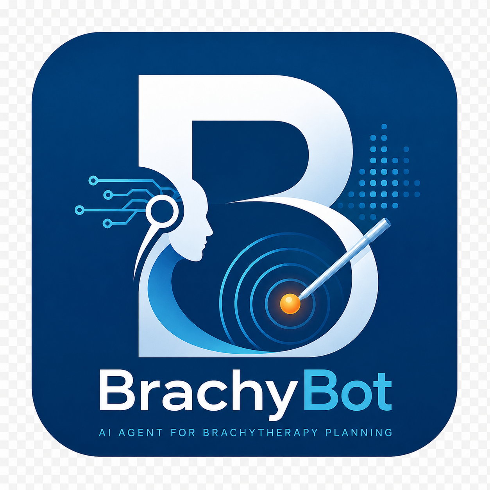

# BrachyBot: Self-Evolving AI Agent for Brachytherapy Treatment Planning

<div align="center">




**An autonomous, self-improving AI agent for multi-site brachytherapy treatment planning — powered by LLM function calling, layered memory, trajectory-based reflection, and crystallized skills.**

</div>

## Recent safety and viewer hardening

- Candidate needle trajectories are filtered against the current Data Tree
  non-traversable masks before optimization and are revalidated in physical
  coordinates before display.
- 3D meshes for non-traversable labels preserve the exact safety-mask boundary;
  cosmetic dilation and smoothing remain limited to ordinary anatomy so the
  viewer cannot visually contradict the trajectory safety check.
- Session switching clears stale canvases, meshes, overlays, and charts before
  restoring the selected workspace; late image callbacks cannot repaint an
  older case.
- Deferred mesh, DVH, and dose-surface restoration is case-generation scoped,
  so a late presentation callback from the prior workspace cannot repaint a
  newly selected case.
- 2D volume, label-volume, server-slice, and batch-preload callbacks now carry
  the same case generation/session fence. A delayed old CT or segmentation
  response is discarded instead of repopulating the new case's canvases.
- Asynchronous 3D segmentation prewarm requests are invalidated on case
  changes before their results can add meshes. This prevents old OAR/CTV
  surfaces from reappearing after a new session is created.
- Case creation, switching, and deletion are serialized as one workspace
  transition. The sidebar is briefly unavailable while the selected case is
  persisted and restored, preventing rapid clicks or out-of-order responses
  from mixing one case's chat with another case's viewer state.
- The control-plane transition now paints the server-owned lightweight case
  snapshot immediately; CT, meshes, dose arrays, and agent hydration continue
  in a generation-scoped background task. A rapid second switch cancels the
  old restore instead of blocking the sidebar for the full GPU/data load.
- Dynamically generated clinical evaluation text follows the global EN/中文
  switch, including metric labels, review items, source policy, and empty
  states. Viewer resize handles keep their drag hit area while the divider
  itself stays visually quiet until hover or active dragging.
- Trusted-local developer tools are advertised to the LLM only after their
  explicit `BRACHYBOT_ENABLE_*` opt-in is active. This preserves code-writing
  workflows when enabled while preventing wasted tool calls in clinical mode.
- 2D seed overlays use the finite physical seed-cylinder contour projected
  through the existing CT coordinate chain. The active plan's seed geometry is
  shared with the 3D viewer.
- 3D endpoint context menus now close reliably on outside click, Escape,
  scrolling, and session changes.
- Low-risk greetings and self-description requests use local intent
  classification to bypass unnecessary routing/review overhead, while the
  configured LLM still generates the answer; there is no canned greeting
  response. If no provider is configured, the assistant reports that state
  instead of pretending a rule-based answer came from the LLM. Ordinary
  knowledge and UI requests use intent-specific tool schemas instead of
  advertising the full registry on every turn.
- Manual CTV segmentation exposes an explicit bilingual model selector. The
  selected stable model ID is sent to `/api/segmentation`, persisted with the
  planning configuration, and the manual step buttons refresh immediately
  after a programmatic CT upload.
- Long conversations retain a compact session summary plus recent turns and
  structured case state. Prompt, tool-schema, and cleaned-summary caches reduce
  repeated preparation work without caching live viewer inspection results.
- Intermediate model text is kept out of the answer bubble until the server's
  required review gate has completed. Phase timings for routing, context build,
  first token, generation, checker, and SSE completion are returned in
  `llm_meta.phase_timings_ms`.
- Reviewed answers now stream only after the quality/completeness gate, so model
  drafts and checker text cannot create duplicate user-facing answer bubbles.
- Needle endpoint picking uses a capture-phase guard and the scene-owned render
  scheduler. Both endpoints remain editable without handing the same pointer
  event to OrbitControls; the intrabody endpoint and shaft are clipped to the
  deepest associated seed.
- Case-scoped audit events and review comments are persisted through the
  workspace store and are available from the Report toolbar. The Input panel
  can import DICOM RTSTRUCT/RTDOSE into the selected case, but keeps it as
  registration-unconfirmed metadata and never silently rasterizes or replaces
  a clinical mask or dose grid. The same file pickers, audit dialog, and review
  dialog are registered in the structured UI-control catalog so BrachyBot and
  the operator use one implementation.
- 3D endpoint rendering is owned by `scene3D.requestRender()`. A temporary
  global compatibility bridge protects already-open tabs from mixed static
  asset revisions during deployment; current tabs load the versioned viewer
  scripts and no longer leave endpoint interaction stuck after a render-scope
  exception.

---

## 📋 Table of Contents

- [Overview](#-overview)
- [Architecture](#-architecture)
- [Self-Evolving Mechanisms](#-self-evolving-mechanisms)
- [Key Features](#-key-features)
- [Installation](#-installation)
- [Quick Start](#-quick-start)
- [Usage Guide](#-usage-guide)
- [Complete Workflow](#-complete-workflow)
- [Memory System Deep Dive](#-memory-system-deep-dive)
- [Tool Factory](#-tool-factory)
- [Brain System](#-brain-system)
- [Skills Library](#-skills-library)
- [API Reference](#-api-reference)
- [Configuration](#-configuration)
- [Web Interface](#-web-interface)
- [Account-Owned Case Workspaces](#-account-owned-case-workspaces)
- [Agent Runtime Contracts](#agent-runtime-contracts)
- [Code Quality](#-code-quality)
- [Testing](#-testing)
- [Product Readiness & Clinical KB Governance](#product-readiness--clinical-kb-governance)
- [Research & Citations](#-research--citations)
- [Acknowledgements](#-acknowledgements)
- [License](#-license)

---

## 🌟 Overview

BrachyBot is a **closed-loop, self-evolving AI agent** for brachytherapy treatment planning. It combines:

- **LLM-driven decision making** with function calling across 15 LLM providers
- **Smart context management** with entity tracking, topic detection, and relevance scoring
- **Layered memory system** (L0-L4) for contextual information density maximization
- **Trajectory-based self-reflection** (Reflexion pattern) for continuous learning
- **Skill crystallization pipeline** that converts successful trajectories into reusable SOPs
- **Multi-agent clinical critique** for safety review of treatment plans
- **Tree-search exploration** (LATS) for complex planning optimization
- **Dialectic user profiling** that learns doctor preferences over time

The system grows smarter with every use — automatically extracting patterns from successful plans, learning from failures, and crystallizing reusable workflows.

### 🎯 Clinical Application

BrachyBot automates the complete brachytherapy planning workflow:

```
CT Scan → CTV Segmentation → OAR Segmentation → Trajectory Planning →
Seed Placement → Dose Calculation → Dose Evaluation → DICOM Export
```

Supporting:
- **Prostate** brachytherapy
- **Pancreas** brachytherapy
- **Liver, kidney, lung, and colon** research workflows when validated optional CTV checkpoints are installed
- **Intra-operative replanning**
- **Plan quality optimization**

### 📊 Project Statistics

| Metric | Value |
|--------|-------|
| Python files | ~290 |
| Core code lines | ~60,000+ |
| LLM providers | 15 |
| Medical AI tools | 24 packages (50+ tools) |
| Search engines | 28 specialized + 3 general |
| Skill templates | 28+ |
| VoCo model weights | 18 datasets |
| Benchmark test cases | 889 (32 categories) |
| Documentation files | 15+ markdown |

---

## 📸 Screenshot


---

## 🏗️ Architecture

### System Overview

```
┌─────────────────────────────────────────────────────────────────────────┐
│                          BrachyBot Agent                                │
│                                                                         │
│  ┌─────────────┐    ┌──────────────┐    ┌──────────────────────────┐   │
│  │  LLM Brain  │───▶│ Tool Factory │───▶│  Medical AI Tools        │   │
│  │  (15 prov.) │    │  (50+ tools) │    │  CT/CTV/OAR/Dose/Plan    │   │
│  └──────┬──────┘    └──────┬───────┘    └──────────────────────────┘   │
│         │                  │                                           │
│         ▼                  ▼                                           │
│  ┌──────────────────────────────────────────────────────────────┐      │
│  │                 Self-Evolving Memory Layer                    │      │
│  │                                                              │      │
│  │  ┌──────────┐ ┌──────────┐ ┌──────────┐ ┌──────────┐        │      │
│  │  │ L0 Rules │ │ L1 Index │ │ L2 Facts │ │ L3 SOPs  │        │      │
│  │  │ (Meta)   │ │ (Fast)   │ │ (Stable) │ │ (Skills) │        │      │
│  │  └──────────┘ └──────────┘ └──────────┘ └──────────┘        │      │
│  │  ┌──────────────────────────────────────────────────┐       │      │
│  │  │              L4 Session Archive                   │       │      │
│  │  └──────────────────────────────────────────────────┘       │      │
│  └──────────────────────────────────────────────────────────────┘      │
│         │                  │                  │                        │
│         ▼                  ▼                  ▼                        │
│  ┌─────────────┐  ┌──────────────┐  ┌──────────────────────┐         │
│  │ Reflexion   │  │ Skill        │  │ Multi-Agent Critic   │         │
│  │ Engine      │  │ Crystallizer │  │ (4 Expert Personas)  │         │
│  └─────────────┘  └──────────────┘  └──────────────────────┘         │
│                                                                       │
│  ┌─────────────┐  ┌──────────────┐  ┌──────────────────────┐         │
│  │ User Profile│  │ Context      │  │ Tree Search Planner  │         │
│  │ (Dialectic) │  │ Optimizer    │  │ (LATS/MCTS)          │         │
│  └─────────────┘  └──────────────┘  └──────────────────────┘         │
└─────────────────────────────────────────────────────────────────────────┘
```

### Component Diagram

```
┌─────────────────────────────────────────────────────────────────────┐
│                        User Interface                               │
│  ┌──────────┐  ┌──────────┐  ┌──────────┐                          │
│  │ CLI      │  │ Web UI   │  │ API      │                          │
│  │ brachybot│  │ Flask    │  │ REST     │                          │
│  └────┬─────┘  └────┬─────┘  └────┬─────┘                          │
│       └──────────────┼──────────────┘                                │
│                      ▼                                                │
│  ┌───────────────────────────────────────────────────────────────┐   │
│  │                    BrachyAgent Core                            │   │
│  │                                                               │   │
│  │  ┌─────────────────┐  ┌─────────────────┐                    │   │
│  │  │ AgentMemory     │  │ ToolRegistry    │                    │   │
│  │  │ - patient_data  │  │ - 50+ tools     │                    │   │
│  │  │ - planning_res  │  │ - name-based    │                    │   │
│  │  │ - conversation  │  │ - auto-inject   │                    │   │
│  │  └────────┬────────┘  └────────┬────────┘                    │   │
│  │           │                    │                              │   │
│  │  ┌────────▼────────────────────▼────────┐                    │   │
│  │  │         Execution Engine              │                    │   │
│  │  │  ┌─────────────────────────────────┐ │                    │   │
│  │  │  │ LLM Function Calling Loop       │ │                    │   │
│  │  │  │ - Parse tool_call blocks        │ │                    │   │
│  │  │  │ - Auto-inject memory data       │ │                    │   │
│  │  │  │ - Enhanced context injection    │ │                    │   │
│  │  │  │ - Post-task auto-evolution      │ │                    │   │
│  │  │  └─────────────────────────────────┘ │                    │   │
│  │  │  ┌─────────────────────────────────┐ │                    │   │
│  │  │  │ Rule-Based Fallback             │ │                    │   │
│  │  │  │ - Keyword matching              │ │                    │   │
│  │  │  │ - Hardcoded pipelines           │ │                    │   │
│  │  │  └─────────────────────────────────┘ │                    │   │
│  │  └──────────────────────────────────────┘                    │   │
│  └───────────────────────────────────────────────────────────────┘   │
└─────────────────────────────────────────────────────────────────────┘
```

### Session-scoped chat execution

Chat workflows are owned by the authenticated account and case session. A
browser may switch to another case while segmentation, planning, or a
knowledge workflow continues in the background. The UI detaches and later
replays the case-owned SSE event journal; an explicit Stop action remains the
only normal way to cancel that task. Durable workspace checkpoints retain the
execution trace and validated response, while server restart recovery still
marks unfinished GPU/LLM work as interrupted instead of pretending it
completed. See `docs/CODE_REVIEW.md`, Round 70.

### Reconnect-safe chat and command history

The selected case transcript is painted from the lightweight workspace snapshot
before CT, segmentation, dose, WebGL, and hydrated-agent restoration begins.
This keeps a reconnect from looking like an empty conversation while the
clinical data plane is loading in the background. The composer is cleared on
case changes and its Up/Down history is rebuilt from the selected case's user
messages only, with repeated navigation and draft restoration matching a
terminal-style agent UI. A resumed live task reconnects to the case-owned
event stream rather than creating a second request or cancelling the original.

Manual dose/replanning requests also expose a persistent indeterminate progress
row with a live elapsed timer and breathing indicator. The progress state is
truthful: it reports activity without inventing a percentage when the backend
does not provide one.

---

## 🧬 Self-Evolving Mechanisms

BrachyBot implements **six self-evolving mechanisms** inspired by state-of-the-art agent frameworks:

### 1. Layered Memory (L0-L4) — GenericAgent Pattern

```
┌─────────────────────────────────────────────────────────────────┐
│                    Context Window (8K tokens)                   │
│                                                                 │
│  ┌──────────────┐  Always loaded (hot memory)                  │
│  │  L0: Rules   │  8 meta-rules: safety, clinical, privacy     │
│  │  (Meta)      │  "Always validate inputs"                     │
│  │  ~200 tokens │  "Check past successful chains"               │
│  └──────────────┘                                              │
│                                                                 │
│  ┌──────────────┐  Fast routing index (warm memory)            │
│  │  L1: Index   │  Keywords → target layer mapping             │
│  │  (Fast)      │  "pancreas" → L3:SOP_Pancreas_COS            │
│  │  ~100 tokens │                                              │
│  └──────────────┘                                              │
│                                                                 │
│  ┌──────────────┐  Retrieved on-demand (warm memory)           │
│  │  L2: Facts   │  "CTV→Seed→Dose chain is effective"          │
│  │  (Stable)    │  Confidence-scored, evidence-backed           │
│  │  ~500 tokens │                                              │
│  └──────────────┘                                              │
│                                                                 │
│  ┌──────────────┐  Retrieved on-demand (warm memory)           │
│  │  L3: SOPs    │  Reusable workflows with success rates       │
│  │  (Skills)    │  SOP_Pancreas_COS: CTV→OAR→Seed→Dose (92%)   │
│  │  ~800 tokens │                                              │
│  └──────────────┘                                              │
│                                                                 │
│  ┌──────────────┐  Retrieved on-demand (cold memory)           │
│  │  L4: Archive │  Past session summaries with lessons         │
│  │  (Sessions)  │  "Prostate plan: D90=115%, V100=95%"         │
│  │  ~1000 tokens│                                              │
│  └──────────────┘                                              │
└─────────────────────────────────────────────────────────────────┘
```

**Key principle**: Only L0 is always in context. L1-L4 are retrieved on-demand based on the current task, maximizing contextual information density.

### 2. Reflexion Engine — Shinn et al. Pattern

```
Task: "Generate prostate plan"
    │
    ▼
┌──────────────────────────────────────┐
│         Execute Trajectory            │
│  CTV Seg → OAR Seg → Seed → Dose     │
└──────────────┬───────────────────────┘
               │
               ▼
┌──────────────────────────────────────┐
│     Self-Reflection (3 modes)        │
│                                      │
│  Mode 1: Self-Reflection (LLM)       │
│  "What went wrong? Root cause?"      │
│                                      │
│  Mode 2: Multi-Agent Reflexion (MAR) │
│  - Clinical Safety Reviewer          │
│  - Technical Efficiency Reviewer     │
│  - Error Analysis Specialist          │
│                                      │
│  Mode 3: Heuristic Reflection        │
│  Rule-based pattern detection        │
│  (repeated actions, failed tools)    │
└──────────────┬───────────────────────┘
               │
               ▼
┌──────────────────────────────────────┐
│    Store in Episodic Memory          │
│  - Critique                          │
│  - Root cause                        │
│  - Lesson learned                    │
│  - Alternative approach              │
└──────────────┬───────────────────────┘
               │
               ▼
┌──────────────────────────────────────┐
│    Next time: Auto-inject warnings   │
│  "Past failure: dose_evaluation      │
│   Lesson: Verify preconditions"      │
└──────────────────────────────────────┘
```

### 3. Skill Crystallization Pipeline — GenericAgent + EvoSkills Pattern

```
┌──────────────────────────────────────────────────────────────┐
│                    Skill Crystallization                      │
│                                                              │
│  [Successful Trajectory]                                     │
│  Task: "Generate prostate plan"                              │
│  Chain: CTV→OAR→Seed→Dose (success!)                         │
│                                                              │
│         │                                                    │
│         ▼                                                    │
│  ┌──────────────────┐                                        │
│  │ Extract Pattern  │  Extract keywords, tool chain, params  │
│  └────────┬─────────┘                                        │
│           │                                                  │
│           ▼                                                  │
│  ┌──────────────────┐                                        │
│  │ Create SOP       │  Auto_Prostate_COS                     │
│  │                  │  Triggers: [prostate, plan]            │
│  │                  │  Steps: [CTV, OAR, Seed, Dose]         │
│  └────────┬─────────┘                                        │
│           │                                                  │
│           ▼                                                  │
│  ┌──────────────────┐                                        │
│  │ Co-Evolutionary  │  LLM verifier checks:                  │
│  │ Verification     │  - Is chain appropriate?               │
│  │                  │  - Are triggers sufficient?            │
│  └────────┬─────────┘                                        │
│           │                                                  │
│           ▼                                                  │
│  ┌──────────────────┐                                        │
│  │ Register Skill   │  verified=True, success_rate=1.0       │
│  └────────┬─────────┘                                        │
│           │                                                  │
│           ▼                                                  │
│  ┌──────────────────┐                                        │
│  │ Auto-Apply       │  Next time user says "prostate plan"   │
│  │                  │  → SOP auto-matched and suggested      │
│  └──────────────────┘                                        │
└──────────────────────────────────────────────────────────────┘
```

### 4. Context Density Optimization — GenericAgent Pattern

```
┌──────────────────────────────────────────────────────────────┐
│              Context Density Optimizer                        │
│                                                              │
│  Problem: Context window fills with irrelevant content       │
│  Solution: Maximize decision-relevant token density          │
│                                                              │
│  Strategies:                                                 │
│  ┌─────────────────────────────────────────────────────┐    │
│  │ 1. Tiered Retention                                  │    │
│  │    - Critical: always kept (system prompt, task)     │    │
│  │    - Optional: pruned by density score               │    │
│  └─────────────────────────────────────────────────────┘    │
│  ┌─────────────────────────────────────────────────────┐    │
│  │ 2. Smart Compression                                 │    │
│  │    - Tool descriptions: name + short summary         │    │
│  │    - Conversation: first 2 + last 2 + "[N omitted]"  │    │
│  │    - Memory: important facts first, others trimmed   │    │
│  └─────────────────────────────────────────────────────┘    │
│  ┌─────────────────────────────────────────────────────┐    │
│  │ 3. Token Budgeting                                   │    │
│  │    System: 1500 | Tools: 2000 | Memory: 1500        │    │
│  │    Conversation: 3000 | Total: 8000 tokens          │    │
│  └─────────────────────────────────────────────────────┘    │
│                                                              │
│  Density Score = relevance×0.4 + recency×0.3 + importance×0.3│
└──────────────────────────────────────────────────────────────┘
```

### 5. Multi-Agent Clinical Critique — MAR + MedAgent-Pro Pattern

```
┌──────────────────────────────────────────────────────────────┐
│              Multi-Agent Clinical Review                      │
│                                                              │
│  Treatment Plan → 4 Expert Personas Review Independently     │
│                                                              │
│  ┌─────────────────────┐  ┌─────────────────────┐           │
│  │ Dosimetry Safety    │  │ Clinical Protocol   │           │
│  │ Expert (weight 1.5) │  │ Reviewer (1.3)      │           │
│  │                     │  │                     │           │
│  │ - D90, V100, V150   │  │ - Seed placement    │           │
│  │ - OAR dose limits   │  │ - CTV coverage      │           │
│  │ - QUANTEC/TG-43     │  │ - Standard practice │           │
│  └─────────┬───────────┘  └─────────┬───────────┘           │
│            │                        │                        │
│  ┌─────────▼───────────┐  ┌─────────▼───────────┐           │
│  │ Risk Assessment     │  │ Quality Assurance   │           │
│  │ Specialist (1.2)    │  │ Auditor (1.0)       │           │
│  │                     │  │                     │           │
│  │ - Seed migration    │  │ - Step completion   │           │
│  │ - Edema robustness  │  │ - Consistency check │           │
│  │ - Contouring errors │  │ - Missing evals     │           │
│  └─────────┬───────────┘  └─────────┬───────────┘           │
│            │                        │                        │
│            └───────────┬────────────┘                        │
│                        ▼                                     │
│              ┌───────────────────┐                           │
│              │ Weighted Consensus│                           │
│              │ APPROVE/CONDITION │                           │
│              │ /REJECT           │                           │
│              └───────────────────┘                           │
└──────────────────────────────────────────────────────────────┘
```

### 6. Auto-Evolution Trigger — Hermes Agent Pattern

```
┌──────────────────────────────────────────────────────────────┐
│                    Auto-Evolution Loop                        │
│                                                              │
│  Every interaction → interaction_count++                     │
│                                                              │
│  interaction_count - last_evolution_time >= threshold (5)    │
│         │                                                    │
│         ▼                                                    │
│  ┌──────────────────────────────────────┐                    │
│  │  Auto-Evolution Cycle                │                    │
│  │                                      │                    │
│  │  1. Analyze all experiences          │                    │
│  │  2. Create skills from new chains    │                    │
│  │  3. Update existing skill metrics    │                    │
│  │  4. Optimize parameters from data    │                    │
│  │  5. Analyze failures for insights    │                    │
│  │  6. Update user profile              │                    │
│  │                                      │                    │
│  │  Output: EvolutionCycle report       │                    │
│  └──────────────────────────────────────┘                    │
│                                                              │
│  No manual trigger needed — happens automatically!           │
└──────────────────────────────────────────────────────────────┘
```

---

## ✨ Key Features

### 🧠 LLM-Driven Decision Making
- **Universal LLM support**: Any provider with OpenAI-compatible API (`/v1/chat/completions`) works out of the box — just set `base_url`, `api_key`, `model`
- **15+ built-in providers**: OpenAI, Anthropic, OpenRouter, Qwen, Kimi, MiniMax, GLM, Gemini, Groq, Grok, Mimo, DeepSeek, Tencent, Ollama, vLLM
- **Anthropic-compatible proxies**: Also supports Anthropic protocol (`/v1/messages`) via custom `base_url`
- **Function calling**: LLM discovers and invokes tools via `tool_call` blocks
- **Operational fallback**: Rule-based parsing is limited to explicit clinical
  workflow operations when the LLM is unavailable; conversational questions
  never receive a canned answer and instead report the provider configuration
  problem clearly

### 📚 Layered Memory System
- **L0 Meta Rules**: 8 core behavioral rules always in context
- **L1 Insight Index**: Fast keyword-based routing to relevant knowledge
- **L2 Global Facts**: Confidence-scored stable knowledge
- **L3 SOPs**: Reusable workflows with success rates
- **L4 Session Archive**: Cross-session experience recall

### 🧠 Smart Context Management (NEW)
- **Intelligent Context Selection**: Selects relevant messages based on entity/topic overlap
- **Entity Tracking**: Automatically tracks patients, doses, organs, tools, protocols
- **Topic Tracking**: Detects and tracks conversation topics (dose_planning, segmentation, etc.)
- **Importance Scoring**: Messages scored by importance (clinical values, questions, errors)
- **Relevance Scoring**: Messages scored by relevance to current query (recency + entity + topic)
- **Smart Compression**: Low-relevance messages compressed, high-importance messages preserved
- **Timestamp Support**: All messages timestamped for time-based relevance decay

### 🔄 Self-Evolution
- **Reflexion**: Automatic trajectory critique after every task
- **Skill Crystallization**: Successful chains → verified SOPs
- **Auto-Evolution**: Triggers every 5 interactions automatically
- **User Profiling**: Learns doctor preferences over time

### 🏥 Clinical Safety
- **Multi-Agent Critique**: 4 expert personas review every plan
- **Dose Constraints**: QUANTEC/TG-43 limits via RAG
- **Plan Quality Scoring**: V100, D90, V150, V200 metrics

### 🔧 Tool Factory
- **50+ medical tools**: CTV/OAR segmentation, trajectory, seed planning, dose calculation/evaluation
- **nnU-Net + VoCo**: Deep learning segmentation models
- **TotalSegmentator**: 104 anatomical structures segmentation
- **Rule-based + RL**: Dual seed planning modes. RL uses bounded candidate,
  action, and wall-clock budgets, and ranks complete accumulated AI-dose plans
  rather than the final seed's local reward.
- **DICOM RT Export**: linked RT Structure Set, RT Plan, and RT Dose objects
  on the current CT grid. Exports are explicitly marked `UNAPPROVED`; they
  are interoperability artifacts for downstream review, not a treatment
  planning system approval or clinical sign-off.
- **Autonomous Tool Creation**: LLM can create new tools on-demand via `tool_creator`
- **Clinical Knowledge Base**: Dose constraints, organ tolerances, treatment protocols, and source-backed literature retrieval (`clinical_kb`). Safety-critical clinical claims must cite KB/web sources; prompts and validators should not invent standalone clinical thresholds.
- **Case Memory**: Store, retrieve, and learn from past treatment plans (`case_memory`)
- **Plan Comparator**: Multi-plan comparison, ranking, and recommendation (`plan_comparator`)
- **Safety Validator**: Pre-export safety checks for dose constraints and coverage (`safety_validator`)
- **Report Generator**: Clinical report generation in Markdown and JSON formats (`report_generator`)
- **Performance Tracker**: System metrics, trends, and improvement suggestions (`performance_tracker`)
- **🌐 Web Search (NEW)**: Internet search for uncertain knowledge (`web_search`)
  - PubMed API for clinical literature
  - Bing CN + Baidu for general/equipment search (China-accessible)
  - Automatic real-time query detection (weather, time, news, sports)
  - Direct search bypass for real-time queries (skips PubMed/cache)
  - Page content fetch from first search result for richer data
  - 24-hour result caching
  - Transparent search behavior (mentions when searching)
  - Graceful fallback when search fails

### 🎮 Interactive Viewer Control
- **ui_controller**: Direct LLM control of CT viewer (navigate, window/level, presets, overlays)
- **ui_screenshot**: LLM captures screenshots of any UI component for visual analysis
- **ui_annotate**: LLM draws annotations (arrows, circles, text labels) on screenshots
- **Workspace-scoped multimodal LLM**: Screenshots are sent as base64 images
  from the active case workspace only; a chat request cannot reference an
  image from another case.
- **Auto Screenshots**: LLM proactively screenshots UI areas during `/help` and explanations
- **Image Modal**: Click-to-enlarge fullscreen view of any chat image
- **Non-blocking UI feedback**: Viewer, colorbar, and upload failures use
  dismissible in-app notices instead of browser dialogs, so an error cannot
  freeze a 3D gesture or obscure the active planning workspace.

### UI-Aware Manual Planning and Training Monitor

BrachyBot can now operate as both an agentic planner and a standalone manual planning workstation:

- **UI state bridge**: the browser reports active panel, viewer settings, overlays, Data Tree state, manual planning state, and recent user interactions to the backend.
- **Structured UI control**: `ui_controller` can switch panels, adjust viewers, toggle overlays, run manual workflow steps, add manual needles/seeds, recompute manual dose with myDoseNet, request advice, and toggle 3D dose surface mode. A safe generic `ui.control` fallback can click, set, toggle, focus, or blur controls by DOM id/selector when no dedicated target exists.
- **Inspectable UI capability contract**: `GET /api/ui/capabilities` exposes the structured control registry, screenshot targets, manual workflow steps, training monitor support, and execution-tool enablement state for tests and operators.
- **Manual planning without LLM dependency**: the Input panel exposes CTV/OAR segmentation, trajectory initialization/refinement, seed planning, dose calculation, dose evaluation, report fill, and export controls as direct UI actions.
- **Manual 3D fine planning**: users can add editable needles in the 3D viewer, drag needle endpoints, add or drag seeds, and recompute myDoseNet dose/DVH after edits.
- **Training monitor**: users can ask BrachyBot to monitor a manual or automatic planning process, receive live feedback after key interactions, capture rate-limited review screenshots at key checkpoints, request detailed advice at any time, and stop monitoring to receive a final workflow report.

Important boundary: manual dose recomputation uses the trained myDoseNet AI model and no analytical/Gaussian fallback. Formal clinical review still requires the established planning workflow and independent verification.
Plan refinement proposes seed candidates from the current dose map only; it does not simulate dose or claim improved metrics until `dose_engine` or `planning_pipeline` reruns myDoseNet.

Implementation and audit details:

- [`docs/UI_CONTROL_MANUAL_TRAINING_REPORT_2026-06-30.md`](docs/UI_CONTROL_MANUAL_TRAINING_REPORT_2026-06-30.md)
- [`docs/PRODUCT_READINESS_UI_MANUAL_TRAINING_AUDIT_2026-07-02.md`](docs/PRODUCT_READINESS_UI_MANUAL_TRAINING_AUDIT_2026-07-02.md)
- [`docs/CLINICAL_KB_PROMPT_ALIGNMENT_AUDIT_2026-07-02.md`](docs/CLINICAL_KB_PROMPT_ALIGNMENT_AUDIT_2026-07-02.md)

### 📸 Visual Interaction System (NEW)
BrachyBot's LLM can **see and annotate** the UI in real-time:

```
User: "Show me the current segmentation result"
  → LLM calls ui_screenshot(target="viewer-axial")
  → Frontend captures viewer via html2canvas
  → Image uploaded to server, displayed in chat
  → LLM calls ui_annotate to add arrows/labels
  → Annotated image shown with explanation
```

**Screenshot Targets:** viewer-axial, viewer-sagittal, viewer-coronal, viewer-3d, data-tree, metrics, planning, full page

**Annotation Types:** arrow, circle, ellipse, rectangle, text label, crosshair, line

**Use Cases:**
- `/help` — LLM screenshots each UI area with numbered annotations
- "Check segmentation" — Navigate + screenshot + annotate key features
- "How does 3D look" — Capture 3D view, mark issues
- After any tool execution — Visual result display

### 🌐 Internet Search Capability (28 Specialized Engines)

BrachyBot has a **multi-engine search system** with 28 specialized data sources and intelligent fallback:

**Architecture:**
```
Query → Specialized Engine (direct API) → Quality Check → General Search (Bing/Sogou) → Merge
```

**Specialized Engines (28):**

| Category | Engines | Source |
|----------|---------|--------|
| Real-time | Weather (wttr.in), Exchange Rate | Direct API |
| Medical Guidelines | NCCN, Radiopaedia, ICD-11 (WHO), OMIM, AAPM, MeSH | API + Scraping |
| Clinical Research | ClinicalTrials.gov, FDA, PubMed, Europe PMC, Semantic Scholar | API |
| Academic Publishing | CrossRef, OpenAlex, arXiv, bioRxiv, Springer Nature, IEEE Xplore, Lens.org, IOP | API |
| Patents | Google Patents, CNIPA | Scraping |
| Chinese Academic | CNKI, Wanfang | Scraping |
| Technical | Stack Overflow, Papers With Code, GitHub | API |

**Information Reliability Hierarchy:**
```
1. 🔍 Search results (latest)    → Use directly, cite source + year
2. 📚 Search results (older)     → Use with staleness warning
3. 🧠 AI knowledge (verified)    → Use with attribution
4. ❌ Unknown                    → Honestly state: "Data not found"
```

**Query Processing:**
- Intent detection (factual, research, realtime, navigational)
- Per-engine query optimization (GitHub: extract keywords, PubMed: remove filler)
- Query variant generation (short names, cross-language, simplified)
- Auto year injection for time-sensitive queries
- Auto page content fetching when snippets are insufficient

**Example Interactions:**
```
# Medical knowledge — direct answer from clinical knowledge base
"What is the ABS recommended D90 for prostate monotherapy?"
→ "145 Gy per ABS consensus guidelines (Davis et al., Brachytherapy 2017)."

# Journal metrics — specialized engine + page content extraction
"What is the current impact factor of IEEE TMI?"
→ "IEEE TMI 2025 IF: 9.8/Q1, 5-year average: 11.3 [Source: iikx.com/JCR]"

# Clinical trial search — ClinicalTrials.gov API
"Active HDR brachytherapy trials for cervical cancer"
→ "[NCT06413992] Status: RECRUITING, Phase: II, Institution: ..."

# Dose calculation — tool execution + synthesis
"Segment OAR and evaluate dose for the current plan"
→ "OAR segmentation complete (57 organs). Dose evaluation: D90=112%, V100=94%,
    Rectum D2cc=68 Gy (limit: 75 Gy). Plan quality: ACCEPTABLE."

# Real-time data — wttr.in API (no search engine needed)
"What is the weather today?"
→ "Shanghai: 25°C, Partly Cloudy, Humidity: 83%, Wind: 6 km/h [Source: wttr.in]"
```

### 🌐 Web Interface
- **Real-time CT Viewer**: 3D Slicer-level slice interaction with volume rendering
- **Streaming Output**: Real-time LLM text streaming with SSE
- **Tool Progress**: Live progress bars during long-running tasks
- **Slash Commands**: `/help`, `/plan`, `/segment`, `/evaluate`, `/export`, `/viewer`, `/clear`
- **Keyboard Shortcuts**: `Ctrl+L` clear chat, `Ctrl+K` focus input

### 📝 Skills System (Markdown)
- **Claude Code Style**: SKILL.md format with YAML frontmatter
- **Trigger Matching**: Auto-match user requests to skills
- **10 Built-in Skills**: Planning, segmentation, evaluation, export workflows

---

## 📦 Installation

### Prerequisites

```
Python 3.10+
GPU (recommended for nnU-Net/VoCo segmentation)
SimpleITK, numpy, torch
```

### Step 1: Clone and Install Dependencies

```bash
git clone https://github.com/Haitao-Lee/BrachyBot.git
cd BrachyBot

# Install core dependencies
pip install -r requirements.txt

# Install optional dependencies for deep learning
pip install torch torchvision torchaudio
pip install nibabel SimpleITK
```

### Step 2: Configure LLM Provider (Optional)

BrachyBot works without an LLM (rule-based mode), but for full self-evolving capabilities:

```bash
# Option A: OpenRouter (recommended, 200+ models)
export OPENROUTER_API_KEY="your-key"
export BRACHY_LLM_PROVIDER="openrouter"

# Option B: OpenAI
export OPENAI_API_KEY="your-key"
export BRACHY_LLM_PROVIDER="openai"

# Option C: Qwen
export QWEN_API_KEY="your-key"
export BRACHY_LLM_PROVIDER="qwen"

# Option D: Ollama (local)
export BRACHY_LLM_PROVIDER="ollama"
```

### Step 3: Configure Security (Recommended for Production)

```bash
# Loopback development can run without an API key. Any non-loopback bind is
# refused unless this key is set (the unsafe override is documented below).
export BRACHYBOT_API_KEY="your-secure-key"

# API key for the brain/LLM system
export BRACHYBOT_LLM_API_KEY="your-llm-api-key"

# CORS allowed origins (comma-separated)
# Default: http://localhost, http://127.0.0.1
export ALLOWED_ORIGINS="http://localhost,http://127.0.0.1"

# Trusted-local Developer Mode capabilities are all disabled by default.
# They are policy-limited host-process capabilities, not OS sandboxes. Enable
# only the specific capabilities needed on a private workstation.
# export BRACHYBOT_ENABLE_CODE_EXECUTOR=1
# export BRACHYBOT_ENABLE_SHELL_EXECUTOR=1
# export BRACHYBOT_ENABLE_TOOL_CODE_WRITER=1
# export BRACHYBOT_ENABLE_TOOL_CREATOR=1
# export BRACHYBOT_ENABLE_ENV_MANAGER=1
```

The server defaults to `127.0.0.1`. To bind to a LAN/public interface, set
`BRACHYBOT_API_KEY` first. `BRACHYBOT_ALLOW_INSECURE_REMOTE=1` is an explicit
unsafe override for isolated trusted networks; `BRACHYBOT_TRUST_NETWORK=1`
only broadens CORS/rate-limit policy and never disables a configured API key.

### Step 3b: Configure Account-Owned Case Workspaces

The web UI uses server-side accounts and persistent case workspaces. Register
an account on first use, then every case in the sidebar restores its own CT,
segmentation, planning result, dose, Data Tree, viewer state, report, chat,
and completed progress after a browser or server restart.

```bash
# Required for a stable deployment login cookie. Generate a long random value.
export BRACHYBOT_SECRET_KEY="replace-with-a-long-random-secret"

# Runtime clinical data is intentionally separate from the Git repository.
# Default: .runtime/ below the project root.
export BRACHYBOT_RUNTIME_DIR="/srv/brachybot-runtime"

# Per-account capacity and recoverable deletion window.
export BRACHYBOT_USER_STORAGE_QUOTA_BYTES=$((20 * 1024 * 1024 * 1024))
export BRACHYBOT_TRASH_RETENTION_DAYS=7

# Enable only behind HTTPS in production.
export BRACHYBOT_COOKIE_SECURE=1
```

Browser login is protected by `HttpOnly`/`SameSite=Lax` cookies and CSRF
validation. `BRACHYBOT_API_KEY` remains a deployment perimeter control; it is
not a substitute for user identity or case ownership. Two users cannot access
one another's sessions or artifacts. See
[Account-Owned Persistent Case Workspaces](docs/ACCOUNT_WORKSPACES_2026-07-17.md)
for lifecycle, recovery, edit leases, API details, and migration notes.

When a deployment key is configured, open the workspace with
`?api_key=...` or expand **Deployment access key** on the sign-in screen. New
browser-provided keys are retained only in `sessionStorage`; they are never
stored in a case workspace or sent to the planning agent.

### Step 4: Download Pre-trained Models (Optional)

VoCo segmentation model weights are not included in the repository due to size (~18GB). To use VoCo models:

1. Download weights from [Large-Scale-Medical](https://github.com/Luffy03/Large-Scale-Medical)
2. Place them in the corresponding `VoCo/<dataset>/` directories

Without a specified tumor site plus verified CTV weights, or a user-provided `label_path`, CTV segmentation now fails closed. BrachyBot no longer treats TotalSegmentator organ masks or HU-threshold fallbacks as tumor CTV.

Imported/manual `label_path` CTV masks remain source-aware in the Data Tree, viewer overlays, and reports. They are displayed as CTV/manual labels unless a validated tumor model was explicitly selected.

CTV model discovery is exposed through:

```bash
python scripts/download_ctv_models.py --list
curl -H "X-API-Key: $BRACHYBOT_API_KEY" http://localhost:8080/api/ctv/models
```

The catalog marks the pancreatic nnU-Net path as the production CTV route when
local weights are installed. Optional VoCo CT tumor routes cover PANORAMA PDAC,
3D-IRCADb liver tumor, KiPA kidney tumor, MSD lung cancer, and MSD colon cancer;
each requires its local checkpoint and site-specific validation. Anatomical,
embolism, infection, and MRI-only models are deliberately excluded from
automatic CT CTV routing. If the site cannot be inferred, chat asks for it;
the Python API requires `tumor_type` unless `ctv_path` is supplied.

The myDoseNet CNN dose prediction model is resolved from
`BRACHYBOT_DOSE_MODEL_PATH`, `plans/dose_pre/dose_model.pth`, or the legacy
`dose_pre/dose_model.pth` location. `BRACHYBOT_DOSE_MODEL_SCALE_GY` defines the
checkpoint's calibrated Gy scale (default `120.0`); startup fails on invalid
values and dose calculation fails closed when no usable checkpoint exists.

---

## 🚀 Quick Start

### Method 1: Python API

```python
from AgenticSys import BrachyAgent

# Create agent (self-evolving components auto-initialize)
agent = BrachyAgent(session_id="patient_001")

# Pre-operative planning (full pipeline)
result = agent.run_preoperative_plan(
    ct_path="/path/to/ct.nii.gz",
    ctv_path=None,  # or provide an existing/manual CTV label
    oar_path="/path/to/oar_label.nii.gz",  # optional
    tumor_type="nnunet_pancreatic",  # required for automatic CTV segmentation
    mode="rule_based",  # or "rl" for reinforcement learning
    output_dir="./output/patient_001",
)

print(f"Seeds planned: {result['total_seeds']}")
print(f"D90: {result['metrics']['d90']:.2f}Gy")
print(f"V100: {result['metrics']['v100']:.1%}")

# Natural language chat (auto-triggers self-evolution)
response = agent.chat("Generate treatment plan for pancreatic cancer patient")
print(response)

# Chat with execution trace
trace = agent.chat_with_trace("Segment CTV and OAR, then evaluate dose")
for step in trace["steps"]:
    print(f"[{step['status']}] {step['title']}: {step['content'][:100]}")

# Check agent status (includes self-evolution metrics)
status = agent.get_status()
print(status["enhanced"]["layered_memory"])
print(status["enhanced"]["skill_crystallizer"])
```

### Method 2: CLI

```bash
# Interactive chat mode
python brachybot.py --chat

# Direct planning with an existing CTV label
python brachybot.py --ct /path/to/ct.nii.gz --ctv /path/to/ctv.nii.gz --mode rule_based

# Automatic CTV segmentation requires an explicit supported site/model
python brachybot.py --ct /path/to/ct.nii.gz --tumor-type nnunet_pancreatic --mode auto

# Start web server
python brachybot.py --server --host 127.0.0.1 --port 8080
```

### Method 3: Web Interface

```bash
python brachybot.py --server --port 8080
# Open http://localhost:8080 in browser
```

### Current UI behavior

- The chat body shows only the response emitted after the final completeness
  review; intermediate tool calls and draft text remain in the execution trace.
- An explicit replan request can reuse the existing CTV/OAR results and apply
  the current reference-direction controls, including mixed Chinese/English
  commands such as reversing the reference direction.
- The Planning data-tree parent controls all trajectory, seed, needle, dose,
  and reconstructed planning descendants. Dose Surface loads available OAR
  meshes before applying the dose texture.
- HU threshold highlighting is opt-in. Leave the field blank for normal CT
  display; entering a value enables the temporary threshold visualization.

---

## 📖 Usage Guide

### Natural Language Commands

| Command | Action | Auto-Triggers |
|---------|--------|---------------|
| `Segment CTV` | CTV segmentation | Experience recording, SOP matching |
| `Segment OAR` | OAR segmentation | Experience recording, SOP matching |
| `Generate plan` | Full planning pipeline | Reflexion, skill crystallization |
| `RL planning` | RL-based seed planning | Parameter optimization |
| `Evaluate dose` | Dose evaluation | Fact extraction, user profiling |
| `Optimize plan` | Plan optimization suggestions | Failure pattern analysis |
| `Self-evolve` | Manual evolution trigger | Full evolution cycle |
| `Create tool` | Create new tool via LLM | Tool code generation |
| `Status` | Agent status report | Memory stats display |

### Automatic Self-Evolution Flow

**No manual intervention needed.** After every interaction:

1. **Pre-task**: Agent retrieves past experiences, matched SOPs, crystallized skills, and user preferences
2. **During task**: Context optimizer ensures relevant information is in the prompt
3. **Post-task**: Agent automatically:
   - Records the experience
   - Reflects on the trajectory (Reflexion)
   - Crystallizes new skills if successful
   - Updates user profile
   - Archives the session
   - Triggers auto-evolution if threshold reached

### Example Session

```
User: Segment CTV and OAR
Agent: [Memory] Matched SOP: PancreasFull (85% success): CTV→OAR→Seed→Dose
       [Memory] Crystallized skill: Auto_Pancreas_COS (92%): CTV→OAR→Seed→Dose
       [Tool] CTV segmentation completed. CTV voxels: 15,234
       [Tool] OAR segmentation completed. Organs: stomach, duodenum, kidneys

User: Generate treatment plan
Agent: [Memory] Past failure warning: dose_evaluation - D90 too low
       [Memory] Lesson: Verify preconditions before calling dose_evaluation
       [Tool] Trajectory planning: 12 candidates generated
       [Tool] Seed planning (rule_based): 85 seeds placed
       [Tool] Dose evaluation: D90=115%, V100=95%, Score=88.5
       [Critique] Multi-Agent Review: APPROVE (score: 9.2/10)
       [Evolution] Auto-evolution triggered: 1 new skill created

User: Self-evolve
Agent: Self-evolution cycle complete:
       - New skills: 2 (Auto_Prostate_Quick, Auto_Pancreas_Detailed)
       - Lessons learned: 3
       - Parameter optimizations: 5
       - Failure insights: 2
```

---

## 🔄 Complete Workflow

### Pre-Operative Planning Pipeline

```
┌─────────────────────────────────────────────────────────────────────────────┐
│                     Pre-Operative Planning Workflow                          │
│                                                                             │
│  Step 1: Load CT Image                                                      │
│  ┌─────────────────────────────────────────────────────────────────────┐   │
│  │  Input: ct_path (DICOM/NIfTI)                                       │   │
│  │  Output: ct_image (SimpleITK Image)                                 │   │
│  │  Tool: sitk.ReadImage()                                             │   │
│  └─────────────────────────────────────────────────────────────────────┘   │
│                                    │                                        │
│                                    ▼                                        │
│  Step 2: CTV Segmentation                                                   │
│  ┌─────────────────────────────────────────────────────────────────────┐   │
│  │  Input: ct_image, optional ctv_path (ground truth)                  │   │
│  │  Models: nnU-Net (6 tumor types) + VoCo (8 tumor types)             │   │
│  │  Output: ctv_array (numpy mask)                                     │   │
│  │  Tool: CTVSegmentationTool                                          │   │
│  └─────────────────────────────────────────────────────────────────────┘   │
│                                    │                                        │
│                                    ▼                                        │
│  Step 3: OAR Segmentation                                                   │
│  ┌─────────────────────────────────────────────────────────────────────┐   │
│  │  Input: ct_image, optional oar_path                                 │   │
│  │  Models: TotalSegmentator, VoCo OAR, Pancreatic OAR, Aorta          │   │
│  │  Output: oar_array (numpy mask with organ labels)                   │   │
│  │  Tool: OARSegmentationTool                                          │   │
│  └─────────────────────────────────────────────────────────────────────┘   │
│                                    │                                        │
│                                    ▼                                        │
│  Step 4: Build Radiation Volume                                             │
│  ┌─────────────────────────────────────────────────────────────────────┐   │
│  │  Input: ctv_array, oar_array                                        │   │
│  │  Logic: CTV=1.0, OAR=3.0 (obstacle), Background=0.0                 │   │
│  │  Output: radiation_volume (numpy array)                             │   │
│  └─────────────────────────────────────────────────────────────────────┘   │
│                                    │                                        │
│                                    ▼                                        │
│  Step 5: Trajectory Planning                                                │
│  ┌─────────────────────────────────────────────────────────────────────┐   │
│  │  Input: ct_image, radiation_volume                                  │   │
│  │  Methods: Directional sampling + quality filtering                  │   │
│  │  Output: trajectories (list of candidate needle paths)              │   │
│  │  Tool: TrajectoryPlanningTool                                       │   │
│  └─────────────────────────────────────────────────────────────────────┘   │
│                                    │                                        │
│                                    ▼                                        │
│  Step 6: Seed Planning                                                      │
│  ┌─────────────────────────────────────────────────────────────────────┐   │
│  │  Input: trajectories, radiation_volume, ct_image                    │   │
│  │  Modes: rule_based (greedy+CNN) or RL (REINFORCE)                   │   │
│  │  Output: optimal_plan (seed positions), total_seeds                 │   │
│  │  Tool: SeedPlanningTool                                             │   │
│  └─────────────────────────────────────────────────────────────────────┘   │
│                                    │                                        │
│                                    ▼                                        │
│  Step 7: Dose Evaluation                                                    │
│  ┌─────────────────────────────────────────────────────────────────────┐   │
│  │  Input: dose_distribution, ctv_mask, oar_mask                       │   │
│  │  Metrics: D90, V100, V150, V200, OAR violations, plan_score         │   │
│  │  Output: eval_metrics (dict)                                        │   │
│  │  Tool: DoseEvaluationTool                                           │   │
│  └─────────────────────────────────────────────────────────────────────┘   │
│                                                                             │
│  Final Output: {success, total_seeds, metrics, optimal_plan, dose}          │
└─────────────────────────────────────────────────────────────────────────────┘
```

### Intra-Operative Replanning Pipeline

```
┌─────────────────────────────────────────────────────────────────────────────┐
│                    Intra-Operative Replanning Workflow                       │
│                                                                             │
│  Step 1: Load Intra-Op CT                                                   │
│  ┌─────────────────────────────────────────────────────────────────────┐   │
│  │  Input: intra_op_ct_path                                            │   │
│  │  Output: intra_op_image                                             │   │
│  └─────────────────────────────────────────────────────────────────────┘   │
│                                    │                                        │
│                                    ▼                                        │
│  Step 2: Seed Detection                                                     │
│  ┌─────────────────────────────────────────────────────────────────────┐   │
│  │  Input: intra_op_image, planned_seeds                               │   │
│  │  Method: Intensity threshold + connected component analysis         │   │
│  │  Output: detected_seeds, deviation_stats                            │   │
│  │  Tool: SeedSegmentationTool                                         │   │
│  └─────────────────────────────────────────────────────────────────────┘   │
│                                    │                                        │
│                                    ▼                                        │
│  Step 3: Deviation Check                                                    │
│  ┌─────────────────────────────────────────────────────────────────────┐   │
│  │  Compare: max_deviation_mm vs threshold (default: 2.0mm)            │   │
│  │  Decision:                                                          │   │
│  │    - Within threshold → Accept plan                                 │   │
│  │    - Exceeds threshold → Trigger replanning                         │   │
│  └─────────────────────────────────────────────────────────────────────┘   │
│                                    │                                        │
│                          ┌─────────┴─────────┐                             │
│                          ▼                   ▼                             │
│              ┌──────────────────┐  ┌──────────────────┐                    │
│              │   Accept Plan    │  │  Trigger Replan  │                    │
│              │                  │  │                  │                    │
│              │ Return success   │  │ 1. Adjust volume │                    │
│              │ with stats       │  │ 2. New trajectory│                    │
│              └──────────────────┘  │ 3. New seed plan │                    │
│                                    │ 4. New dose eval │                    │
│                                    └──────────────────┘                    │
└─────────────────────────────────────────────────────────────────────────────┘
```

---

## 🧠 Memory System Deep Dive

### Layered Memory Architecture

```
┌─────────────────────────────────────────────────────────────────────┐
│                        Memory Layers                                 │
│                                                                      │
│  L0: Meta Rules (Always Active)                                      │
│  ┌──────────────────────────────────────────────────────────────┐   │
│  │ r001: Always validate tool inputs before execution           │   │
│  │ r002: Never execute destructive operations without confirm   │   │
│  │ r003: Record every interaction as experience                 │   │
│  │ r004: When uncertain, prefer conservative clinical decisions │   │
│  │ r005: Check past successful tool chains before planning      │   │
│  │ r006: After 3 consecutive failures, suggest alternative      │   │
│  │ r007: Always include dose evaluation after seed placement    │   │
│  │ r008: Preserve patient data privacy                          │   │
│  └──────────────────────────────────────────────────────────────┘   │
│  Storage: memory/data/l0_rules.json                                  │
│                                                                      │
│  L1: Insight Index (Fast Routing)                                    │
│  ┌──────────────────────────────────────────────────────────────┐   │
│  │ "pancreas" → l3_sops:SOP_Pancreas_COS (relevance: 0.8)      │   │
│  │ "prostate" → l3_sops:SOP_Prostate_Full (relevance: 0.9)     │   │
│  │ "dose" → l2_facts:f_dose_chain (relevance: 0.7)             │   │
│  └──────────────────────────────────────────────────────────────┘   │
│  Storage: memory/data/l1_index.json                                  │
│                                                                      │
│  L2: Global Facts (Stable Knowledge)                                 │
│  ┌──────────────────────────────────────────────────────────────┐   │
│  │ f_abc123: "CTV→OAR→Seed→Dose chain is effective" (conf:0.85)│   │
│  │ f_def456: "Tool 'dose_evaluation' produces reliable results" │   │
│  │ f_ghi789: "Tool 'seed_planning' may fail with poor CTV"      │   │
│  └──────────────────────────────────────────────────────────────┘   │
│  Storage: memory/data/l2_facts.json                                  │
│                                                                      │
│  L3: SOPs (Reusable Workflows)                                       │
│  ┌──────────────────────────────────────────────────────────────┐   │
│  │ SOP_Pancreas_COS: CTV→OAR→Seed→Dose (success: 92%, used: 15) │   │
│  │ SOP_Prostate_Full: CTV→OAR→Traj→Seed→Dose (success: 88%)     │   │
│  │ SOP_Quick_Plan: CTV→Seed→Dose (success: 95%, used: 8)        │   │
│  └──────────────────────────────────────────────────────────────┘   │
│  Storage: memory/data/l3_sops.json                                   │
│                                                                      │
│  L4: Session Archive (Cross-Session Recall)                          │
│  ┌──────────────────────────────────────────────────────────────┐   │
│  │ arch_001: "Prostate plan" → success, D90=115%, V100=95%     │   │
│  │ arch_002: "Pancreas plan" → failed, CTV too small            │   │
│  │ arch_003: "Quick plan" → success, 3-step workflow            │   │
│  └──────────────────────────────────────────────────────────────┘   │
│  Storage: memory/data/l4_archives.json                               │
└─────────────────────────────────────────────────────────────────────┘
```

### Reflexion Memory

```
┌─────────────────────────────────────────────────────────────────────┐
│                     Reflexion Memory                                 │
│                                                                      │
│  Episodic Memory (Last 10 reflections)                               │
│  ┌──────────────────────────────────────────────────────────────┐   │
│  │ ref_001: "Prostate plan - D90 too low"                       │   │
│  │   Critique: Dose evaluation failed due to insufficient CTV   │   │
│  │   Root cause: CTV mask was empty                             │   │
│  │   Lesson: Verify CTV mask before dose evaluation             │   │
│  │   Alternative: Check segmentation quality first              │   │
│  │   Applied: 3 times                                           │   │
│  └──────────────────────────────────────────────────────────────┘   │
│                                                                      │
│  Failure Patterns                                                    │
│  ┌──────────────────────────────────────────────────────────────┐   │
│  │ dose_evaluation: 5 failures                                  │   │
│  │   Root causes: ["CTV mask empty", "Dose array mismatch"]     │   │
│  │   Last seen: 2026-05-15T10:30:00                             │   │
│  └──────────────────────────────────────────────────────────────┘   │
│                                                                      │
│  Success Patterns                                                    │
│  ┌──────────────────────────────────────────────────────────────┐   │
│  │ CTV→OAR→Seed→Dose: 12 successes                              │   │
│  │   Tasks: ["prostate plan", "pancreas plan", ...]             │   │
│  │   Last used: 2026-05-15T11:00:00                             │   │
│  └──────────────────────────────────────────────────────────────┘   │
│                                                                      │
│  Storage: memory/data/reflexion_memory.json                          │
└─────────────────────────────────────────────────────────────────────┘
```

### User Profile (Dialectic)

```
┌─────────────────────────────────────────────────────────────────────┐
│                      User Profile                                    │
│                                                                      │
│  Explicit Preferences (User stated directly)                         │
│  ┌──────────────────────────────────────────────────────────────┐   │
│  │ planning_mode: "rl" (confidence: 1.0, source: explicit)      │   │
│  │ dose_method: "cnn" (confidence: 1.0, source: explicit)       │   │
│  └──────────────────────────────────────────────────────────────┘   │
│                                                                      │
│  Inferred Preferences (Agent observed)                               │
│  ┌──────────────────────────────────────────────────────────────┐   │
│  │ prefers_quick_planning: confidence 0.6 (2 observations)      │   │
│  │ prefers_voco_seg: confidence 0.7 (3 observations)            │   │
│  └──────────────────────────────────────────────────────────────┘   │
│                                                                      │
│  Validated Preferences (Inferred + confirmed)                        │
│  ┌──────────────────────────────────────────────────────────────┐   │
│  │ prefers_detailed_eval: confidence 0.85 (5 observations)      │   │
│  └──────────────────────────────────────────────────────────────┘   │
│                                                                      │
│  Interaction Patterns                                                │
│  ┌──────────────────────────────────────────────────────────────┐   │
│  │ planning: frequency 25, last seen: 2026-05-15                │   │
│  │ segmentation: frequency 18, last seen: 2026-05-14            │   │
│  │ evaluation: frequency 12, last seen: 2026-05-15              │   │
│  └──────────────────────────────────────────────────────────────┘   │
│                                                                      │
│  Storage: memory/data/user_profiles/{user_id}.json                   │
└─────────────────────────────────────────────────────────────────────┘
```

---

## 🔧 Tool Factory

### Tool Categories (27 packages, 50+ tools)

```
tool_factory/
├── CTV_seg/              # Tumor segmentation (14 tools)
│   ├── ctv_segmentation.py   # Unified entry point
│   ├── pancreatic_tumor.py   # nnU-Net pancreas CTV
│   ├── prostate_tumor.py     # nnU-Net prostate CTV
│   ├── liver_tumor.py        # nnU-Net liver tumor
│   ├── lung_tumor.py         # nnU-Net lung tumor
│   ├── head_neck.py          # nnU-Net head & neck
│   ├── kidney_tumor.py       # nnU-Net kidney tumor
│   ├── voco_pancreas.py      # VoCo pancreas
│   ├── voco_prostate.py      # VoCo prostate (MRI)
│   ├── voco_liver.py         # VoCo liver
│   ├── voco_lung.py          # VoCo lung
│   ├── voco_brain.py         # VoCo brain
│   ├── voco_kidney.py        # VoCo kidney
│   └── ...                   # Additional VoCo models
│
├── OAR_seg/              # Organ-at-risk segmentation (4 tools)
│   ├── oar_segmentation.py      # Unified entry point
│   ├── totalsegmentator_oar.py  # TotalSegmentator (104 organs)
│   ├── voco_total_segmentation.py
│   ├── pancreatic_oar.py
│   └── aorta_vessel_voco.py
│
├── traj_plan/            # Trajectory planning (2 tools)
│   ├── trajectory_init.py     # Directional sampling
│   └── trajectory_refine.py   # Quality filtering
│
├── seed_plan/            # Seed placement (3 tools)
│   ├── seed_planning_rule_based.py  # Greedy + CNN dose prediction
│   └── seed_planning_rl.py        # REINFORCE RL optimization
│
├── dose_engine/          # Dose calculation (1 tool)
│   └── cnn_dose_engine.py         # CNN dose prediction (myDoseNet)
│
├── dose_eval/            # Dose evaluation (5 tools)
│   ├── vx_metrics.py              # Vx metrics (V100, V150, V200)
│   ├── dx_metrics.py              # Dx metrics (D90, D100)
│   ├── absolute_dose_metrics.py   # Absolute dose calculation
│   ├── dvh_calculation.py         # DVH curve analysis
│   └── comprehensive_dose_evaluation.py
│
├── seed_seg/             # Intra-operative seed detection
│   └── seed_segmentation.py
│
├── plan_quality/         # Plan quality tools
│   ├── plan_quality_scorer.py
│   ├── oar_constraint_checker.py
│   └── plan_refinement.py
│
├── image_processing/     # Image utilities
│   ├── image_loader.py
│   └── image_preprocessor.py
│
├── code_executor/        # Python code execution, disabled unless BRACHYBOT_ENABLE_CODE_EXECUTOR=1
│
├── filesystem_browser/   # File system navigation
│
├── env_manager/          # Python environment management
│
├── shell_executor/       # Shell command execution, disabled unless BRACHYBOT_ENABLE_SHELL_EXECUTOR=1
│
├── tool_creator/         # Dynamic tool creation (self-evolution)
│
├── doc_reader/           # Document reading (PDF, Word, CSV, JSON)
│
├── ui_inspector/         # UI state inspection and component scanning
│
├── case_memory/          # Patient case database (NEW)
│   └── __init__.py       # Store, retrieve, search past treatment plans
│
├── clinical_kb/          # Clinical knowledge base (NEW)
│   └── __init__.py       # Dose constraints, organ tolerances, protocols
│
├── plan_comparator/      # Multi-plan comparison (NEW)
│   └── __init__.py       # Compare, rank, recommend treatment plans
│
├── safety_validator/     # Pre-export safety checks (NEW)
│   └── __init__.py       # Dose constraints, coverage, hotspots validation
│
├── report_generator/     # Clinical report generation (NEW)
│   └── __init__.py       # Full reports, summaries, DVH analysis, export
│
├── performance_tracker/  # System performance tracking (NEW)
│   └── __init__.py       # Session logging, feedback, trends, suggestions
│
├── viewer_command/       # CT viewer control
│
├── ui_controller/        # UI element control (panels, overlays, slices)
│
├── ui_screenshot/        # Screenshot capture for visual analysis
│
├── ui_annotate/          # Image annotation (arrows, circles, text labels)
│
└── output/               # Export tools
    ├── __init__.py
    ├── dicom_rt_exporter.py
    └── report_auto_fill.py
```

### Tool Interface

All tools follow the `BaseTool` interface:

```python
class BaseTool(ABC):
    name: str
    description: str
    input_schema: dict
    output_schema: dict

    def validate_input(self, **kwargs) -> bool
    def execute(self, **kwargs) -> ToolResult  # Wrapper with timing
    def _execute(self, **kwargs) -> ToolResult  # Abstract, implemented by subclass

class ToolResult:
    success: bool
    data: Any
    message: str      # Machine-readable (for LLM context, logging)
    display: str       # Human-readable markdown (for user-facing response)
    metadata: dict
    error: str
    execution_time: float
```

**Unified Result Pipeline (`ToolResultPipeline`):**
- `format(tool_name, result, lang)` — single entry point, uses `result.display` first, auto-generates from metadata
- `synthesize(formatted_results, user_message, brain_router, lang)` — LLM synthesis for coherent narrative
- All tool execution paths (direct, LLM function calling, streaming) use the same pipeline

---

## 🧠 Brain System

### LLM Providers (15 supported)

| Provider | Environment Variable | Model Options |
|----------|---------------------|---------------|
| OpenAI | `OPENAI_API_KEY` | gpt-4, gpt-4o, gpt-3.5-turbo |
| Anthropic | `ANTHROPIC_API_KEY` | claude-sonnet-4, claude-opus-4 |
| OpenRouter | `OPENROUTER_API_KEY` | 200+ models |
| Qwen | `QWEN_API_KEY` | qwen-plus, qwen-max |
| Kimi | `KIMI_API_KEY` | moonshot-v1 |
| MiniMax | `MINIMAX_API_KEY` | MiniMax-M2.7-highspeed (default) |
| GLM | `GLM_API_KEY` | glm-4 |
| Gemini | `GEMINI_API_KEY` | gemini-2.0-flash |
| Groq | `GROQ_API_KEY` | llama-3, mixtral |
| Grok | `GROK_API_KEY` | grok-2 |
| Mimo | `MIMO_API_KEY` | mimo-v2 |
| DeepSeek | `DEEPSEEK_API_KEY` | deepseek-chat |
| Tencent | `TENCENT_API_KEY` | hunyuan |
| Ollama | (local) | any local model |
| vLLM/LMDeploy | (local) | any served model |

### Deciders

| Decider | Role | Output |
|---------|------|--------|
| `PlannerDecider` | Generates JSON execution plans | Plan with step IDs, tool IDs, dependencies |
| `ClinicalDecider` | Clinical accept/reject | Accept + reason, or reject + concerns |
| `QualityDecider` | Plan quality scoring | Score 0-100 + improvement suggestions |

### RAG Knowledge

- **DoseRAG**: Dose constraints for pancreas, prostate, lung (QUANTEC/TG-43)
- **SimpleRAG**: Keyword-based retrieval from static knowledge base

---

## 📚 Skills Library

### Markdown Skills (Recommended)

Skills are now defined in Markdown files with YAML frontmatter (Claude Code style):

```
skills/markdown/
├── standard_planning.md      # Standard treatment planning
├── rl_planning.md            # Reinforcement learning planning
├── pancreas_segmentation.md  # Pancreas segmentation
├── prostate_segmentation.md  # Prostate segmentation
├── generic_segmentation.md   # Generic segmentation
├── dose_evaluation.md        # Dose evaluation
├── viewer_control.md         # Viewer control
├── dicom_export.md           # DICOM export
├── report_generation.md      # Report generation
└── intraop_replan.md         # Intra-operative replanning
```

**Skill Format Example**:
```yaml
---
name: standard_planning
description: Standard brachytherapy treatment planning workflow
category: planning
triggers:
  - plan
  - standard plan
  - treatment plan
tool_sequence:
  - ctv_segmentation
  - oar_segmentation
  - trajectory_planning
  - seed_planning
  - dose_engine
  - dose_evaluation
parameters:
  tumor_type: null
  organ_type: general
success_threshold: 0.7
version: "1.0.0"
---

# Standard Brachytherapy Planning

Execute the complete brachytherapy treatment planning workflow.

## Steps
1. **CTV Segmentation**: Segment the clinical target volume from CT
2. **OAR Segmentation**: Segment organs at risk
...
```

### Built-in Skills (28 Python skills)

| Category | Skills |
|----------|--------|
| **Planning** | StandardPlanningSkill, RLPlanningSkill, QuickPlanningSkill, FullAutoPlanningSkill, QuickPlanSkill, RLPlanSkill |
| **Segmentation** | PancreasSegmentationSkill, ProstateSegmentationSkill, GenericSegmentationSkill, MultiOrganSegSkill, VoCoSegSkill |
| **Workflow** | PancreasFullSkill, ProstateFullSkill |
| **Evaluation** | StandardEvaluationSkill, DetailedEvaluationSkill, DoseEvalSkill, QualityCheckSkill, DVHAnalysisSkill |
| **Optimization** | PlanOptimizationSkill |
| **Intraoperative** | IntraOpReplanSkill |
| **Export** | DICOMExportSkill, ReportGenerationSkill |
| **Meta** | SelfEvolveSkill, CodeWriterSkill |

### Crystallized Skills (Auto-generated)

Skills automatically created from successful trajectories:
- Named `Auto_{Type}_{Tools}` (e.g., `Auto_Prostate_COS`)
- Include trigger keywords, tool chain, success rate
- Verified by LLM before registration
- Auto-applied when matching user input

### Autonomous Tool Creation

When existing tools are insufficient, the LLM can create new tools:
1. Check available tools: `self.registry.tool_names`
2. Use `code_writer` tool to generate new tool code
3. Tool is automatically validated and registered
4. Available immediately for use

---

## 📡 API Reference

### BrachyAgent

```python
class BrachyAgent:
    def __init__(self, session_id: str = "default", config: dict = None)

    # Core planning
    def run_preoperative_plan(ct_path, ctv_path=None, oar_path=None,
                              mode="rule_based", output_dir="./output",
                              tumor_type=None) -> dict
    def run_intraoperative_replan(intra_op_ct_path, original_plan,
                                   deviation_threshold_mm=2.0) -> dict

    # Natural language interface
    def chat(message: str) -> str
    def chat_with_trace(message: str) -> dict  # {response, steps}

    # Status and evolution
    def get_status() -> dict
    def evolve_from_interactions() -> dict
    def get_recommended_skill(message: str) -> dict

    # Enhanced integration (auto-initialized)
    # Available via self.enhanced:
    #   enhanced.pre_task_hook(message) -> context dict
    #   enhanced.post_task_hook(...) -> auto-records experience
    #   enhanced.review_plan_with_critics(...) -> multi-agent review
    #   enhanced.get_agent_status() -> full status report
```

### Memory Components

```python
# Layered Memory
layered = LayeredMemory()
layered.get_active_rules()  # L0 rules
layered.find_sop(query)     # L3 SOP matching
layered.get_facts()         # L2 facts
layered.search_archives(q)  # L4 session search

# Reflexion Engine
reflexion = ReflexionEngine(llm_callback=fn)
reflexion.reflect(task, chain, results, outcome, success)
reflexion.get_reflection_context(task)  # Auto-injected warnings

# Skill Crystallizer
crystallizer = SkillCrystallizer(llm_callback=fn)
crystallizer.crystallize(task, chain, results)
crystallizer.find_matching_skill(task)
crystallizer.should_auto_evolve()  # Check if evolution needed

# User Profile
profile = UserProfile(user_id="doctor_001")
profile.record_interaction(input, response, success)
profile.get_active_preferences()
profile.get_profile_summary()

# Multi-Agent Critic
critic = MultiAgentCritic(llm_callback=fn)
report = critic.review_plan(plan_desc, dose_metrics, tool_chain)
critic.format_report_for_display(report)
```

---

## 🔐 Account-Owned Case Workspaces

The Web UI is account-aware and stores each case in a durable, isolated
workspace. Select a case from the sidebar to restore its complete clinical and
visual state; delete it to move it to a seven-day recovery bin. Long-running
tasks interrupted by a server restart retain their last reliable checkpoint and
are marked for explicit continuation rather than silently rerun.

See [Account-Owned Persistent Case Workspaces](docs/ACCOUNT_WORKSPACES_2026-07-17.md)
for operational and security details.

## Agent Runtime Contracts

BrachyBot uses a provider-neutral runtime contract layer in
`agent_runtime/contracts.py`. It adopts the useful discipline of modern agent
runtimes while retaining the case-scoped, deterministic behaviour required for
clinical planning.

- **Bounded portable context:** Before the first provider request in a turn,
  historical chat context is selected within a configurable token budget. The
  current user request, including multimodal image content, and the system
  safety prompt are never dropped. Historical tool messages are converted to
  bounded evidence rather than being sent as orphaned provider tool-call
  protocol messages.
- **Provider-neutral recovery:** Native opaque compaction payloads are not
  persisted because they cannot safely move between OpenAI-compatible,
  Anthropic-compatible, and local providers. Each workspace stores only a
  JSON-safe context manifest and run lifecycle evidence.
- **Canonical run lifecycle:** Every turn is tracked as reasoning, tool
  execution, awaiting user input, completed, failed, or cancelled. A restored
  in-flight run is recorded as interrupted, while an explicit clarification is
  preserved as awaiting input; BrachyBot never silently restarts GPU inference
  after a server restart.
- **Tool-call gateway:** The established tool registry remains authoritative.
  The gateway validates declared schemas, journals outcomes, and reuses only
  safe read-only calls within the same workspace revision. Planning,
  segmentation, mutation, export, and viewer-editing tools always execute
  explicitly and are never replayed from a cache.
- **Truthful motion and dialogs:** Active workflow rows use a subtle infinite
  pulse only while their run state is active. Done, failed, cancelled, and
  restored rows remove timers and motion deterministically. Systems requesting
  reduced motion receive a stable active highlight instead. Report dialogs use
  focus management, Escape, backdrop dismissal, and a short non-blocking
  transition rather than browser-native modal interruption.

The context budget may be configured per agent without changing the clinical
pipeline:

```python
config = {
    "agent_runtime": {
        "max_context_tokens": 12000,
        "reserve_output_tokens": 2000,
    },
}
```

The runtime intentionally does **not** import coding-agent worktree semantics,
unbounded recursive subagents, or arbitrary plugin execution. Those patterns
are useful for software generation but would weaken ownership, auditability,
and predictable resource use in a treatment-planning case.

## ⚙️ Configuration

### Config File Format

```python
config = {
    "llm": {
        "openrouter": {"enabled": True, "model": "hy3-preview"},
        "openai": {"enabled": False},
    },
    "seed_info": {
        "radius": 0.4,       # mm
        "length": 4.5,       # mm
        "seed_avr_dose": 50, # Gy
    },
    "dl_params": {
        "model_path": "./dose_pre/myDoseNet.pth",
    },
    "oar_constraints": {
        "rectum": {"D2cc": 75, "unit": "Gy"},
        "bladder": {"D2cc": 90, "unit": "Gy"},
    },
}

agent = BrachyAgent(session_id="patient_001", config=config)
```

### Environment Variables

```bash
# LLM Provider
BRACHY_LLM_PROVIDER="openrouter"  # Default provider
OPENROUTER_API_KEY="sk-..."       # OpenRouter key
OPENAI_API_KEY="sk-..."           # OpenAI key
ANTHROPIC_API_KEY="sk-..."        # Anthropic key
QWEN_API_KEY="sk-..."             # Qwen key

# BrachyBot LLM API Key (for brain system)
BRACHYBOT_LLM_API_KEY="your-key"  # API key for the default LLM provider

# Server Security
BRACHYBOT_API_KEY="your-key"      # API key for web server authentication
ALLOWED_ORIGINS="http://localhost,http://127.0.0.1"  # CORS allowed origins (comma-separated)
# BRACHYBOT_REQUIRE_API_KEY=1      # fail startup if BRACHYBOT_API_KEY is absent
# BRACHYBOT_TRUST_NETWORK=1        # trusted-LAN CORS/rate policy; not an auth bypass
# BRACHYBOT_ALLOW_INSECURE_REMOTE=1 # unsafe non-loopback override; isolated networks only

# Optional trusted-local Developer Mode; leave unset for production
# BRACHYBOT_ENABLE_CODE_EXECUTOR=1
# BRACHYBOT_ENABLE_SHELL_EXECUTOR=1
# BRACHYBOT_ENABLE_TOOL_CODE_WRITER=1
# BRACHYBOT_ENABLE_TOOL_CREATOR=1
# BRACHYBOT_ENABLE_ENV_MANAGER=1

# Filesystem and data boundaries (use the platform path separator for lists)
# BRACHYBOT_FILESYSTEM_ROOTS="/data/cases:/mnt/research"
# BRACHYBOT_CT_DATA_ROOTS="/data/ct"
# BRACHYBOT_MR_DATA_ROOTS="/data/mr"
# BRACHYBOT_US_DATA_ROOTS="/data/us"
# BRACHYBOT_DATA_ROOTS="/data/cases"
# BRACHYBOT_OUTPUT_ROOTS="/data/results"
# BRACHYBOT_ENABLE_FILESYSTEM_BROWSER_GLOBAL=1  # trusted-local only
# BRACHYBOT_MAX_DOCUMENT_BYTES=52428800

# Dose checkpoint and calibration
# BRACHYBOT_DOSE_MODEL_PATH="/models/dose_model.pth"
# BRACHYBOT_DOSE_MODEL_SCALE_GY=120.0

# Server
BRACHY_PORT=8080                  # Web server port
BRACHY_HOST="127.0.0.1"          # used by brachybot.py; web/server.py accepts --host
```

API clients should send a stable `X-BrachyBot-Session` header. Agent memory,
UI state, training events, cancellation generation, and screenshots are scoped
to that session so concurrent cases do not share planning state.

---

## 🌐 Web Interface

### REST API Endpoints

| Endpoint | Method | Description |
|----------|--------|-------------|
| `/api/chat` | POST | Send message, get streaming response (SSE) |
| `/api/status` | GET | Get agent status |
| `/api/plan/preoperative` | POST | Run pre-operative planning |
| `/api/plan/intraoperative` | POST | Run intra-operative replanning |
| `/api/viewer/load` | POST | Load CT into viewer |
| `/api/viewer/slice` | POST | Get slice as PNG |
| `/api/viewer/volume` | GET | Get full CT volume data |
| `/api/viewer/control` | POST | Control viewer settings |
| `/api/viewer/hu` | POST | Get HU value at point |
| `/api/viewer/3d` | POST | 3D reconstruction |
| `/api/export/dicom` | POST | Export to DICOM RT |
| `/api/tasks/stream` | SSE | Task progress stream |

### Frontend Features

The browser UI keeps `web/app/index.html` as a small DOM shell and loads
feature-split static assets:

- `web/app/static/css/brachybot-theme-layout.css` — theme variables, base layout, header/sidebar shell.
- `web/app/static/css/brachybot-chat-status.css` — chat, markdown, execution trace, and live status styling.
- `web/app/static/css/brachybot-panels-viewers.css` — control panels, viewer cards, data tree, and visualization chrome.
- `web/app/static/css/brachybot-report-controls.css` — report editor/export and remaining control styles.
- `web/app/static/js/brachybot-chat-core.js` — chat rendering, markdown, streaming chain UI.
- `web/app/static/js/brachybot-chat-todo.js` — live task/todo progress.
- `web/app/static/js/brachybot-ui-api.js` — API wrapper, upload/reset, UI bridge, screenshot capture.
- `web/app/static/js/brachybot-viewer-volume.js` — CT/label volume loading and 2D slice rendering.
- `web/app/static/js/brachybot-viewer-layout.js` — viewer layout, resize, zoom, data-tree operations.
- `web/app/static/js/brachybot-3d-manual.js` — 3D meshes, dose surfaces, manual needles/seeds, training monitor.
- `web/app/static/js/brachybot-manual-annotation.js` — manual planning steps and annotation tools.
- `web/app/static/js/brachybot-dvh-planning.js` — DVH, metrics, OAR table, clinical evaluation widgets.
- `web/app/static/js/brachybot-report-*.js` — report editor, figure capture, export.

The script tags are intentionally ordered in `index.html` so legacy global
functions remain compatible. Preserve that order unless doing a planned module
migration.

**Chat Panel (Left)**
- Real-time streaming output (text_chunk events)
- Tool execution progress bars
- Slash commands: `/help`, `/plan`, `/segment`, `/evaluate`, `/export`, `/viewer`, `/clear`
- Keyboard shortcuts: `Ctrl+L` clear, `Ctrl+K` focus, `Escape` close menu

**Control Panel (Right)**
- Input: File upload with progress indicator
- Analysis: Metrics + DVH + OAR constraints
- Seeds: Seed positions and doses
- Viewers: Real-time CT slice viewer (3D Slicer level)

**CT Viewer**
- Volume-based client-side rendering (instant response)
- Axial, Sagittal, Coronal views
- Window/Level adjustment (presets: soft tissue, bone, lung, brain)
- CTV/OAR overlay toggle with per-organ opacity control
- 3D mesh reconstruction (marching cubes + Laplacian smoothing)
- 5 layout modes: Vertical, Horizontal, Grid, 3D-top, 3D-bottom
- Fullscreen mode with proper layout restoration
- Syntax-highlighted code blocks (Prism.js, Catppuccin Mocha theme)
- Markdown rendering via marked.js (headers, tables, code, links)
- Data tree with organ classification and right-click context menu

---

## 🔍 Code Quality

### Security Review (2026-06-18)

A comprehensive security and correctness review was conducted across the entire project. **15 issues** were identified and verified using Code Graph analysis and source code inspection.

| Severity | Count | Key Findings |
|----------|-------|--------------|
| 🔴 Critical | 7 | API key leak, path traversal, CORS/XSS, PHI persistence, retry logic, auth bypass |
| 🟠 High | 6 | Plan reviewer design, pancreas bias, dose calculation bugs, KB content, regex failure |
| 🟡 Medium | 2 | UnboundLocalError, variable initialization |

**10 issues fixed** (2026-06-18):

| # | Finding | Fix Applied |
|---|---------|-------------|
| 1 | Hardcoded API key | Changed to `os.environ.get("BRACHYBOT_LLM_API_KEY")` |
| 2 | Path traversal | Added allowlist-based path validation |
| 3 | CORS/Authentication | Auto-generate API key, restrict CORS origins, add auth to `api_clear_all` |
| 7 | Retry logic | Changed `_MAX_RETRIES` to 2, removed "DO NOT re-run" restriction |
| 11 | `direction[3]` typo | Fixed to `np.linalg.norm(direction)` |
| 12 | Dose conversion | Use actual prescription dose, fix boundary comparison |
| 14 | Search regex | Updated to match actual `## ` headers |
| 15 | UnboundLocalError | Initialize `_tool_results_to_store` in non-streaming path |

**5 issues pending** (require frontend changes or larger refactoring):
- XSS via innerHTML (needs DOMPurify)
- PHI encryption (needs encryption logic)
- I-125 hardcoded (needs frontend modification)
- KB content recovery (needs git history or PubMed re-fetch)
- Pancreas bias (needs anatomy detection)

See [`docs/BRACHYBOT_PROJECT_REVIEW_2026-06-18.md`](docs/BRACHYBOT_PROJECT_REVIEW_2026-06-18.md) for the full review report.

### Code Review (2026-06-01)

A comprehensive code review was conducted across the core modules with **4 rounds of auditing**:

| Round | Issues Found | Issues Fixed | Key Findings |
|-------|-------------|-------------|--------------|
| Round 1 | 12 | 11 | Streaming filter, path validation, duplicate imports |
| Round 2 | 2 | 2 | VoCo MODEL_PATH, if/if vs if/elif |
| Round 3 | 7 | 6 | Path traversal, MiniMax format, oar_mask, color collision |
| Round 4 | 5 | 5 | Missing tools, greedy regex, dead code |
| **Total** | **26** | **24** | |

**Critical fixes applied:**
- **Path validation**: `_validate_path()` checks `..` before `normpath` resolves them
- **Path traversal**: Symlink attacks prevented via `os.path.realpath()` resolution
- **Axis consistency**: All viewer endpoints now use the same anatomical axis mapping
- **Streaming filter**: Regex patterns refined to avoid filtering legitimate user text
- **MiniMax format**: Non-streaming path now supports OpenAI format tool_calls
- **OAR mask**: Correctly assigns SimpleITK image object instead of string path
- **Color collision**: Golden-ratio HSV distribution for 57+ organs without modulo collision

**Code cleanup:**
- Removed 6 duplicate `import re as _re` statements across function bodies
- Extracted `_normalize_tool_params()` method to eliminate duplicate parameter alias logic
- Added lazy cleanup for rate-limit storage to prevent memory leaks
- LLM streaming responses now extract usage statistics from API responses
- Moved `_label_color` function to module level (was redefined per request)
- Removed 5 missing tool registrations and phantom system prompt references

### Benchmark Overcorrection Fix (2026-06-01)

A code review identified **9 benchmark-driven overcorrections** that were causing incorrect behavior in production:

| # | Finding | Severity | Status |
|---|---------|----------|--------|
| 1 | "TOP PRIORITY" forces clinical_kb on greetings | Critical | ✅ Fixed |
| 2 | Greedy regex eats legitimate response text | High | ✅ Fixed |
| 3 | Stopping rules allow 5 rounds for simple questions | Medium | ✅ Fixed |
| 4 | 78 lines of hardcoded clinical facts duplicate clinical_kb | Medium | ✅ Fixed |
| 5 | Fragile string matching for CT state | Medium | ✅ Fixed |
| 6 | Streaming vs non-streaming tool filtering inconsistency | Medium | ✅ Fixed |
| 7 | Report generator auto-detect masks errors | Medium | ✅ Fixed |
| 8 | Benchmark runners deleted | Low | ⚠️ Pending |
| 9 | Prompt injection rules may block legitimate requests | Low | ⚠️ Pending |

**Root cause:** Benchmarks were testing for tool names in responses (e.g., expecting "clinical_kb" to appear), which led to adding forceful instructions like "YOU MUST USE clinical_kb" that broke natural conversational behavior.

**Fixes applied:**
- **Removed "TOP PRIORITY" section**: System now answers clinical questions directly from knowledge
- **Fixed greedy regex**: Reverted to bounded matching (max 2000 chars) to avoid eating legitimate text
- **Added conditional stopping rules**: Simple questions get 1 round, workflows get up to 5 rounds
- **Removed hardcoded clinical facts**: Facts now come from clinical_kb tool when needed
- **Fixed CT state detection**: Uses boolean `ct_loaded` flag instead of fragile string matching
- **Unified tool filtering**: Both streaming and non-streaming paths now filter CT-dependent tools consistently
- **Fixed report generator**: Returns error with guidance when action is missing

**Benchmark updates:**
- Removed expectations that tool names appear in response text
- Added `forbidden_keywords` to prevent tool name leakage
- Added `_comment` fields explaining each test case's purpose
- Focused tests on clinical accuracy, not tool invocation

See [`docs/BENCHMARK_OVERCORRECTION_REVIEW.md`](docs/BENCHMARK_OVERCORRECTION_REVIEW.md) for the full review report.

---

## 🧪 Testing

### Benchmark Suite (889 test cases, 32 categories)

```bash
# Show benchmark statistics
python benchmarks/run_benchmarks.py --stats

# Run specific category
python benchmarks/run_benchmarks.py --category greeting

# Run all benchmarks
python benchmarks/run_benchmarks.py --all

# Run with CT upload (requires Playwright)
python benchmarks/run_benchmarks.py --all --upload-ct

# Run new tool tests
python benchmarks/run_benchmarks.py --category case_memory
python benchmarks/run_benchmarks.py --category clinical_kb
python benchmarks/run_benchmarks.py --category safety_validator
python benchmarks/run_benchmarks.py --category multi_turn
python benchmarks/run_benchmarks.py --category clinical_workflow
```

**Benchmark Location:** `benchmarks/` (root directory)
**Execution Guidelines:** See [`benchmarks/GUIDELINES.md`](benchmarks/GUIDELINES.md) for detailed instructions on running benchmarks and interpreting results.

### Scoring System

The benchmark runner uses a weighted scoring system with penalties for incorrect answers:

| Component | Weight | Description |
|-----------|--------|-------------|
| Keyword Match | 40% | Response contains expected clinical terms |
| Completeness | 20% | Response is substantial (≥300 chars) |
| Safety | 20% | No forbidden keywords (tool names, etc.) |
| Accuracy | 10% | No hallucination indicators |
| UX Quality | 10% | Well-formatted, appropriate length |

**Penalty Rules:**
- **Forbidden keywords present**: Score = 0 (automatic fail)
- **Hallucination detected**: -50% penalty
- **Low keyword match (<30%)**: Automatic fail
- **System error**: Score = 0
- **Response too short (<100 chars)**: -50% penalty

**Pass Threshold:** 60% (configurable per test case)

### Benchmark Categories

| Category | Cases | Description |
|----------|-------|-------------|
| Core Medical AI | 210 | CT analysis, CTV/OAR segmentation, planning, dose |
| User Interaction | 172 | Greeting, multilingual, memory, multi-turn |
| Safety & Security | 119 | Adversarial, safety, edge cases, hallucination |
| Clinical & Compliance | 115 | Medical reasoning, compliance, medium complexity |
| System Resilience | 110 | Stress, recovery, workflow |
| New Tools | 75 | Case memory, clinical KB, plan comparator, safety validator, etc. |

### Unit Tests

```bash
# Test brain system
python tests/test_brain_system.py

# Test memory system
python -c "
from memory import LayeredMemory, ReflexionEngine, SkillCrystallizer
lm = LayeredMemory()
print('LayeredMemory:', lm.get_stats())
re = ReflexionEngine()
print('ReflexionEngine: OK')
sc = SkillCrystallizer()
print('SkillCrystallizer:', sc.get_skill_summary())
"

# Test full integration
python -c "
from brain.integration import EnhancedAgentIntegration
print('EnhancedAgentIntegration: OK')
"
```

---

## Product Readiness & Clinical KB Governance

The latest product-readiness pass focused on making BrachyBot usable as both an
agentic planner and a standalone planning workstation:

- **UI-aware assistant control**: BrachyBot can inspect UI state, switch panels,
  adjust supported controls, run manual workflow steps, request screenshots,
  and provide planning advice through the same UI capability registry exposed by
  `/api/ui/capabilities`.
- **Manual planning path**: the web UI supports LLM-independent CTV/OAR
  segmentation, trajectory refinement, seed planning, dose recomputation, DVH
  review, report fill, export, and 3D manual needle/seed editing.
- **Training monitor**: users can ask BrachyBot to monitor manual or automatic
  planning, receive step-level feedback, request advice, and stop monitoring to
  generate a final training summary.
- **Session and turn isolation**: API clients use `X-BrachyBot-Session`; agent
  memory, UI state, screenshots, training events, and cancellation tokens are
  isolated per case. A cancelled callback cannot complete a newer turn.
- **Dose-model boundary**: manual dose recomputation uses the trained myDoseNet
  path. Analytical/Gaussian dose simulation is not used for active manual dose
  feedback; legacy analytical utility entry points fail closed with explicit
  `NotImplementedError` messages.
- **CTV model governance**: `ctv_model_catalog` and `/api/ctv/models` distinguish
  production-installed CTV models, external research checkpoints, and public
  training datasets. Unsupported tumor sites must use a verified model or a
  user-provided CTV label; organ/OAR masks are not accepted as tumor CTV.
- **Multi-site CTV routing**: automatic CT routing includes the verified local
  pancreatic nnU-Net path plus optional PANORAMA PDAC, liver, kidney, lung, and
  colon VoCo checkpoints. Unsupported or ambiguous sites trigger clarification
  instead of borrowing a different model. The Python API and CLI accept an
  explicit `tumor_type`/`--tumor-type`.
- **Clinical KB governance**: safety-critical clinical claims, target
  thresholds, OAR constraints, and literature summaries must come from
  `clinical_kb`, clinical web search, actual tool output, or explicit
  `plan_config`. Runtime prompts and validators should not invent standalone
  clinical thresholds.
- **System readiness checklist**: the Input panel now exposes a `Readiness`
  action backed by `/api/readiness`. The same action is available to the LLM via
  `system.readiness` in the UI controller registry, so the assistant can report
  missing CT, CTV, OAR, planning, dose/DVH, report, and clinical KB prerequisites
  before the user exports or reviews a plan.
- **Screenshot feedback hardening**: UI screenshots and annotated screenshots
  use short-lived signed image URLs when API-key protection is enabled, so chat
  images continue to render without exposing unrestricted screenshot access.
  `/api/readiness` also reports whether the screenshot directory is writable.
- **Source-aware reporting**: report auto-fill, the Clinical Evaluation panel,
  and agent planning summaries now report observed metrics first. They require
  retrieved `clinical_kb` evidence or explicit `plan_config` before labeling
  target coverage or OAR dose as pass/fail.
- **Tumor and prescription context in reports**: final planning replies,
  report auto-fill, and report export include deterministic CTV geometry
  summaries (volume, centimeter-scale location, bounding dimensions, and shape
  regularity) plus prescription-dose rationale.
- **Intra-operative safety contract**: replanning verifies physical frames,
  matches detected and planned seeds by assignment, predicts residual dose with
  myDoseNet, and evaluates cumulative dose rather than replacing the delivered
  contribution.
- **Professional visualization/reporting**: 2D and 3D viewers share Data Tree
  visibility/color/opacity state, zero opacity removes occlusion, all available
  DVH curves remain present, dose texture/isosurfaces use one calibrated color
  scale, and report figures are responsive and print-safe.
- **Safe tool creation boundary**: dynamic tool names are normalized and
  constrained to the dynamic tool directory, preventing path traversal while
  preserving BrachyBot's ability to create code-based tools when that policy is
  enabled.

### Session and Chat Reliability

- Session switching, creation, deletion, workspace restore, authentication,
  and lease release use bounded browser requests. A stopped or restarting
  server cannot leave the sidebar permanently busy or the chat stuck on
  `Thinking`.
- Streaming chat has a connection deadline and an idle-event deadline. When a
  stream stalls, the browser aborts the underlying request and clears its
  progress state; long clinical tasks remain supported because normal server
  progress events reset the idle window.
- Workspace recovery is generation-scoped, so a late response from a failed
  transition cannot repaint an older case over the currently selected case.
- Segmentation image objects injected from the active workspace are declared
  explicitly as server-owned tool inputs. The runtime validates ordinary JSON
  objects strictly while accepting these canonical SimpleITK objects without
  corrupting the CT geometry contract.
- Active Todo, pipeline, and execution-trace progress indicators continue
  breathing until a terminal event. Browsers that request reduced motion use a
  smaller continuous opacity/shadow pulse, so long-running work remains
  visibly alive without distracting layout movement.
- A remote deployment still requires the web server process to be running.
  When it is unavailable, the UI reports the operational error instead of
  pretending that a case was loaded. See the latest evidence in
  [`docs/CODE_REVIEW.md`](docs/CODE_REVIEW.md), Round 53.

Audit reports:

- [`docs/PRODUCT_READINESS_UI_MANUAL_TRAINING_AUDIT_2026-07-02.md`](docs/PRODUCT_READINESS_UI_MANUAL_TRAINING_AUDIT_2026-07-02.md)
- [`docs/CLINICAL_KB_PROMPT_ALIGNMENT_AUDIT_2026-07-02.md`](docs/CLINICAL_KB_PROMPT_ALIGNMENT_AUDIT_2026-07-02.md)
- [`docs/PRODUCT_REAUDIT_AND_SOURCE_AWARE_HARDENING_2026-07-02.md`](docs/PRODUCT_REAUDIT_AND_SOURCE_AWARE_HARDENING_2026-07-02.md)
- [`docs/THIRD_PARTY_REAUDIT_2026-07-02.md`](docs/THIRD_PARTY_REAUDIT_2026-07-02.md)
- [`docs/REPORT_CONTEXT_ENHANCEMENT_2026-07-05.md`](docs/REPORT_CONTEXT_ENHANCEMENT_2026-07-05.md)
- [`docs/PRODUCT_LOGIC_AUDIT_AND_FIXES_2026-07-05.md`](docs/PRODUCT_LOGIC_AUDIT_AND_FIXES_2026-07-05.md)
- [`docs/CODE_REVIEW.md`](docs/CODE_REVIEW.md) - consolidated 95-item
  re-verification, Round 6 fixes, intentional boundaries, and validation evidence.

---
## 📊 Research & Citations

### BrachyBot Architecture Inspired By

| Framework | Paper/Source | Contribution to BrachyBot |
|-----------|-------------|--------------------------|
| **DeepRare** | Nature 2026, Zhao et al. | Central host + specialized agents, traceable reasoning |
| **MedAgent-Pro** | ICLR 2026, Wang et al. | Hierarchical agent workflow, Decider/Planner/Executor |
| **GenericAgent** | arXiv 2026, Liang et al. | Layered memory (L0-L4), context density maximization, SOP crystallization |
| **Hermes Agent** | NousResearch, 152k stars | Closed learning loop, Honcho user modeling, auto-evolution |
| **Reflexion** | Shinn et al. 2023 | Actor/Evaluator/Self-Reflection, episodic memory |
| **LATS** | ICML 2024, Zhou et al. | Monte Carlo Tree Search + LLM reflection |
| **EvoSkills** | arXiv 2026, Google | Co-evolutionary skill verification |
| **SkillOS** | arXiv 2026, Google/CMU | Experience-driven skill curation |
| **MAR** | arXiv 2025 | Multi-Agent Reflexion for avoiding confirmation bias |
| **EvolveR** | arXiv 2025 | Offline self-distillation + online interaction lifecycle |

### VoCo Segmentation Models

- **Source**: [Large-Scale-Medical](https://github.com/Luffy03/Large-Scale-Medical)
- **Models**: 8 VoCo pre-trained models for multi-organ segmentation

### Dose Prediction

- **myDoseNet**: CNN-based dose prediction model (stored in `dose_pre/`)

---

## 🙏 Acknowledgements

BrachyBot's architecture is inspired by and builds upon the following open-source projects and research:

### Agent Architecture
- **[GenericAgent](https://github.com/lsdefine/GenericAgent)** — Self-evolving agent with layered memory and SOP crystallization
- **[Hermes Agent](https://github.com/NousResearch/hermes-agent)** — NousResearch's self-improving agent with closed learning loop
- **[Reflexion](https://arxiv.org/abs/2303.11366)** — Language agents with verbal reinforcement learning
- **[LATS](https://github.com/lapisrocks/LanguageAgentTreeSearch)** — Language Agent Tree Search (ICML 2024)
- **[EvoSkills](https://evoskills.net/)** — Self-evolving agent skills via co-evolutionary verification
- **[SkillOS](https://arxiv.org/abs/2605.06614)** — Learning skill curation for self-evolving agents

### Medical AI
- **[DeepRare](https://github.com/MAGIC-AI4Med/DeepRare)** — Nature 2026, rare disease diagnosis agent with traceable reasoning
- **[MedAgent-Pro](https://github.com/jinlab-imvr/MedAgent-Pro)** — ICLR 2026, evidence-based multi-modal medical diagnosis
- **[VoCo](https://github.com/Luffy03/Large-Scale-Medical)** — Visual Contextual Learning for medical image segmentation
- **[nnU-Net](https://github.com/MIC-DKFZ/nnUNet)** — Self-adapting framework for medical image segmentation
- **[TotalSegmentator](https://github.com/wasserth/TotalSegmentator)** — Robust segmentation of 104 anatomical structures

### Web Access & Search
- **[Agent-Reach](https://github.com/Panniantong/Agent-Reach)** — Multi-platform web access (17 platforms, zero API fees)
- **[web-access](https://github.com/eze-is/web-access)** — CDP browser automation, site experience accumulation
- **[bb-browser](https://github.com/epiral/bb-browser)** — Real browser integration with login state preservation
- **[Higress ai-search](https://github.com/higress-group/higress)** — Intelligent search query optimization and multi-engine support
- **[wttr.in](https://github.com/chubin/wttr.in)** — Weather API for real-time weather data
- **[CrossRef](https://www.crossref.org/)** — Universal DOI metadata for all academic publishers
- **[OpenAlex](https://openalex.org/)** — Open academic database with citation data
- **[Semantic Scholar](https://www.semanticscholar.org/)** — AI-powered academic paper search
- **[Europe PMC](https://europepmc.org/)** — Open access biomedical literature
- **[ClinicalTrials.gov](https://clinicaltrials.gov/)** — Clinical trial registry API

### Infrastructure
- **[MCP Protocol](https://modelcontextprotocol.io)** — Model Context Protocol for standardized tool integration
- **[Jina Reader](https://jina.ai/reader)** — Web page to text conversion service
- **[PubMed E-utilities](https://www.ncbi.nlm.nih.gov/books/NBK25500/)** — Access to biomedical literature database

We are grateful to all the developers, researchers, and contributors who made these projects available.

---

## 📄 License

MIT License. See the [LICENSE](LICENSE) file for details.

---

## 📞 Contact & Support

- **Issues**: Report bugs and feature requests via [GitHub Issues](https://github.com/Haitao-Lee/BrachyBot/issues)
- **Discussions**: Join the discussion in [GitHub Discussions](https://github.com/Haitao-Lee/BrachyBot/discussions)
- **Citation**: If you use BrachyBot in your research, please cite:

### 🎨 Branding

| Asset | Path | Description |
|-------|------|-------------|
| Logo | `web/app/_assets/brachybot-logo.png` | Full BrachyBot logo (header, report cover) |
| Avatar | `web/app/_assets/brachybot-avatar.png` | Chat bot avatar |
| Favicon | `web/app/_assets/favicon-64.png` | Browser tab icon (64×64) |

```bibtex
@software{brachybot2026,
  title = {BrachyBot: Self-Evolving AI Agent for Brachytherapy Treatment Planning},
  year = {2026},
  url = {https://github.com/Haitao-Lee/BrachyBot},
}
```

---

<div align="center">

**BrachyBot** — Growing smarter with every plan.

</div>
