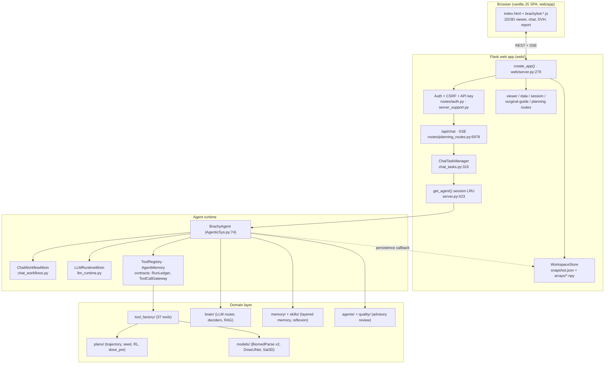
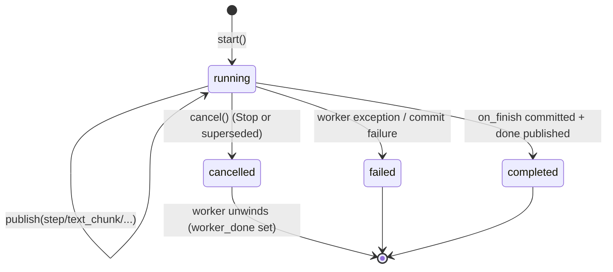
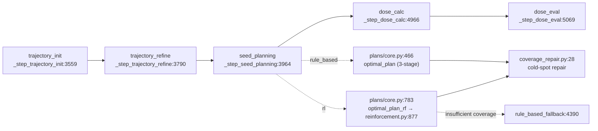
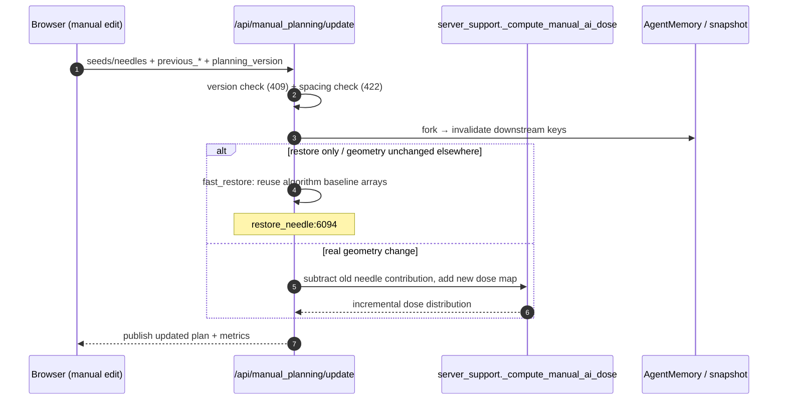
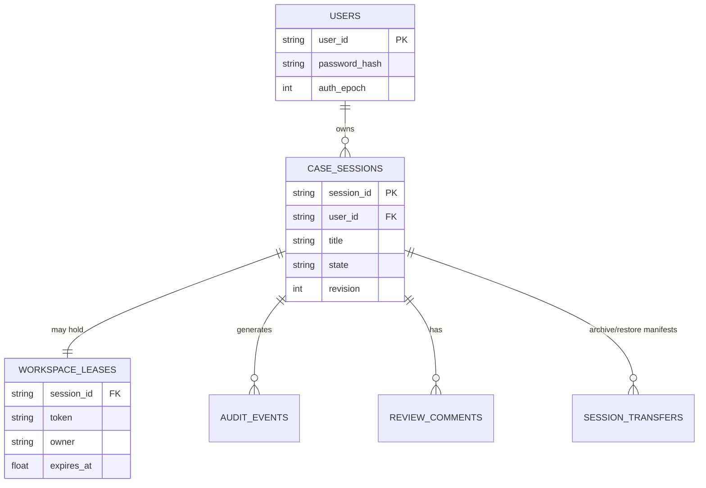

# BrachyBot — Architecture & Maintenance Guide

> **Audience:** engineers maintaining, debugging, and extending BrachyBot.
> **Scope:** end-to-end system architecture, runtime contracts, clinical data flow,
> persistence model, testing strategy, and a maintenance playbook with hard safety
> invariants.
> **Baseline:** commit `f0a2eae63` (branch `codex/session-task-recovery`), 2026-09-15.
> Line numbers are provided as navigation aids; they drift as the code evolves —
> always confirm with the named symbol before editing.
> **Supersedes:** `docs/ARCHITECTURE.md` (2026-06-13) and
> `docs/BRACHYBOT_CODE_IMPLEMENTATION_2026-08-25.md` for architecture questions.

---

## Table of Contents

1. [System at a Glance](#1-system-at-a-glance)
2. [Repository Map](#2-repository-map)
3. [Request Lifecycle: Browser → Flask → Agent → SSE](#3-request-lifecycle-browser--flask--agent--sse)
4. [Runtime Contracts (`agent_runtime/contracts.py`)](#4-runtime-contracts-agent_runtimecontractspy)
5. [Tool System](#5-tool-system)
6. [Planning Pipeline](#6-planning-pipeline)
7. [Dose & Evaluation Domain](#7-dose--evaluation-domain)
8. [Medical Imaging & Safety-Critical Geometry](#8-medical-imaging--safety-critical-geometry)
9. [Web Infrastructure](#9-web-infrastructure)
10. [Brain & LLM Layer](#10-brain--llm-layer)
11. [Memory & Self-Evolution](#11-memory--self-evolution)
12. [Multi-Agent Review & Quality Gate](#12-multi-agent-review--quality-gate)
13. [Frontend Architecture](#13-frontend-architecture)
14. [Persistence Model](#14-persistence-model)
15. [Testing & Verification](#15-testing--verification)
16. [Maintenance Playbook](#16-maintenance-playbook)
17. [Known Hazards & Stale Areas](#17-known-hazards--stale-areas)
18. [Appendix A: File/Line Quick Reference](#appendix-a-fileline-quick-reference)
19. [Appendix B: Environment Variable Reference](#appendix-b-environment-variable-reference)
20. [Appendix C: Glossary](#appendix-c-glossary)

---

## 1. System at a Glance

### 1.1 What BrachyBot Is

BrachyBot is a clinical-grade, LLM-driven brachytherapy treatment-planning
platform. It wraps a full pre-operative and intra-operative planning pipeline
(CT → CTV/OAR segmentation → needle trajectory planning → seed placement →
dose calculation → DVH/constraint evaluation → DICOM-RT / report / surgical
guide export) behind:

- a deterministic **tool factory** (`tool_factory/`, 37 registered tools),
- an **agent runtime** with auditable run contracts (`agent_runtime/`),
- a **Flask web application** with account-owned, lease-protected case
  workspaces (`web/`),
- a multi-provider **LLM brain** (`brain/`, 15 providers) with layered
  memory, reflexion, and skill crystallization (`memory/`, `skills/`),
- a **multi-agent review layer** (`agents/`, `quality/`) that is advisory by
  design, and
- a large **contract-test suite** (`tests/`, ~1,100 collected tests) that
  pins behavior via both unit tests and source-text assertions.

The system is safety-first: clinically risky behavior (trajectory safety,
dose units, mask grids) is guarded by explicit, test-enforced invariants
(see [§16.1](#161-invariants--red-lines)).

### 1.2 Runtime Topology



### 1.3 Entry Points

| Entry | File | Purpose |
|---|---|---|
| CLI dispatcher | `brachybot.py:17` (`main`) | `--chat`, `--server`, or one-shot planning |
| One-shot planning | `brachybot.py:70` (`_run_planning`) | Calls `agent.run_preoperative_plan(...)` |
| Interactive chat | `brachybot.py:94` (`_run_chat`) | Terminal REPL over `agent.chat()` |
| Web launch | `brachybot.py:118` (`_run_server`) | Prints configured providers, calls `web.server.run_server` |
| Shell launcher | `start_server.sh:23` | `setsid python web/server.py --host --port`; defaults `127.0.0.1:8080` |
| Flask factory | `web/server.py:279` (`create_app`) | Blueprints, auth, workspace store, maintenance timers |
| Dev server | `web/server.py:2111` (`run_server`) | Binding policy + `app.run(threaded=True)` |
| Production server | `web/public_server.py:71` (`main`) | Waitress behind TLS reverse proxy, fail-closed env validation |
| Agent class | `AgenticSys.py:74` (`BrachyAgent`) | Composition of three mixins |

### 1.4 Design Principles Observed in the Code

1. **Clinical determinism over agent flexibility.** Lethal operations (seed
   coordinates, dose units, mask grids, needle geometry) are computed by
   deterministic code and only *invoked* by the LLM, never invented by it.
2. **Fail-closed safety.** Unknown/ambiguous geometry (truncated CT, missing
   obstacle masks, mismatched grids) rejects rather than guesses.
3. **Durable case state, disposable process state.** The workspace
   `snapshot.json` + `arrays/` is the single source of truth; in-process
   agents are an LRU cache.
4. **Auditable turns.** Every user turn gets a `RunLedger` entry with bounded
   event history; tool calls pass through a validating gateway.
5. **Advisory, non-blocking review.** Multi-agent review appends feedback and
   flags human review; it must never silently mutate a plan.
6. **Test-pinned UI contracts.** Frontend behavior is pinned by source-text
   tests (including script version strings). Frontend changes are never
   "just JS" changes.

---

## 2. Repository Map

### 2.1 Top-Level Directories

| Path | Responsibility | Key files |
|---|---|---|
| `AgenticSys.py` | `BrachyAgent` composition root: memory, registry, tools, brain init | `BrachyAgent:74`, `_load_tools:666`, `_init_brain_system:185` |
| `brachybot.py` | CLI entry points | see [§1.3](#13-entry-points) |
| `agent_runtime/` | Turn runtime: workflows, LLM loop, intent policy, contracts | `chat_workflows.py`, `llm_runtime.py`, `contracts.py`, `turn_policy.py`, `core.py` |
| `web/` | Flask app, routes, workspace store, chat task manager | `server.py`, `chat_tasks.py`, `workspace_store.py`, `routes/` |
| `tool_factory/` | 37 registered tools; segmentation, planning, dose, UI, web, reporting | `__init__.py`, `seed_plan/planning_pipeline.py` |
| `plans/` | Treatment planning algorithms (rule + RL), dose pre-inference, geometry | `core.py`, `reinforcement.py`, `utilizations.py`, `dose_pre/` |
| `brain/` | LLM provider abstraction, router, deciders, RAG, execution | `core/router.py`, `providers/`, `deciders/` |
| `agents/` | Multi-agent reviewers (plan, fact, safety, completeness) | `orchestrator.py`, `plan_reviewer.py`, `safety_guardian.py` |
| `quality/` | Output quality gate (advisory) | `quality_gate.py` |
| `memory/` | Layered memory, smart context, reflexion, skill crystallization | `layered_memory.py`, `smart_context.py`, `reflexion_engine.py` |
| `skills/` | Python and Markdown skill registry | `skill_base.py`, `markdown/` |
| `models/` | Local model assets (BiomedParse v2, DoseUNet checkpoint) | `ctv/`, `dose_unet_spacing1mm/` |
| `clinical_kb/` | Clinical guideline corpus + sources | `guidelines/` |
| `config/` | Default parameters and prompt modules | `default_params.json`, `prompts/` |
| `utils/` | Cross-cutting helpers (errors, retry, CT utils, op tracking) | `ct_volume.py`, `user_errors.py` |
| `communication/` | Message bus + protocol for multi-agent exchanges | `message_bus.py`, `protocol.py` |
| `scripts/` | Model worker scripts (Sat3D, BiomedParse, nnU-Net) | `sat3d_worker.py` |
| `deploy/` | Public deployment templates (Nginx, systemd, SSH tunnel, account creation) | `deploy/public/` |
| `tests/` | pytest suite + Node `.cjs` contract tests | ~94 `.py`, 5 `.cjs` |
| `docs/` | Design docs, audits, plans (historical; verify line numbers) | this file |
| `benchmarks/` | Playwright-driven benchmark system (v1 archive, v2 active) | `aligned_benchmark.py` |
| `uploads/` | Legacy shared upload directory (historical; new data under `.runtime/`) | — |
| `.runtime/` | Live state: SQLite DB, per-account workspaces, logs, staging | not in git |

### 2.2 "Where Do I Go For X" Index

| I need to change/understand… | Start here |
|---|---|
| Chat behavior, tool dispatch, response text | `agent_runtime/chat_workflows.py`, `llm_runtime.py`, `response_tools.py` |
| Why an instruction ran without the LLM | `agent_runtime/turn_policy.py:1604` + `execution_authorization.py` |
| A tool's parameters/behavior | `tool_factory/<tool>/__init__.py`; register in `AgenticSys.py:666` |
| The 5-step planning flow | `tool_factory/seed_plan/planning_pipeline.py` |
| Seed/trajectory math | `plans/core.py`, `plans/utilizations.py`, `plans/reinforcement.py` |
| Dose units / DVH metrics | [§7.2](#72-unit-conventions-critical), `plans/dose_pre/model_loader.py` |
| CT/mask grid handling | `planning_pipeline.py` loaders; `utils/ct_volume.py` |
| Non-traversable masks | `planning_pipeline.py:1416`, `web/structure_service.py` |
| Case/session persistence | `web/workspace_store.py`, `web/routes/session_routes.py` |
| Chat task/SSE/reconnect | `web/chat_tasks.py`, `routes/planning_routes.py` (chat routes) |
| Auth, API keys, leases | `web/routes/auth.py`, `web/server_support.py`, `workspace_store.py` |
| Viewer rendering | `web/routes/viewer_routes.py`, `web/app/static/js/brachybot-viewer-*.js` |
| Report capture/export | `brachybot-report-*.js`, `routes/planning_routes.py` (report/screenshot routes) |
| LLM provider configuration | `AgenticSys.py:278` (`_auto_detect_llm_provider`), `brain/core/router.py:48` |
| Tests | `tests/` (run from repo root), see [§15](#15-testing--verification) |

---

## 3. Request Lifecycle: Browser → Flask → Agent → SSE

This is the single most important flow to understand for maintenance; most bug
reports land here.

### 3.1 Chat Endpoints

| Endpoint | Location | Behavior |
|---|---|---|
| `POST /api/chat` | `web/routes/planning_routes.py:6978` | Main entry; streaming (SSE) by default. Accepts `message`, `ui_state`, `stream`, `image_path`, `clear_context`, `ui_language`, `request_id`, `*_message_id`, `internal_followup`, `visual_context` |
| `GET /api/chat/task` | `:7431` | Latest/active task public state for refresh recovery |
| `GET /api/chat/tasks/<id>/stream` | `:7474` | Replay + follow-up with `?after_seq=` |
| `GET /api/tasks/stream` | `:7514` | Planning task polling SSE (5 s), unrelated to chat |
| `POST /api/chat/abort` | `:6599` | Explicit Stop; cancels active/live task |

Key validation rules in `/api/chat`:

- `X-BrachyBot-Session` header + authenticated user is resolved to a case
  context (`request_case_context`, `:1796`); cross-account access is rejected.
- `image_path` must belong to the current case (`:7104`).
- `visual_context` is only accepted for visual-child turns (`:7034`).
- Concurrent turn in the same case → HTTP 409 `chat_task_running` (`:7179`).
- A cold (unhydrated) case starts a deferred agent hydration path
  (`agent_supplier`, `:7123`), publishing a `workspace_hydration` step.

### 3.2 Sequence: One Chat Turn (Streaming)

```mermaid
sequenceDiagram
    autonumber
    participant B as Browser (JS)
    participant R as planning_routes /api/chat
    participant T as ChatTaskManager
    participant W as Chat worker thread
    participant A as BrachyAgent
    participant G as ToolCallGateway

    B->>R: POST /api/chat (message, request_id, ...)
    R->>R: auth + case context + validation
    alt task already live for case
        R-->>B: 409 chat_task_running
    else accepted
        R->>T: start(agent or agent_supplier, on_finish)
        T->>T: dedupe by request_id / predecessor barrier
        T->>W: spawn daemon thread
        R-->>B: SSE task_meta (task_id, ids, language)
        W->>A: (optional hydration) then chat_with_stream(message)
        loop each agent event
            A-->>W: step / text_chunk / planning_preview / ...
            W->>T: publish(event) (bounded journal, seq numbers)
            T-->>B: SSE data (replay-safe)
        end
        A-->>W: done event
        W->>W: hold done; call on_finish
        W->>T: persist transcript + schedule checkpoint
        T-->>B: SSE done (or error)
        W->>T: mark worker_done
    end
```

### 3.3 Chat Task Lifecycle

`ChatTask` (`web/chat_tasks.py:54`) is the durable unit of a chat turn,
independent of the HTTP connection. Statuses are `running`, `completed`,
`failed`, `cancelled`.



Critical mechanics:

- **Event journal** (`publish:145`, `iter_events:233`): bounded at
  `MAX_TASK_JOURNAL_EVENTS = 2000`; `_event_base` keeps absolute sequence
  numbers stable across trims. Subscribers older than the retained window
  replay from the oldest available event (no error).
- **Step metadata** (`steps`) is bounded separately (`MAX_TASK_STEPS = 2000`).
- **`workspace_checkpoint` step events are suppressed** (`:156`) — persistence
  is not a user-visible tool step.
- **`done` is held** until `on_finish` (transcript + checkpoint scheduling)
  succeeds (`:616-687`). A commit failure publishes an `error` instead.
- **Cancellation** (`cancel:197`) writes a terminal `done {cancelled:true}`
  event immediately so all subscribers stop; the worker notices
  `is_running() == False` and unwinds. `cancel_session:744` additionally
  waits for `worker_done` — required before moving/deleting a workspace.
- **Predecessor barrier** (`start:419-501`): a new turn in the same case waits
  for the prior worker to fully leave the agent (`live()`, not `status`).
  Concurrent mutation of one `AgentMemory` is forbidden.
- **Internal follow-ups** (visual analysis children) are identity-bound to
  the exact parent `request_id` + message ids (`:429-460`); a mismatched child
  is rejected rather than attached to an unrelated turn.

### 3.4 SSE Event Catalog

Emitted by the agent workflow and relayed by the task journal:

| Event | Payload (abridged) | Meaning |
|---|---|---|
| `task_meta` | task/request/message ids, language, brain availability | Handshake before replay |
| `brain_status` | `{available, source}` | LLM availability boundary |
| `step` | `{id, type, tool, title, status, content, result?}` | Execution trace / todo row |
| `text_chunk` | partial text | Interim assistant text |
| `final_text_chunk` | `{text}` | Final answer, 24-char chunks (`chat_workflows.py:3691`) |
| `planning_preview` | plan summary before full evaluation | Early planning display |
| `progress` | progress hints | Long operations |
| `response` | `{response, ...}` | Authoritative final text (`:3699`) |
| `done` | `{}` or `{cancelled:true}` | Terminal protocol boundary |
| `error` | `{message}` | Failure |
| `: brachybot-task-alive` | comment frame | Idle heartbeat (10 s) |

**Do not rename events** without updating: the frontend stream parser
(`brachybot-chat-todo.js`), `ChatTask.publish` state extraction
(`chat_tasks.py:150-181`), and recovery tests.

### 3.5 Turn Workflow Phases in Detail

`_chat_with_stream_impl` (`agent_runtime/chat_workflows.py:3502`) runs:

1. **Turn setup** (`_begin_turn:3513`): new turn token + generation,
   `TurnExecutionAuthorization`, `run_ledger.begin(...)`. Non-child turns
   persist the user message (`:3517`).
2. **Language resolution** (`:3519`) and **local classification**
   (`classify_local_turn`, `turn_policy.py:1604`) → `_activate_turn_policy:3800`
   installs execution grants and an `ActionPlan`.
3. **Local direct answers** (`:3872-3940`): deterministic read-only queries
   (case state, metrics, provenance) answered without the LLM.
4. **Direct execution** (`:3942-4080`): report generation, viewer display,
   session-content queries, planning sub-step streams.
5. **Direct tool calls** (`:4212-4565`): when the policy grants specific tools,
   `_detect_tool_request` + grants execute them without an LLM round-trip.
6. **LLM function-calling** (`:4597`, implemented in `llm_runtime.py:1912`),
   with a lightweight path for small talk (`:4590`).
7. **Review** (`:4695-4958`): plan review / completeness appendices; fact-check
   notes after web tools.
8. **Workflow enforcer** (`:4973-5218`): fills missing prerequisites
   (segmentation/planning) for clinical intents; surgical guide only with an
   explicit grant (`:5172`).
9. **Finalization** (`:3595`): `final_text_chunk` chunks, authoritative
   `response`, then `done` (`:5346`); cancellation path at `:3713`.

### 3.6 Local Turn Classification

`classify_local_turn` (`turn_policy.py:1604`) is a deterministic pre-router.
Representative categories (each maps to allowed tools/grants):

`small_talk`, `planning_provenance_query`, `planning_assessment_query`,
`case_state_question`, `segmentation`, `clinical_planning` (fixed 4-step
ActionPlan at `:1883`), `report_generation`, `viewer_display`,
`dose_recompute`, `surgical_guide_generation`,
`session_visual_location_query`, `session_visual_discovery_query`,
`ui_control_location_query`, `ui_operation`, `session_content_query`,
`current_oar_query`, `case_dose_query`, `knowledge_query`,
`external_project_query`, `clinical_knowledge`, `ui_control`,
`visual_analysis` (`:84`), with a `semantic_action` fallback (`:2056`).

**Maintenance note:** adding/removing categories changes which requests bypass
the LLM. There are dedicated tests (`tests/test_runtime_contracts.py`,
`tests/test_semantic_execution_authorization.py`) that pin this behavior.

### 3.7 LLM Function-Calling Loop

`llm_runtime.py` non-stream at `:601`, stream at `:1912`. Per iteration:

1. Build messages: language directive, no-CT override (`:686`), enhanced
   memory/SOP/preference context (`:692`), query type, ActionPlan (`:781`),
   system/runtime context (`:787`), smart context or last-12 fallback
   (`:793-836`), current multimodal message (`:840`).
2. Pack with `ContextPackBuilder` (`_pack_context_for_provider:571`), record
   the manifest in the run ledger.
3. Filter tool schemas: by CT availability / external-project mode / visual
   child (`:2358-2396`) then `filter_tool_schemas` (`:2401`).
4. Parse tool calls: native calls or textual ```tool_call blocks
   (`_parse_tool_calls:2522`), normalize params, apply
   `grant_tool_calls` + `tool_allowed` (`:2696-2715`).
5. Execute sequentially with streaming daemon threads + heartbeats
   (`:3009-3054`); append results as `tool_calls`/`tool` messages (`:3334`).
6. Terminate on: no tool calls, all-duplicate calls, cancellation, read-only
   single result, screenshot-only, missing inputs, or iteration cap — caps are
   `3` for knowledge/external/clinical_knowledge intents, `5` for
   `semantic_action`, `6` otherwise (`:997`, `:2271`). Provider failure emits
   an `llm_unavailable` step (`:2488`); an empty reply is retried once
   (`:2589`); the final result is emitted at `:3527`.

### 3.8 Execution Authorization & ActionPlan

- `TurnExecutionAuthorization` (`execution_authorization.py:68`) is created per
  turn. `MUTATING_TOOLS` (`:24`) cannot run without a grant; `tool_allowed`
  (`:137`) permits planning-workflow-derived `ctv`/`oar`/pipeline calls.
- `ActionPlan` (`action_plan.py:46`) models the intended tool sequence:
  `from_tool_calls:79`, `merge:146` (keeps first occurrence order),
  `ordered_steps:219` (dependency topo-sort). Clinical planning uses a fixed
  4-step plan.
- Grants live only in turn memory — they cannot leak across turns or replays.

### 3.9 Cancellation and Turn Tokens

- `BrachyAgent._cancel_active_turn` (`AgenticSys.py`, search symbol;
  `chat_workflows.py:2482`) increments the turn generation, so every later
  `_is_turn_cancelled` check (`:2513`) in LLM/tool loops sees the stale token
  and unwinds.
- `ChatTask.cancel` + `agent._cancel_active_turn` are always paired by
  `ChatTaskManager.cancel:731`.
- `_skip_finalization` prevents a superseded/cancelled worker from checkpointing
  after the next turn has taken ownership.

### 3.10 Concurrency Invariants

1. **One live worker per (user, case)** — enforced by `ChatTaskManager`
   (`live()` + predecessor barrier + HTTP 409).
2. **One agent per (user, case)** — `_sessions` LRU with per-key initializer
   events (`server.py:423-495`).
3. **Never trust public task status for lifecycle decisions** — use
   `live()`/`wait_for_worker`; `cancel()` flips status before the thread
   actually exits.
4. **Workspace deletion** must call `cancel_session` and wait
   (`chat_tasks.py:744`), otherwise files may move under a live reader.

---

## 4. Runtime Contracts (`agent_runtime/contracts.py`)

Provider-neutral discipline layer around the established execution path. It
adds auditability and validation, not a new execution model.

### 4.1 RunLedger

`RunLedger` (`contracts.py:108`) is a case-local, bounded ledger.

| API | Line | Behavior |
|---|---|---|
| `begin(message)` | `:117` | Supersedes a non-terminal active run (`run.superseded`), archives it, starts a new `AgentRun` in `reasoning` |
| `transition(status, kind, **detail)` | `:133` | Moves the active run; terminal statuses archive and clear active |
| `record_tool(...)` | `:150` | Increments tool counter, appends `tool.completed`/`tool.failed` |
| `set_context_manifest(...)` | `:161` | Stores the context-pack manifest |
| `export_state` / `restore_state` | `:167` / `:174` | Persistence; restore marks previously-running runs as `interrupted` (except `awaiting_input`) and never revives them |

`AgentRun.transition` (`:87`) refuses to resurrect a terminal run. `RunStatus`
(`:23`): `queued`, `reasoning`, `awaiting_input`, `executing_tool`, `reviewing`,
`completed`, `failed`, `cancelled`.

### 4.2 ContextPackBuilder

`ContextPackBuilder` (`:193`, defaults 12,000 / reserve 2,000 tokens) builds a
bounded, portable message pack:

- keeps all system messages,
- walks non-system messages newest-first until budget,
- converts historical `tool` messages into `user` evidence with a 1,400-char
  truncation notice (`_compact_tool_content:218`) — this avoids emitting
  invalid provider tool-message sequences after compaction,
- always appends the current user content,
- returns `(messages, manifest)` with token estimates, retained/dropped counts.

CJK text is costed at ~1 token/char, ASCII at ~1/4 (`_estimate_tokens:52`).

### 4.3 ToolCallGateway

`ToolCallGateway` (`:300`) is the single validation + journaling boundary:

- **Validation** (`validate:347`): unknown tool, missing required fields
  (→ `awaiting_input`), declared-type mismatch, enum mismatch. Fields marked
  `"x-server-injected": true` are exempt — they are trusted, server-supplied
  objects (e.g. SimpleITK images) and are also stripped from the provider
  schema by `ToolRegistry._llm_properties` (`core.py:205`).
- **Idempotency cache** (`execute:382`): **only** `_CACHEABLE_TOOLS =
  {"clinical_kb"}` (`:315`) may reuse results, keyed by
  `ToolCall.idempotency_key` (`:290`, includes workspace revision). Viewer,
  UI, metrics, and model-availability tools must never be cached.
- **Journaling**: `tool.started` → execute → `tool.returned`, with duration;
  exceptions are converted to failed `ToolResult`s so a malformed tool can
  never escape the trace.

---

## 5. Tool System

### 5.1 ToolResult / BaseTool

`tool_factory/__init__.py`:

- `ToolResult` (`:21`): `success`, `data`, `message`, `display`, `metadata`,
  `error`, `execution_time`.
- `BaseTool` (`:71`): subclasses implement `_execute(**kwargs)`; the public
  `execute` validates, times, and wraps exceptions into a failed `ToolResult`.

### 5.2 ToolRegistry

`agent_runtime/core.py:70`:

| Method | Line | Notes |
|---|---|---|
| `register` / `unregister` | `:81` / `:85` | Invalidates the schema cache |
| `get` | `:92` | Raises `KeyError` with available names |
| `is_available` | `:97` | Calls optional `tool.is_available()`; exceptions → `False` |
| `list_tools` | `:109` | Availability-filtered metadata |
| `execute` | `:121` | Thin forwarder to `tool.execute` |
| `to_openai_tools` | `:129` | Cache key includes availability + description + schema repr; supports nested and flat schemas |
| `_llm_properties` | `:205` | Removes `x-server-injected` fields from provider schemas |

### 5.3 Registered Tool Inventory (37)

Registered in `AgenticSys._load_tools:666` (optional tools fail soft with a
warning if their imports/weights are missing):

| Category | Tools |
|---|---|
| Segmentation | `CTVSegmentationTool` (per-site CTV), `BiomedParseV2GenericSegmentationTool` (open anatomy prompts; never auto-promoted to CTV/OAR), `CTVModelCatalogTool`, `OARSegmentationTool` |
| Planning | `TrajectoryPlanningTool`, `SeedPlanningTool`, `SeedSegmentationTool` (intra-op), `PlanningPipelineTool` (unified 5-step) |
| Dose | `DoseEngineTool` (CNN/gaussian), `CurrentPlanDoseRecomputeTool`, `DoseEvaluationTool` |
| Reporting / export | `ReportGeneratorTool`, `ReportAutoFillTool`, `DicomRTExporterTool` |
| UI / viewer | `UIInspectorTool`, `UIControllerTool`, `UIScreenshotTool`, `UISessionContentTool`, `UIAnnotateTool`, `QueryMetricsTool` |
| Clinical knowledge / memory | `CaseMemoryTool`, `ClinicalKnowledgeBaseTool`, `PlanComparatorTool`, `PlanQualityScorerTool`, `OARConstraintCheckerTool`, `PlanRefinementTool`, `SafetyValidatorTool` |
| Surgical guide | `SurgicalGuideTool` (constructed with the agent) |
| Web | `WebSearchTool`, `WebFetchTool`, `WebAccessTool` |
| Developer (opt-in env gated) | `CodeExecutorTool`, `ShellExecutorTool`, `EnvManagerTool`, `ToolCreatorTool`, `FilesystemBrowserTool`, `DocumentReaderTool` |

Developer tools are disabled by default and only enabled through explicit
`BRACHYBOT_ENABLE_*` environment variables (see
[Appendix B](#appendix-b-environment-variable-reference)).

### 5.4 Result Formatting Pipeline

`ToolResultPipeline` (`agent_runtime/core.py:885`):

- `format:940` selects output with priority: explicit `display` > category
  mapping (segmentation/planning/...) > `display_message` > `message`.
- `synthesize:2332` performs one LLM synthesis pass over evidence; evidence-only
  results never fall back to raw dumps.

### 5.5 Dynamic Tool Creation

`brain/core/tool_code_writer.py:76` (`ToolCodeWriter`) generates Python source,
imports it via `importlib`, and registers a wrapper
(`tool_factory/tool_creator/__init__.py:29` `DynamicTool`). This path is
environment-gated (`BRACHYBOT_ENABLE_TOOL_CODE_WRITER`,
`BRACHYBOT_ENABLE_TOOL_CREATOR`) and must be treated as a development-only
capability, not a clinical one.

---

## 6. Planning Pipeline

### 6.1 Pipeline Overview

`tool_factory/seed_plan/planning_pipeline.py:2739` implements the unified
5-step pipeline. Step enum at `:2790`; dispatcher `_execute:2852` (step
dispatch at `:3116`).



### 6.2 Step Contracts

| Step | Input | Work | Output keys |
|---|---|---|---|
| `trajectory_init` (`:3559`) | CT/CTV/OAR/ref direction | Resample to 128³, `plans/core.py:204 init_plan` cone sampling, safety filter | `trajectories`, `resampled_ct/ctv/oar`, `radiation_volume`, `ref_direc_voxel` |
| `trajectory_refine` (`:3790`) | trajectories | Depth + world-obstacle filtering; auto re-runs step 1 if missing | `refined_trajectories` |
| `seed_planning` (`:3964`) | refined trajectories | Rule or RL planning; validated needle geometry trimming; snapshot build | `seed_plan`, `seed_plan_serialized`, `verified_needle_geometry`, `needle_safety_context`, `algorithm_plan_snapshot`, `dose_distribution`, `plan_config` |
| `dose_calc` (`:4966`) | seed plan | Resample planning-grid dose back to original CT | `dose_distribution_gy` |
| `dose_eval` (`:5069`) | dose + resampled masks | DVH + metrics | `dose_metrics`, `algorithm_plan_dose_metrics`, `dvh_data` |

`_execute` (`:2852`) opens a planning run (`begin_planning_run`), publishes
progress (`full`/`dose_eval` publish as `completed`, others `running`), and on
failure marks the run failed and restores the parent run. There is no
cross-step automatic retry; each step self-checks and re-runs prerequisites.

### 6.3 State Ownership & Persistence

- Planning state lives in `AgentMemory.planning_results` (`core.py:233`,
  `store:294`) with monotonic `_planning_versions` per key (`:238`) used to
  reuse unchanged array sidecars.
- The web layer persists it via the workspace sidecar (`web/server.py:586`)
  and per-run records (`planning_run:<id>`, `web/planning_runs.py`).
- `AgentMemory.store` also updates `conversation_state["data_available"]` so
  routing/context know what exists without copying arrays into prompts.

### 6.4 Algorithm Layer

- `plans/core.py:204 init_plan` — candidate trajectory generation.
- `plans/core.py:466 optimal_plan` — 3 stages: trajectory selection + seed
  placement to a DVH rate, replan refinement, sequential remove/add polish.
  Outputs world coordinates.
- `plans/core.py:783 optimal_plan_rf` → `plans/utilizations.py:4291` →
  `plans/reinforcement.py:877 reinforcement_planning` (hierarchical REINFORCE:
  high-level needle selection, low-level seed placement).
- `plans/coverage_repair.py:28` — budget-bounded cold-spot repair, accepted
  only if the full-dose objective improves.
- `plans/dose_pre/inference.py:479 predict_seed_doses` — batched DoseUNet
  inference; consumed by `plans/utilizations.py:956`.
- Mode normalization: `planning_pipeline.py:577 normalize_planning_mode`
  (only `rule_based`/`rl`). Legacy `auto` resolves via config `use_rf` in the
  old synchronous entry point.

### 6.5 Mode Selection & Fallbacks

1. Requested mode (`rule_based` / `rl`).
2. RL result with insufficient coverage and a strictly better rule-based
   result ⇒ `rule_based_fallback` (`:4390`).
3. Both modes share `coverage_repair`.
4. `_validated_needle_geometry` (`:2465`) removes needles that fail physical
   safety validation before results are published.

### 6.6 Planning APIs

| Endpoint | Location | Notes |
|---|---|---|
| `POST /api/planning/run_step` | `routes/planning_routes.py:3678` | Runs one step (or `full`) via `tool._execute(_agent=agent)`; config precedence: request > `plans/config.json`; heavy arrays fetched via `show_step:3200` |
| `POST /api/plan/preoperative` | `:6435` | Old synchronous path: `chat_workflows.py:5777 run_preoperative_plan` (ctv/oar → radiation volume → trajectory → seed → dose eval) |
| `POST /api/plan/intraoperative` | `:6533` | Seed segmentation + deviation matching; above threshold triggers replan |
| `POST /api/manual_planning/update` | `:5136` | Manual seed/needle edits; see [§6.7](#67-manual-editing--algorithm-baseline-reuse) |
| `GET /api/planning/status` | `:6328` | Case planning state |
| Planning history | `web/planning_runs.py:383/455/558/669/703` | Run list/snapshots |

### 6.7 Manual Editing & Algorithm Baseline Reuse

The core promise: an accidental drag can be cheaply undone using the immutable
validated algorithm baseline, while complex edits use AI dose recomputation.



Key locations:

- Baseline snapshot: `planning_pipeline.py:2638 _build_algorithm_plan_snapshot`
  → `algorithm_plan_snapshot` (world-coordinate seeds/needles) plus
  `algorithm_plan_dose_distribution(_gy)` and `algorithm_plan_dose_metrics` /
  `dvh_data`.
- Snapshot read priority: `routes/planning_routes.py:1307
  _current_planning_snapshot`: `manual_seeds/needles` → `seed_plan_serialized`
  → `algorithm_plan_snapshot`.
- Incremental base switch: `server_support.py:2725` (`manual_ai_dose` flag).
- Restore fast path: `planning_routes.py:6094 restore_needle` reuses baseline
  arrays when only the restored needle changed; otherwise
  `_compute_manual_ai_dose` (`server_support.py:2350`).
- Incremental dose: automatic plans cache each seed's dose map in
  `seed_plan[i][2]`; single-seed edits add/subtract only that map. Seed
  positions are reprojected to the needle line on drag.

---

## 7. Dose & Evaluation Domain

### 7.1 Engines

| Engine | Path | Notes |
|---|---|---|
| CNN dose (DoseUNet) | `tool_factory/dose_engine/cnn_dose_engine.py:116` → `plans/utilizations.py:1118` → `plans/dose_pre/inference.py:479` | 12 cm crops, 1 mm spacing, line/ct/soft 3-channel input, sliding window |
| Gaussian approximation | `tool_factory/dose_engine/gaussian_dose_engine.py` | Analytic fallback |
| Plan recompute | `tool_factory/dose_recompute/` (`CurrentPlanDoseRecomputeTool`) | Recompute current plan dose from stored seeds |
| Evaluation | `tool_factory/dose_eval/__init__.py:41` → `comprehensive_dose_evaluation.py:116` | Independent evaluation path; `vx_metrics.py:104`, `dx_metrics.py:83`, `dvh_utils.py:19` |

### 7.2 Unit Conventions (Critical)

These conventions are load-bearing and test-pinned. Violating them produces
clinically wrong numbers.

| Quantity | Convention | Where |
|---|---|---|
| Model output → Gy | `model_output * dose_scale_gy`; default `190.8`; legacy `120` is a fallback for old plans only | `plans/dose_pre/model_loader.py:19`, `resolve_dose_scale_gy:112` |
| Prescription default | `120 Gy` (report tool treats Rx ≤ 5 as a multiple of 120) | `model_loader.py:26`, `report_generator/__init__.py:92` |
| V100/V150/V200 internally | **fraction (0–1)**, including OAR | `planning_pipeline.py:5386`, `:5214`, `:5290` |
| DVH curve volumes | **percent (0–100)** | `dvh_utils.py:79 build_cumulative_dvh` |
| Report boundary | converts fraction → percent **exactly once** | `web/server_support.py:536 _volume_metric_as_percent` |
| Clinical agent metrics | `agents/clinical_metrics.py:41 normalized_fraction` (>1.5 treated as percent) | — |
| D90 and friends | `dose_at_volume:5209` (ceil); Dxcc must use planning-grid spacing (`:5254`) | — |
| Dose distribution keys | `dose_distribution` (model units) and `dose_distribution_gy` (Gy) are distinct | `_step_dose_calc:4966` |

**Never** re-scale legacy plans with the new default; legacy plans keep their
recorded scale.

### 7.3 Metrics & DVH

- Vx/Dx and DVH are computed in `_step_dose_eval` (`:5069`) from the resampled
  masks (the planning grid, not the display grid).
- `dose_metrics` is the canonical per-case result; separate
  `algorithm_plan_dose_metrics` preserves the baseline for comparison.
- `web/planning_runs.py` records metric history per run.

### 7.4 Dose Recompute

`dose_recompute` exists as a distinct user-facing capability
(`turn_policy` category `dose_recompute`; tool
`CurrentPlanDoseRecomputeTool`). It recomputes dose for the *current*
manual/algorithm plan without re-optimizing needle positions. Progress is
surfaced as a persistent indeterminate row rather than a fake percentage.

---

## 8. Medical Imaging & Safety-Critical Geometry

### 8.1 Input Formats

- CT: `.nii` / `.nii.gz` / `.mhd` / `.dcm` / DICOM directories.
  DICOM directory loading prefers the CT series, then the most numerous series
  (`web/server.py:1345 _load_ct_image_raw`).
- Generic loader: `tool_factory/image_processing/image_loader.py:91`
  (`.nii.gz`, `.mhd`, `.dcm`, directories).
- Normalization: `utils/ct_volume.py:10` — 4D takes frame 0; vector images take
  the first component; spacing/origin/direction preserved.
- Mask formats mirror CT; uploaded multi-label masks are staged and can be
  promoted to CTV or merged into OAR only after explicit user action
  (`tests/test_uploaded_mask_staging.py` pins this).

### 8.2 The LPI + Physical Grid Contract

**Red line.** Every image and mask is oriented to `DICOMOrient('LPI')`:
`planning_pipeline.py:523/3308/3438/3513`, `workspace_store.py:3543`.

- A label and its CT must share the **same physical grid**. Same shape but
  different origin/direction ⇒ reject (`_normalize_mask_to_ct_grid`,
  `planning_pipeline.py:2707`).
- CTV is always binarized (label 1 = target; source labels 2/3 are treated as
  vessel obstacles). Original multi-label data is preserved as
  `ctv_full_labels`.

Any change touching resampling, orientation, or mask loading must run the
geometry/dose tests and be manually verified against a known case.

### 8.3 Segmentation Routing

- Dispatcher: `tool_factory/CTV_seg/__init__.py:435`; registry at `:96`
  (pancreas nnU-Net, liver/kidney cascades, BiomedParse v2 for others; SAT3D is
  explicit interactive only, `:90-109`); alias normalization `:126`.
- BiomedParse v2: `biomedparse_v2.py:52 SITE_SPECS`, windowing `:399-431`,
  LPI enforcement `:626`, isolated-venv subprocess `:537-597`, availability
  `:1015`. Empty masks produce a diagnostic, never a fabricated mask
  (`__init__.py:680-736`).
- OAR: `OAR_seg/__init__.py:116`; TotalSegmentator subprocess with lock +
  timeout (`totalsegmentator_oar.py:523-682`). The legacy VoCo OAR path is
  disabled (no inverse transform) at `OAR_seg/__init__.py:28-33`.
- Failure returns `success=False`; there is no silent cross-model fallback.

### 8.4 Data Tree

- `web/structure_service.py:409` builds the effective CTV/OAR registry shown in
  the UI; traversability edits at `:969` (PATCH
  `web/routes/data_routes.py:313`).
- Classification changes invalidate downstream keys listed in
  `_DOWNSTREAM_KEYS` (`structure_service.py:37`): trajectories, seeds, dose,
  metrics, etc.
- Open anatomy prompts create reviewable masks and are never auto-promoted.

### 8.5 Non-Traversable Masks & Trajectory Validation

This is the core geometric safety subsystem.

- Mask construction: `planning_pipeline.py:1416 _build_radiation_volume`
  (CTV labels 2/3 + TotalSegmentator organ list; default list `:61-101`;
  Data Tree resolution `:307`).
- Consumers: trajectory filter `:1470` / `:1516` / `:2403`, final needle
  validation `:2465`, 3D meshes `viewer_routes.py:336`.
- Grid sampling is bidirectional; the world-coordinate full-needle check
  (`:2403`, `:2146`) validates 150 mm of needle with step ≤ half the minimum
  spacing (`_NeedleSafetyContext:2025`). A truncated CT face is **fail-closed**
  (`:2176`).
- Candidate world needles: `_candidate_world_needle_points:1560` reuses
  `plans/utilizations.position/direction_transform`; input fingerprinting at
  `:153` / `:204`.

### 8.6 Needle/Seed Geometry Rules

- Needle tip ends at the **farthest seed center**
  (`_clip_needle_to_farthest_seed:1633`, `_seed_derived_needle_points:1726`);
  the outer extension is 150 mm (`_needle_extension_mm:1530`).
- Only seeds inside the target/OAR geometry contribute; geometry validation
  happens in physical coordinates before display (`_validated_needle_geometry:2465`).
- Manual seed edits are reprojected onto the needle line; needle spacing is
  validated (422 on violation).

### 8.7 3D Mesh Fidelity

- `viewer_routes.py:1952` (`/3d`), `:2078` (`/3d_mask`), `:2482` (`/3d_skin`).
- `_requires_label_faithful_mesh:336` decides fidelity:
  - CTV and non-traversable structures keep exact voxel boundaries
    (`geometry_mode` at `:2404`).
  - Ordinary anatomy may be dilated/filled/Laplacian-smoothed
    (`:2278-2305`, `:2360`).
- **Never apply cosmetic dilation/smoothing to safety masks** — the viewer must
  not visually contradict trajectory validation (README safety notes;
  `viewer_routes.py:336-349`).
- Mesh cache: in-process `_MESH_CACHE` (96 items, `server_support.py:217-220`)
  plus disk cache `artifacts/viewer-cache/v1/...` with atomic writes and
  size/count trimming (`viewer_cache.py:75-97`). Cache keys include the mask
  digest and CT geometry.

---

## 9. Web Infrastructure

### 9.1 App Creation & Blueprints

`create_app` (`web/server.py:279`):

- Flask static folder = `web/app` (`:294`); CORS from `ALLOWED_ORIGINS` or
  trusted-network mode (`:296-316`).
- Upload cap 500 MB (`:317`).
- `WorkspaceStore` (`:319`) → `configure_auth` + `register_auth_routes`
  (`:324-325`).
- Maintenance timers: trash purge (`:327-343`), cold-case archive
  (`:970-988`).
- Blueprints registered at `:2032-2048`: viewer, planning, surgical guide,
  data, session.
- Auth hook (`routes/auth.py:171-182`): all `/api/*` require a session cookie
  (except `/api/auth/`); mutating calls require CSRF.
- Lease guard (`server.py:1026-1089`): workspace mutation requires the lease
  (409 `workspace_locked`).
- Post-request checkpoint scheduling (`_checkpoint_mutating_workspace:990`),
  with a read-only POST whitelist (`:90-106`).

### 9.2 Route Inventory (by blueprint)

| Blueprint | Representative routes |
|---|---|
| `web/server.py` core | `/` (SPA), `/api/upload:1099`, `/api/import/dicom_rt:1241`, `/api/viewer/image:1298`, `/api/header/info:1541`, `/api/report/auto-fill:1727` |
| `planning_routes.py` | `/api/segmentation:3248`, `/api/planning/run_step:3678`, `/api/manual_planning/update:5136`, `/api/status:6328`, `/api/plan/preoperative:6432`, `/api/plan/intraoperative:6530`, `/api/chat:6975`, chat task/stream endpoints, report/STL/DICOM exports `:6706-6841`, `/api/export/report:7576`, screenshots `:7753/8056` |
| `viewer_routes.py` | `/api/viewer/load:597`, `/slice:851`, `/volume:988`, `/label_volume:1036`, `/overlay:1483`, `/3d:1952`, `/3d_mask:2078`, `/3d_skin:2482` |
| `session_routes.py` | `/api/sessions` CRUD `:78-323`, `/api/workspace/snapshot:372`, `/state:391`, `/checkpoint:464`, `/lease:492`, audit `:519`, review comments `:533` |
| `data_routes.py` | `/api/data/catalog:208`, structure classification/delete `:225-575`, export jobs `:576-669`, structure PATCH `:313` |
| `surgical_guide_routes.py` | guide generation/export `:204-355` (STL only) |
| `auth.py` | login/register/password `:241-343` |

### 9.3 Agent Session Cache & Hydration

- Cache key = `(user_id, session_id)` (`server.py:449`), LRU 50, TTL 3600 s
  (`:373-374`).
- Per-key initializer events prevent duplicate concurrent hydration
  (`:461-495`).
- `BrachyAgent(session_id, config)` is constructed with
  `_workspace_state_dir=<case>/agent_state` (`:526-535`) so memory/skills never
  leak across cases.
- Synchronous restore loads JSON metadata only; heavy arrays (CT first, then
  planning results) hydrate in background
  (`_complete_workspace_hydration:607-759`), retried if interrupted by a
  concurrent write.
- Eviction/expiry schedules a checkpoint (`schedule_agent_checkpoint:513/822`).

### 9.4 Account/Case/Workspace Model



A session **is** a case (one CT/case per session). The workspace directory
holds all case state.

### 9.5 Workspace Store

`web/workspace_store.py` (note: ~5,200 lines — the biggest module to treat
carefully):

- Snapshot envelope (`_empty_snapshot:2264`): `schema_version`, `session_id`,
  `saved_at`, `agent` (config, patient_data, conversation, tool_results,
  conversation_state, ui_state, planning_results, planning_versions,
  runtime_state), `ui`, `report`, `chat`, `operation`.
- Checkpoint pipeline: 0.75 s debounce (`:3571`) → `_prepare` (`:2687`, encodes
  arrays) → generation double-check (`:2588/2613/2992`, stale snapshots cannot
  overwrite newer state) → `_commit` (`:2975`, merge + remove unreferenced
  `.npy` + revision increment).
- Manual flush `flush_agent_checkpoint:3661`; discard on delete
  `discard_agent_checkpoint:3685`.
- Chat state uses revision CAS; conflicts return 409 (`session_routes.py`).

### 9.6 Leases

- Table `workspace_leases`; token ≥ 16 chars; TTL clamped 15–300 s (default 75).
- Acquire: active lease owned by another account without `force` ⇒ 409
  (`:3855-3897`). `assert_editable:3904` gates all mutations.
- Rationale: multiple browser tabs must not interleave edits on one case.

### 9.7 Uploads & Imports

- `/api/upload` (`server.py:1099` → `write_upload`): single files to the case's
  `inputs/` (`:1143`); multi-file DICOM to `inputs/dicom_<ts>/` (`:1191`);
  failure rolls the whole batch back (`:1200-1219`).
- `/api/import/dicom_rt` (`:1241`) → `inputs/imports/dicom_rt/`, metadata in
  `AgentMemory.imported_dicom_rt` (`:1282`). RT import is read-only and needs
  manual registration.
- Legacy `uploads/` (`server_support.py:41`) is history only; new data always
  lives under `.runtime/workspaces/...`.

### 9.8 Viewer Endpoints

| Endpoint | Line | Behavior / caching |
|---|---|---|
| `/api/viewer/load` | `:597` | Lightweight agent; same `ct_path` returns restored metadata; new CT ⇒ LPI normalization + case state reset |
| `/slice` | `:851` | Per-request PNG base64 (window/level + MPR resample); no cache |
| `/volume` | `:988` | Raw int16 ZYX blob (optional gzip); no cache |
| `/label_volume` | `:1036` | CTV uint8 / OAR uint16 |
| `/overlay` | `:1483` | Per-slice RGBA PNG per label color/opacity; no cache |
| `/3d` | `:1952` | Marching cubes each call; no cache |
| `/3d_mask` / `/3d_skin` | `:2078` / `:2482` | Two-level cache (process + disk); see [§8.7](#87-3d-mesh-fidelity) |

### 9.9 Report & Export Endpoints

- Auto-fill: `/api/report/auto-fill` (`server.py:1727`).
- Export: `/api/export/report` (`planning_routes.py:7576`; JSON/HTML; PDF
  returns 501), `/api/export/dicom_rt` (`:6706`, RTSTRUCT/RTPLAN/RTDOSE,
  unapproved), STL via surgical guide (`surgical_guide_routes.py:300`).
- Report figures are **captured in the browser**:
  `brachybot-report-editor.js:512/518` (capture/lifecycle), contract strings
  `:1062-1076`, duplicate-pixel guard `:1558`; upload via
  `brachybot-workspace.js:1509` → `POST /api/screenshot` (mode `report`,
  idempotent names by `planningId` + axis, routes `:7886-7900`); annotation
  `:8056` validates sha256 + ownership.
- `ui_screenshot` tool only reads stored screenshots; it never triggers a new
  capture (`tool_factory/ui_screenshot/__init__.py:4,96`).

### 9.10 Security Model

Two independent boundaries:

1. **Machine/API boundary** (`server_support.py:182-190`):
   - `X-API-Key` constant-time compared (`require_api_key:3643`).
   - `BRACHYBOT_REQUIRE_API_KEY` forces a key at startup; missing key with
     requirement ⇒ refuse to start.
   - Non-loopback binds require `BRACHYBOT_API_KEY` (+ secure cookie config),
     unless the explicit unsafe `BRACHYBOT_ALLOW_INSECURE_REMOTE=1`
     (`server.py:2072-2108`).
   - Screenshots may use HMAC-signed URLs (`:3555-3629`).
   - `BRACHYBOT_TRUST_NETWORK` relaxes rate limits only, not key checks.
2. **User boundary** (`routes/auth.py:142`):
   - Cookie sessions signed with `BRACHYBOT_SECRET_KEY` (persisted to
     `.runtime/auth_secret_key` if unset, `:104-135`).
   - CSRF required for mutating calls (`:171-182`).
   - Password change bumps `auth_epoch` and invalidates old sessions
     (`:196-199`).
   - Self-registration gated by `BRACHYBOT_ALLOW_SELF_REGISTRATION` (`:245`).
3. **Production hardening** (`public_server.py`): HTTPS origin enforcement,
   32+ char dual secrets, Host/HTTPS validation, security headers, fail-closed
   env, flock single-instance, Waitress bound to 127.0.0.1 only.

---

## 10. Brain & LLM Layer

### 10.1 Provider Routing

`LLMRouter` (`brain/core/router.py:48`):

- Config comes from `AgenticSys._init_brain_system` (`AgenticSys.py:185`) or
  auto-detection (`AgenticSys.py:278`).
- `_create_llm:118` lazily instantiates 15 providers; `openai_compat` handles
  any OpenAI-compatible endpoint.
- Order: explicit provider → task policy (`DEFAULT_TASK_POLICY:31`) →
  `default_provider` → first registered (`_resolve_provider_order:389`).
- Failures fall through to the next provider; `allow_fallback=False` restricts
  to the explicit one; streaming does **not** fall back mid-stream
  (`:338-362`). All providers failing ⇒ `finish_reason="error"` (`:293`).

### 10.2 Offline Behavior

- `provider=None` uses task policy. With no keys/providers, chat returns
  `"Error: No LLM provider available"` (`:269`), `_brain_available=False`,
  deciders are not built (`AgenticSys.py:255-268`), `_llm_plan → None`, and
  `_llm_evaluate → human_review` (`:630-654`). Chat falls back to
  `_no_provider_fallback_response` (`chat_workflows.py:468`).
- Real availability is probed by `llm_health` (`brain/core/base.py:38-52`);
  `brain_state` reports `unconfigured/online/offline/checking`
  (`AgenticSys.py:582-597`) to the UI via `planning_routes.py:6394`. It only
  reflects the default provider.
- **Caveat:** an empty key still constructs a provider instance; never infer
  availability from `providers` list alone.

### 10.3 Deciders, RAG, CaseExecutor

- `PlannerDecider.plan` (`deciders/planner_decider.py:38`) composes toolset +
  RAG into JSON, validates tool ids, and falls back to `_fallback_plan:155`.
- `CaseExecutor` (`execution/case_executor.py:76`): topological phases
  (`resolve_execution_order:101`), sequential execution (`execute:174`),
  quantitative calls via `registry.execute_fn` (`:337`), qualitative steps are
  VLM placeholders (`:378-412`); any failure short-circuits `FAILED`
  (`:252-281`).
- `rag.py` is a dependency-free BM25 KB (`:15`) with
  `DoseRAG.get_constraints:145`, used by `_build_planning_context`
  (`AgenticSys.py:622`).

### 10.4 The Brain Bridge Caveat

`BrainToolBridge` (`brain/integration/integration.py:14`) registers
tool_factory tools into the brain registry (`:46-64`) and supports
`set_plan_executor` (`:42`). In `AgenticSys.py:251` the executor passed is
`CaseExecutor`, whose interface has no `execute_plan` (only
`brain/core/plan_executor.py:62` does), and there is no production call site of
`execute_via_brain`. **Conclusion:** the bridge is effectively unused at
runtime today. Treat it as a latent hazard: either wire it correctly or remove
it — do not "fix" it halfway.

---

## 11. Memory & Self-Evolution

### 11.1 AgentMemory

`agent_runtime/core.py:226` — case-scoped live state:

- `patient_data`, `planning_results` (+ `_planning_versions`), `tool_results`,
  `conversation`, `context_summary`, `current_phase` (`PlanningPhase`),
  `deviation_threshold_mm` (2.0), `_ui_state`, `conversation_state`.
- `store:294` / `retrieve:309` — `store` bumps versions and updates
  `data_available`; a persistence observer callback (`set_persistence_callback`)
  is notified best-effort.
- CTV/OAR label priority merging (`_normalize_label_name:338` and following
  helpers): when the same anatomical label exists in both CTV and OAR
  segmentation, **CTV wins**; helpers merge/strip to avoid duplicate data-tree
  rows and DVH traces.

### 11.2 Memory Layers

| Component | File | Storage | Trigger |
|---|---|---|---|
| Layered memory L0–L4 | `memory/layered_memory.py:114` | `memory/data/l*.json`; web cases under `<case>/enhanced/layered` | `add_rule`/`add_fact`/`create_sop_from_trajectory`/`archive_session`; recall `get_context_summary:441`, `find_sop:327` |
| Smart context | `memory/smart_context.py:108` | in-memory per agent | `add_message:273` extracts entities/topics/importance; `get_relevant_context:361` scores relevance*0.6+importance*0.4 and compresses |
| Reflexion | `memory/reflexion_engine.py:48` | `reflexion_memory.json` | `post_task_hook` (`memory/enhanced_agent.py:136`) at turn end (`chat_workflows.py:2867/3248`), skipped for internal follow-ups; `reflect:99` heuristic success + MAR 3-persona failure analysis (`:114/198`) |
| Skill crystallization | `memory/skill_crystallizer.py:56` | `crystallized_skills.json` | success with chain length ≥ 2 (`enhanced_agent.py:144`); auto-evolve every 5 interactions (`:78/122/165`) |
| Self-evolution | `memory/self_evolution.py` | `memory/data/evolution_log.json` | explicit "evolve/learn" keywords (`chat_workflows.py:2663/5450/5515`) |
| Experience memory | `memory/experience_memory.py` | `memory/data/<session>/experiences.json` | per-session experiences |
| Interaction memory | `memory/interaction_memory.py` | case `agent_state/interaction` | tool-call patterns |
| Preference store | `memory/preference_store.py` | case `agent_state/preferences` | doctor preferences |

### 11.3 Trigger Points

- Reflexion/skill hooks run at end of successful turns (except internal
  follow-ups). They are best-effort and must never block or fail the user
  response.
- Auto-evolution is keyword-triggered and explicit.
- In web mode, memory directories are **case-scoped** via
  `_workspace_state_dir` (`AgenticSys.py:117-120`); standalone/CLI keep the
  repository defaults.

### 11.4 Storage Locations

```text
<case>/agent_state/            # AgenticSys workspace state (web)
├── interaction/               # InteractionMemory
├── preferences/               # PreferenceStore
└── enhanced/                  # layered memory for web cases
memory/data/                   # standalone/CLI defaults
├── l0.json … l4.json
├── crystallized_skills.json
├── evolution_log.json
├── reflexion_memory.json
└── <session>/experiences.json
```

---

## 12. Multi-Agent Review & Quality Gate

### 12.1 Roles

`MultiAgentOrchestrator` (`agents/orchestrator.py:32`, construction `:56-67`)
composes:

- **Router** — routing/intent specialization,
- **PlanReviewer** — reviewing plans (reads `medical_safety.md` +
  `clinical_kb.md`, `plan_reviewer.py:29-44`),
- **FactChecker** — claim/source verification and anti-hallucination,
- **SafetyGuardian** — 5-item OAR/dose checks (reachable only via QualityGate),
- **CompletenessChecker** — missing-information checks,
- **QualityGate** — aggregation.

### 12.2 Invocation Paths

- Plan review + completeness run each turn in parallel (`chat_workflows.py:4861-4876`,
  fallback `:3397`, post-enforcer `:5267`).
- FactChecker appends reliability notes after `web_search`-class tools
  (`response_tools.py:2067`, `llm_runtime.py:1387/3317`) — the LLM is expected
  to re-search or qualify uncertainty.
- Review feedback is stored (`last_review_feedback`, llm_meta) and **not
  appended to the user-facing reply** (`chat_workflows.py:5324-5336`).

### 12.3 Gate Semantics & Dormancy Caveat

`quality/quality_gate.py:19`:

- Mandatory review types: `MANDATORY_REVIEWS:31`; optional `:39`.
- `review:65` selects agents (`:142`), runs in parallel (`:236`), aggregates
  (`:308`).
- **Append-only, non-blocking:** reject/escalate/low score ⇒
  `conditional, passed=True, requires_human_review=True` (`:334-368`); no
  reviewer ⇒ conditional + human review (`:111`). Nothing is auto-retried or
  blocked.
- **Dormancy:** the only production caller path is
  `brachy_agent_wrapper.py:90/142/165`, which is used by tests; the live web
  path does not invoke QualityGate. SafetyGuardian is therefore effectively
  dormant in production. Do not assume clinical gate enforcement exists; the
  real enforcement lives in the deterministic tool/geometry layer and tests.

---

## 13. Frontend Architecture

### 13.1 SPA Layout

- Single page: `web/app/index.html` (~1,608 lines). Native JS + native CSS; no
  framework, no bundler.
- Third-party libs in `web/app/static/js/`: three.js + OrbitControls, plotly,
  marked, prism, html2canvas.
- Main regions (by id): `panelInput` (chat), `panelViewers` (2D/3D),
  `panelReport`, `viewer3d`, `dvhChart`, `chatMessages`.

### 13.2 Script Loading & Versioning Contract

Scripts are **classic scripts** loaded in dependency order at the end of
`index.html`, each with an explicit `?v=` cache-busting version. A comment
block at the bottom warns: window-level functions form the cross-file UI
control API; do not add strict mode to individual files; migrate to ES modules
as one versioned change.

**Maintenance rules:**

1. Never rename/move a JS file or change its `?v=` without updating the
   text-contract tests (they assert exact version strings, e.g.
   `brachybot-ui-api.js?v=83`).
2. Never add `"use strict"` selectively.
3. New globals must tolerate load order (functions are referenced across
   files at call time, not load time).

### 13.3 Module Map

| Module | Responsibility |
|---|---|
| `brachybot-chat-core.js` | Chat state, message rendering |
| `brachybot-chat-todo.js` | Execution trace/todo, SSE parsing (`:3140-3332`) |
| `brachybot-ui-api.js` | Unified `fetch` wrapper (`:2814`) |
| `brachybot-auth.js` | Login/session UI |
| `brachybot-viewer-volume.js` / `viewer-layout.js` | 2D multi-planar viewer |
| `brachybot-3d-manual.js` | three.js 3D scene, manual needle/seed editing, world-mm coordinates (`:3940/4018`) |
| `brachybot-depth-peeling.js` | Per-pixel depth peeling for transparent meshes |
| `brachybot-manual-annotation.js` / `visual-annotation.js` | Annotation tools |
| `brachybot-dvh-planning.js` | DVH chart + planning UI |
| `brachybot-surgical-guide.js` | Surgical guide workflow |
| `brachybot-report-shell/editor/export.js` | Report editor, capture, export |
| `brachybot-workspace.js` | Sessions/cases, snapshot restore, screenshot upload (`:1509`) |
| `brachybot-session-cache.js` | Client-side session cache |
| `brachybot-data-export.js` | Data tree export |
| `brachybot-theme.js` | Theme switching |

### 13.4 SSE Consumption & Recovery

- Chat uses `fetch` + `ReadableStream.getReader()` parsing `event:`/`data:`
  lines (`brachybot-chat-todo.js:3140-3332`).
- Reconnect uses `/api/chat/tasks/<id>/stream?after_seq=`; the client keeps the
  last sequence number and re-renders from replay.
- On page reload, `/api/chat/task` returns the active task state so the UI can
  reattach instead of resending.
- The transcript is painted from the lightweight workspace snapshot before
  heavy clinical hydration (server-side: `session_routes.py` snapshot/state).

### 13.5 Viewer, DVH, Report Specifics

- 3D viewer works in world millimeters, no scaling; only recentering/sort
  (`brachybot-3d-manual.js:3940/4018`).
- Report figures are browser-captured; capture contracts are pinned in JS and
  tests (see [§9.9](#99-report--export-endpoints)). Duplicate/identical-pixel
  captures are actively guarded (`:1558`).
- DVH rendering consumes `dvh_data` (0–100% volume axis) — do not pre-convert
  in JS; the server already applies the single fraction→percent conversion.

---

## 14. Persistence Model

### 14.1 Single Source of Truth

- **Clinical state:** `.runtime/workspaces/<user>/<session>/snapshot.json` +
  `arrays/*.npy`.
- **Index/lifecycle/leases/audit:** `.runtime/brachybot.sqlite3` (WAL).
- **In-process agents:** disposable LRU cache.
- **Git repository:** code only. `.runtime/`, `uploads/`, model weights, and
  generated artifacts are not committed.

### 14.2 SQLite Schema (tables)

`users`, `case_sessions`, `session_transfers`, `workspace_leases`,
`audit_events`, `review_comments` (`workspace_store.py:1962-2027`). In-place
migrations add columns such as `auth_epoch` (`:2030-2070`).

### 14.3 Filesystem Layout

```text
.runtime/
├── brachybot.sqlite3            # WAL database
├── auth_secret_key              # generated if BRACHYBOT_SECRET_KEY unset
├── workspaces/<uid>/<sid>/
│   ├── snapshot.json            # agent/ui/report/chat/operation state
│   ├── arrays/                  # *.npy sidecars keyed by planning_versions
│   ├── inputs/                  # uploads (incl. inputs/dicom_<ts>/, imports/)
│   ├── artifacts/               # reports, viewer-cache/, exports
│   ├── screenshots/
│   └── agent_state/             # interaction/, preferences/, enhanced/
├── trash/<uid>/<sid>/           # recoverable deletion (7 days)
├── .staging/                    # *.part, scene_exports, workspace-output backups
└── logs/                        # server logs (varies by launch)
```

### 14.4 Lifecycle: Trash, Archive, Migration

- Trash purge: 7-day retention (`purge_expired_trash:4813`).
- Cold-case archive to `BRACHYBOT_ARCHIVE_ROOT` (NAS): `archive_session:4408` /
  `restore_archived_session:4552`, coordinated by `session_transfers` manifests
  with SHA verification and `reconcile_pending_transfers:4691`.
- `migration-backups/` has **no managing code** — it is a one-time manual
  hardlink backup; don't assume it is maintained.
- Deletion must cancel live tasks first (`cancel_session`) and wait, or the
  move races a live reader.

---

## 15. Testing & Verification

### 15.1 Environment

- Python: `~/.conda/envs/brachytherapy/bin/python` (3.12.2, pytest 9.1.1,
  pytest-asyncio 1.4.0, torch 2.6.0, SimpleITK 2.5.0, playwright 1.60.0;
  bundled node v20.17.0).
- Run **from the repository root** (a few tests use relative paths; see
  hazards below).
- `pytest.ini`: `asyncio_mode = auto`, `testpaths = tests` — a bare `pytest`
  only collects `tests/`.
- Baseline health (2026-09-15, verified):
  - `python -m pytest --collect-only -q` → **1,100 tests collected in ~39 s**.
  - `python -m pytest tests/test_runtime_contracts.py
    tests/test_response_presentation_contract.py tests/test_chat_tasks.py -q`
    → **63 passed in ~18 s**.
- Tests are largely offline: external HTTP is mocked; model weights are
  monkeypatched; GPU paths are AST-extracted or faked.

### 15.2 Test Taxonomy

| Group | Examples | Focus |
|---|---|---|
| Runtime contracts | `test_runtime_contracts.py`, `test_semantic_execution_authorization.py`, `test_chat_tasks.py` | Ledger, gateway, classification, task journal |
| Planning/dose/geometry | `test_planning_*`, `test_dose_*`, `test_rl_*`, `test_needle_*`, `test_seed_coordinate*` | Algorithms, units, safety geometry |
| Segmentation/imaging | `test_biomedparse_v2.py`, `test_sat3d*`, `test_totalsegmentator_*`, `test_ct_volume_*` | Model routing, grid handling |
| Workspace/auth/store | `test_workspace_*`, `test_public_*`, `test_debug_auth_policy.py` | Persistence, leases, security |
| Frontend contracts | `test_workspace_frontend.py` (138 cases), `test_viewer_*`, `test_report_*` | DOM ids, JS behavior, script versions |
| Regression rounds | `test_review_round6_regressions.py`, `test_round7*`, `test_round9*` | Historical bug pinning |
| Surgical guide/upload | `test_surgical_guide*`, `test_uploaded_mask_staging.py` | STL watertightness, mask staging |
| Node `.cjs` | `tests/*.test.cjs` (5) | Browser/report lifecycle via node/vm (and one Playwright) |

### 15.3 Contract-Test Fragility (Important)

~755 assertions inspect source text directly. Consequences:

- Renaming JS files, HTML ids, CSS classes, or changing `?v=` version strings
  **will** break tests even if behavior is correct. Update the contract tests
  in the same commit (this is the intended workflow, not a workaround).
- Some tests assert exact expressions in JS. Prefer additive changes; keep
  existing globals stable.
- `tests/conftest.py:10-27` has **zero fixtures**; it only fixes `sys.path` and
  removes a shadowing parent-directory `config.py` before importing the
  project `config` package.

### 15.4 Commands

```bash
# Full suite (repo root, conda env)
~/.conda/envs/brachytherapy/bin/python -m pytest -q

# Fast targeted checks
~/.conda/envs/brachytherapy/bin/python -m pytest tests/test_runtime_contracts.py -q
~/.conda/envs/brachytherapy/bin/python -m pytest -k "needle or replan" -q

# Node contract tests
~/.conda/envs/brachytherapy/bin/node tests/report-readonly-capture.test.cjs

# Collect-only count (import sanity)
~/.conda/envs/brachytherapy/bin/python -m pytest --collect-only -q | tail -2
```

### 15.5 What Is Not Covered

- Real GPU dose/segmentation model inference (weights are faked).
- Live LLM provider calls (mocked).
- Full browser end-to-end except explicit Playwright `.cjs` tests (need
  `NODE_PATH`/`CHROME_PATH`).
- Production reverse proxy (requires `NGINX_TEST_BINARY`).
- Time-sensitive tests (`test_chat_tasks.py` polling) can be flaky on a loaded
  machine.

---

## 16. Maintenance Playbook

### 16.1 Invariants & Red Lines

Treat these as non-negotiable without clinical review:

1. **LPI orientation + identical physical grid** for CT and every mask; reject
   mismatches.
2. **CTV binary contract:** label 1 = target; labels 2/3 = vessel obstacles;
   multi-label preserved separately.
3. **Non-traversable masks are fail-closed**; truncated CT faces reject
   trajectories.
4. **150 mm full-needle physical validation**; needle tip terminates at the
   farthest seed center.
5. **Dose units:** `dose_scale_gy` default 190.8, legacy 120 never re-scaled;
   Vx fraction vs DVH percent; exactly one conversion at the report boundary.
6. **CTO/OAR label priority:** CTV wins on duplicate anatomical labels.
7. **Label-faithful meshes** for CTV and safety masks — no cosmetic dilation.
8. **STL watertightness** for surgical guides; no guide export without
   validation.
9. **One live chat worker per case**; never mutate one AgentMemory
   concurrently; delete only after the worker is done.
10. **`x-server-injected` fields are removed from provider schemas and exempt
    from gateway type validation** — never let the LLM supply them.
11. **Only `clinical_kb` may be idempotent-cached.**
12. **SSE event names and JS script versions are contracts** — change them
    only with matching test updates.

### 16.2 Safe-Change Recipes

**Add a new tool**

1. Implement `BaseTool._execute` in `tool_factory/<category>/`.
2. Register in `AgenticSys._load_tools:666` with a fail-soft `try/except`.
3. If it mutates clinical state, add it to `MUTATING_TOOLS`
   (`execution_authorization.py:24`) and grant it in the relevant
   `turn_policy` category.
4. If it is not safe to cache, do nothing — the gateway only caches
   `clinical_kb`.
5. Add tests: schema validation, authorization denial without grant, result
   formatting.

**Add/change a chat instruction path**

1. Extend `turn_policy.classify_local_turn` with a category + grants.
2. Decide: deterministic direct execution vs LLM. Prefer deterministic for
   read-only/provenance queries.
3. Update routing/authorization tests; verify no mutation without grant.

**Change the frontend**

1. Keep file names, load order, and `?v=` conventions; bump versions for
   functional changes.
2. Grep `web/app/index.html` and the contract test that asserts the old
   version string; update both.
3. Run the frontend contract tests and `node --check` on changed files.

**Change dose/eval math**

1. Locate the single computation path (`_step_dose_eval`, `vx_metrics`,
   `dose_at_volume`, `volume_at_dose`).
2. Write a failing test with a hand-computed fixture first (units!).
3. Never change both engine and report conversion in one step.

**Change persistence/schema**

1. `snapshot.json` gets a new key: update `_empty_snapshot`, checkpoint
   prepare/commit, hydration, and snapshot consumers.
2. SQLite migrations must be additive and idempotent (`ALTER TABLE` guarded by
   schema introspection; see `workspace_store.py:2030-2070`).
3. Test with an old snapshot fixture.

### 16.3 Debugging Entry Points

| Symptom | First places to look |
|---|---|
| SSE stalls / UI reconnecting | `chat_tasks.iter_events` (heartbeat), `.runtime` task journal, reverse-proxy timeouts |
| "A chat task is already running" | `ChatTaskManager.live()` — a prior worker may not have exited |
| Wrong/empty response after switch | case-generation fences in `server.py`/routes; `Ask` order in `chat_workflows` |
| Planning step fails | `planning_pipeline` step logs; prerequisite auto-rerun; `planning_runs` records |
| Dose numbers off | unit conventions [§7.2](#72-unit-conventions-critical); scale resolution; grid spacing |
| Trajectory rejected | `_NeedleSafetyContext`, mask build `_build_radiation_volume`, Data Tree traversability |
| Viewer shows stale case | generation/session fences; mesh cache key digest |
| Agent hydrates slowly | `_complete_workspace_hydration` (CT first, arrays later); `.runtime` checkpoint log |
| Auth/lease 409 | `workspace_leases` rows; `assert_editable`; another tab holding the lease |

### 16.4 Log and State Locations

- Dev server logs: stdout/stderr or `/tmp/brachybot_server.log`
  (`start_server.sh:23`); `.runtime/logs/` for managed runs.
- Per-case state: `.runtime/workspaces/<uid>/<sid>/` (snapshot + arrays).
- Task journals are in-memory (max 2,000 events, retention 3,600 s) — capture
  them promptly when debugging.
- Run ledger history is exported into the workspace checkpoint
  (`runtime_state`), so post-mortems can read the last 40 runs.

---

## 17. Known Hazards & Stale Areas

| # | Hazard | Impact | Guidance |
|---|---|---|---|
| 1 | `docs/ARCHITECTURE.md` (2026-06) line numbers are stale (BrachyAgent is `AgenticSys.py:74`, not `:847`) | Misleading navigation | Use this document; treat old docs as historical intent only |
| 2 | `BrainToolBridge.set_plan_executor(CaseExecutor)` has no matching interface and no production call site | Dead/latent path; misleading code | Either wire to `plan_executor.py` or remove; do not partially fix |
| 3 | `QualityGate` / `SafetyGuardian` only reachable from `brachy_agent_wrapper.py` (test path) | No production gate enforcement despite appearance | Real safety is in deterministic geometry + tests; do not claim gate coverage |
| 4 | ~755 source-text test assertions (JS versions, ids, exact statements) | Renames/cleanups cause mass failures | Update contracts in the same commit; prefer additive changes |
| 5 | Top-level `test_*.py` are gitignored historical snapshots still pointing at `:5000` | Confusion; wrong runs | Always use `tests/` |
| 6 | `tests/conftest.py` works around a parent-directory `config.py` shadowing the project `config` package | Import failures if run outside project root | Always run pytest from the repo root |
| 7 | `chat_tasks` correctness depends on `_worker_done` / `_skip_finalization` / `live()` subtleties | Subtle races on cancel/supersede | Read `tests/test_chat_tasks.py` before touching |
| 8 | `migration-backups/` has no managing code | Users may assume it is maintained | Document/cleanup if touched |
| 9 | Legacy `uploads/` directory still exists alongside `.runtime` | Data split-brain risk | New code writes only under `.runtime/workspaces` |
| 10 | Empty API key still constructs provider instances | False "configured" signals | Rely on `llm_health` / `brain_state` |
| 11 | Time-sensitive chat task tests poll with 2 s budgets | Flaky under load | Re-run single-threaded; avoid parallel load |
| 12 | Node/Playwright `.cjs` tests need `NODE_PATH`/`CHROME_PATH` not set by default | Silently skipped/failed | Export paths explicitly when running |

---

## Appendix A: File/Line Quick Reference

| Concern | File | Symbol / line |
|---|---|---|
| Agent class | `AgenticSys.py` | `BrachyAgent:74`, `__init__:108`, `_load_tools:666`, `_init_brain_system:185` |
| Tool execution boundary | `AgenticSys.py` | `_execute_tool_with_memory:1393`, final boundary `:1773` |
| Chat workflow | `agent_runtime/chat_workflows.py` | `chat:2720`, `chat_with_stream:3479`, impl `:3502`, enforcer `:4973`, preop `:5777` |
| LLM loop | `agent_runtime/llm_runtime.py` | non-stream `:601`, stream `:1912`, context pack `:571` |
| Intent policy | `agent_runtime/turn_policy.py` | `classify_local_turn:1604` |
| Contracts | `agent_runtime/contracts.py` | `RunLedger:108`, `ContextPackBuilder:193`, `ToolCallGateway:300` |
| Authorization | `agent_runtime/execution_authorization.py` | `MUTATING_TOOLS:24`, `tool_allowed:137` |
| Action plan | `agent_runtime/action_plan.py` | `ActionPlan:46` |
| Core state | `agent_runtime/core.py` | `ToolRegistry:70`, `AgentMemory:226`, `ToolResultPipeline:885` |
| Pipeline | `tool_factory/seed_plan/planning_pipeline.py` | tool `:2739`, dispatch `:2852/3116`, steps `:3559/3790/3964/4966/5069` |
| Rule planning | `plans/core.py` | `init_plan:204`, `optimal_plan:466`, `optimal_plan_rf:783` |
| RL planning | `plans/reinforcement.py` | `reinforcement_planning:877` |
| Dose inference | `plans/dose_pre/inference.py` | `predict_seed_doses:479` |
| Dose scale | `plans/dose_pre/model_loader.py` | default `:19`, prescription `:26`, resolver `:112` |
| DVH/metrics | `tool_factory/dose_eval/dvh_utils.py` | `build_cumulative_dvh:19` |
| Flask factory | `web/server.py` | `create_app:279`, blueprint reg `:2032`, `run_server:2111` |
| Agent cache | `web/server.py` | `get_agent:423`, hydration `:607` |
| Chat tasks | `web/chat_tasks.py` | `ChatTask:54`, `start:372`, `worker:496`, `cancel_session:744` |
| Chat routes | `web/routes/planning_routes.py` | chat `:6978`, task `:7431`, stream `:7474`, manual `:5136` |
| Workspace store | `web/workspace_store.py` | snapshot `:2264`, checkpoint `:2687/2975/3571`, lease `:3855/3904` |
| Auth | `web/routes/auth.py` | `configure_auth:142`, hook `:171` |
| Viewer | `web/routes/viewer_routes.py` | `load:597` … `3d_mask:2078` |
| Structure service | `web/structure_service.py` | registry `:409`, traversability `:969`, `_DOWNSTREAM_KEYS:37` |
| LLM router | `brain/core/router.py` | `LLMRouter:48`, `_create_llm:118`, policy `:31` |
| Quality gate | `quality/quality_gate.py` | `review:65`, semantics `:334-368` |
| Frontend entry | `web/app/index.html` | 1,608 lines; script block 1,588–1,606 |

---

## Appendix B: Environment Variable Reference

### Core / deployment

| Variable | Purpose |
|---|---|
| `BRACHYBOT_API_KEY` | Machine-to-machine API key (`X-API-Key`); required for non-loopback binds |
| `BRACHYBOT_REQUIRE_API_KEY` | Force API key requirement at startup |
| `BRACHYBOT_ALLOW_INSECURE_REMOTE` | Explicit unsafe override for remote binds |
| `BRACHYBOT_SECRET_KEY` | Cookie signing secret (fallback: `.runtime/auth_secret_key`) |
| `BRACHYBOT_COOKIE_SECURE` | Secure cookie flag (HTTPS) |
| `BRACHYBOT_ALLOW_SELF_REGISTRATION` | Enable self-service registration |
| `BRACHYBOT_TRUST_NETWORK` | Trusted LAN mode (relaxes rate limits/CORS; not keys) |
| `BRACHYBOT_TRUST_PROXY` | Honor reverse-proxy headers |
| `BRACHYBOT_PUBLIC_ORIGIN` / `BRACHYBOT_PUBLIC_PORT` / `BRACHYBOT_PUBLIC_THREADS` | Public server settings |
| `BRACHYBOT_DEPLOYMENT_MODE` | Deployment mode switch |
| `BRACHYBOT_SERVER_INSTANCE_ID` | Instance identifier |
| `BRACHYBOT_VERSION` | Version string surfaced to clients |
| `BRACHYBOT_HOST` / `BRACHYBOT_PORT` | Bind host/port defaults |
| `BRACHYBOT_RUNTIME_DIR` | Override `.runtime` location |
| `BRACHYBOT_ARCHIVE_ROOT` | Cold-case archive root (NAS) |
| `BRACHYBOT_MONITOR_STALE_SECONDS` | Stale-monitor threshold |
| `BRACHYBOT_WORKSPACE_MAINTENANCE_SECONDS` | Maintenance timer interval |
| `BRACHYBOT_FORCE_SHUTDOWN_ON_SECOND_SIGNAL` | Second-signal hard exit |
| `BRACHYBOT_MIN_OPEN_FILE_LIMIT` | Minimum RLIMIT_NOFILE enforcement |

### Storage / limits

| Variable | Purpose |
|---|---|
| `BRACHYBOT_USER_STORAGE_QUOTA_BYTES` | Per-account quota |
| `BRACHYBOT_TRASH_RETENTION_DAYS` | Trash retention (default 7) |
| `BRACHYBOT_SESSION_ARCHIVE_AFTER_DAYS` / `BRACHYBOT_SESSION_ARCHIVE_SCAN_SECONDS` | Cold archive policy |
| `BRACHYBOT_MAX_UPLOAD_FILES` | Upload batch cap |
| `BRACHYBOT_MAX_SCREENSHOT_BYTES` | Screenshot size cap |
| `BRACHYBOT_MAX_SCREENSHOT_BYTES` | (alias) |
| `BRACHYBOT_DATA_ROOTS` / `BRACHYBOT_CT_DATA_ROOTS` / `BRACHYBOT_MR_DATA_ROOTS` / `BRACHYBOT_US_DATA_ROOTS` / `BRACHYBOT_OUTPUT_ROOTS` | Allowed filesystem roots for data import/export |
| `BRACHYBOT_DATA_RATE_LIMIT_REQUESTS` | Data API rate limit |
| `BRACHYBOT_INLINE_ARRAY_MAX_BYTES` / `BRACHYBOT_EAGER_ARRAY_LOAD_MAX_BYTES` | Array inline vs sidecar threshold |
| `BRACHYBOT_VIEWER_CACHE_MAX_ITEMS` / `BRACHYBOT_VIEWER_CACHE_MAX_FILES` / `BRACHYBOT_VIEWER_CACHE_MAX_BYTES` / `BRACHYBOT_VIEWER_CACHE_WRITE_WORKERS` | Mesh/disk cache tuning |
| `BRACHYBOT_MESH_CACHE_MAX_ITEMS` | Process mesh cache items |
| `BRACHYBOT_UI_BRIDGE_MAX_EVENTS` | UI bridge event cap |
| `BRACHYBOT_TRANSIENT_COLLECTION_LIMIT` | Transient data cap |
| `BRACHYBOT_MANUAL_REPLAN_TIMEOUT_S` | Manual replan time budget |

### Debug / developer capabilities (all default off)

| Variable | Capability |
|---|---|
| `BRACHYBOT_DEBUG_ACCOUNT` / `BRACHYBOT_DEBUG_ACCOUNT_ENABLED` / `BRACHYBOT_DEBUG_SESSION_LIFETIME_DAYS` | Debug account policy |
| `BRACHYBOT_ENABLE_CODE_EXECUTOR` | Python code execution tool |
| `BRACHYBOT_ENABLE_SHELL_EXECUTOR` | Shell execution tool |
| `BRACHYBOT_ENABLE_ENV_MANAGER` | Environment manager tool |
| `BRACHYBOT_ENABLE_TOOL_CREATOR` | Dynamic tool creator |
| `BRACHYBOT_ENABLE_TOOL_CODE_WRITER` | LLM code writer |

### LLM providers (set at least one key; optional `*_MODEL` / `*_BASE_URL`)

`ANTHROPIC_API_KEY` / `ANTHROPIC_AUTH_TOKEN` / `ANTHROPIC_BASE_URL` /
`ANTHROPIC_MODEL`, `OPENAI_API_KEY` / `OPENAI_MODEL`,
`DASHSCOPE_API_KEY` / `QWEN_API_KEY` / `QWEN_MODEL`,
`OPENROUTER_API_KEY` / `OPENROUTER_MODEL`, `DEEPSEEK_API_KEY` /
`DEEPSEEK_MODEL`, `MOONSHOT_API_KEY` / `KIMI_MODEL`, `ZHIPU_API_KEY` /
`GLM_MODEL`, `GOOGLE_API_KEY` / `GEMINI_MODEL`, `GROQ_API_KEY` /
`GROQ_MODEL`, `XAI_API_KEY` / `GROK_MODEL`, `MINIMAX_API_KEY` /
`MINIMAX_MODEL`, `MIMO_API_KEY` / `MIMO_MODEL`, `TENCENT_API_KEY` /
`TENCENT_MODEL`, `OLLAMA_BASE_URL` / `OLLAMA_MODEL`,
generic `LLM_BASE_URL` / `LLM_API_KEY` / `LLM_MODEL`.

Interface-language variables (UI): `BRACHYBOT_VISUAL_RESPONSE_V`,
`BRACHYBOT_VISUAL_EVIDENCE_V` appear in client-facing version signals.

---

## Appendix C: Glossary

| Term | Meaning |
|---|---|
| **AgentMemory** | Case-scoped in-memory state (planning results, conversation, UI state) |
| **Algorithm baseline** | Immutable validated plan snapshot used for fast restores/comparison |
| **ActionPlan** | Ordered tool-call plan derived from turn classification |
| **ChatTask** | Durable unit of one chat turn with a replayable SSE journal |
| **ContextPackBuilder** | Bounded, provider-neutral prompt packer |
| **CTV** | Clinical target volume |
| **Data Tree** | UI + service registry of structures with traversability overrides |
| **DVH** | Dose-volume histogram (volumes shown as 0–100%) |
| **DoseUNet** | CNN dose prediction model (`dose_pre`) |
| **Dx / Vx** | Dose covering x% / volume receiving x% (D in Gy, V as fraction internally) |
| **Internal follow-up** | Visual-analysis child turn bound to a parent request |
| **LPI** | DICOM orientation (Left-Posterior-Inferior) enforced on all images |
| **Lease** | Time-bounded exclusive edit token for a case workspace |
| **Non-traversable mask** | Union of structures needles may not cross; fail-closed |
| **Plan score** | 0–100 composite plan quality metric |
| **RL planning** | Hierarchical REINFORCE seed/needle optimization |
| **RunLedger** | Bounded per-case audit of agent runs and tool events |
| **Snapshot** | `snapshot.json` + array sidecars: the durable case state |
| **ToolCallGateway** | Validation + journaling boundary for all tool calls |
| **Turn policy** | Deterministic pre-router deciding grants and direct execution |

---

*End of document. For historical context see `docs/CODE_REVIEW.md`,
`docs/BRACHYBOT_FULL_SPEC.md`, and the audit reports under `docs/` — but verify
everything against code, as those documents are older than the current runtime.*
