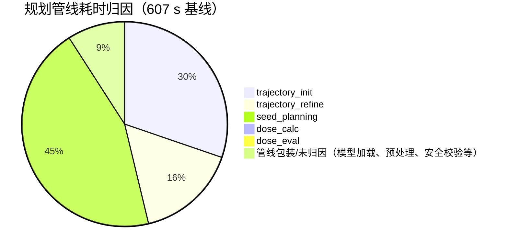
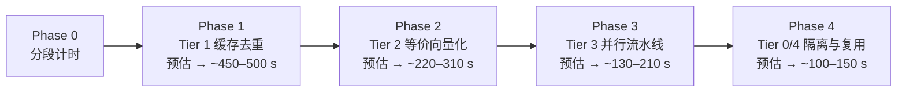

# BrachyBot 规划性能分析报告

> **主题**：一次胰腺病例 `planning_pipeline` 耗时 607 秒（整轮对话 921.9 秒）的根因分析与加速方案
> **日期**：2026-09-15
> **基线**：commit `8444676b8`（分支 `codex/session-task-recovery`）
> **结论先行**：607 秒中几乎没有"算法必需"的开销，绝大部分是**重复计算、单点推理与 CPU 串行预处理**。在不改变算法参数、候选集合与顺序、阈值、坐标与浮点语义的前提下，预计可压缩到 **130–210 秒（3–4.5×）**；若同时隔离 GPU 训练负载，可到 **100–150 秒**。

---

## 目录

1. [案例与基线数据](#1-案例与基线数据)
2. [测量环境与外部因素](#2-测量环境与外部因素)
3. [测量方法](#3-测量方法)
4. [逐步根因分析](#4-逐步根因分析)
   - 4.1 [trajectory_init（183.5 s）](#41-trajectory_init1835-s)
   - 4.2 [trajectory_refine（96.9 s）](#42-trajectory_refine969-s)
   - 4.3 [seed_planning（270.8 s）](#43-seed_planning2708-s)
   - 4.4 [管线外开销](#44-管线外开销)
5. [实测数据汇总](#5-实测数据汇总)
6. [优化原则（同过程、同结果）](#6-优化原则同过程同结果)
7. [优化方案](#7-优化方案)
   - 7.1 [Tier 0：环境隔离（零算法风险）](#71-tier-0环境隔离零算法风险)
   - 7.2 [Tier 1：缓存与去重（bit-exact）](#72-tier-1缓存与去重bit-exact)
   - 7.3 [Tier 2：等价向量化与表达式重排（需 bit-exact 回归）](#73-tier-2等价向量化与表达式重排需-bit-exact-回归)
   - 7.4 [Tier 3：并行与流水线](#74-tier-3并行与流水线)
   - 7.5 [Tier 4：工程化复用](#75-tier-4工程化复用)
   - 7.6 [方案明细表](#76-方案明细表)
8. [预期收益汇总](#8-预期收益汇总)
9. [验证方案](#9-验证方案)
10. [风险与红线](#10-风险与红线)
11. [实施路线图](#11-实施路线图)
12. [附录 A：原始测量数据](#附录-a原始测量数据)
13. [附录 B：关键代码位置索引](#附录-b关键代码位置索引)
14. [附录 C：不要做的事](#附录-c不要做的事)

---

## 1. 案例与基线数据

**病例**：胰腺肿瘤，CT 已上传；用户指令"请执行放射性粒子植入规划"。

**图像**：`ct_20260915_160711.nii.gz`，403×313×201 体素，spacing 0.8984375×0.8984375×1.0 mm，共 25,353,939 体素。

**整体时间线**：

| 阶段 | 耗时 | 备注 |
|---|---:|---|
| 整轮对话（16:17→16:33） | **921.9 s** | 含 OAR 分割、规划、LLM 回复、导板 |
| `planning_pipeline`（full） | **607 s** | 规划主体 |
| └ `trajectory_init` | 183,530 ms | 349 条轨迹 |
| └ `trajectory_refine` | 96,880 ms | — |
| └ `seed_planning` | 270,830 ms | 106 粒子 / 18 针 |
| └ `dose_calc` | 490 ms | 剂量已在 seed_planning 内算好 |
| └ `dose_eval` | 160 ms | DVH/指标 |

**最终计划**：106 粒子、18 轨迹、V100=90.2%、D90=120.63 Gy、评分 83/100、coverage_repair 未添加任何粒子。



---

## 2. 测量环境与外部因素

规划执行期间本机状态（`nvidia-smi` / `ps` / `uptime` 实测）：

| 项目 | 状态 |
|---|---|
| GPU 0 / GPU 1 | RTX 3090，利用率 **100% / 95%**，显存各约 6.9–7.2 GB |
| 占用进程 | 两个 `nnUNetv2_train`（PID 2928093 / 2928094），99% CPU，11:02 启动 |
| CPU | 24 核，load average **14.4–16.9** |
| BrachyBot 服务 | 与训练任务同时运行 |

**影响**：剂量推理（DoseUNet）与训练任务共享 GPU 计算。实测单种子 GPU 滑窗在争用下约 0.28 s（热）；空载 GPU 通常为 0.05–0.1 s 量级。**这是本次"10 分钟+"的近因之一，且只能通过调度/隔离解决，代码优化无法消除。**

---

## 3. 测量方法

对同一病例的真实数据做只读微基准（不修改任何项目代码，脚本在 `/tmp` 运行，使用 `~/.conda/envs/brachytherapy/bin/python`）：

1. 直接用 `SimpleITK` 读取病例 CT；
2. 直接调用被测函数（`infer_truncated_boundary_faces_from_image`、`_body_mask_from_ct`、`_prepare_seed_input`、`generate_line_map`、`sliding_window_predict`、`predict_seed_dose(s)`、`_load_dose_model`）；
3. 对 `generate_line_map` 使用 `cProfile` 定位函数内部分布；
4. 从病例 workspace `snapshot.json` 读取真实运行结果（`coverage_repair_status`、`dose_metrics`、`needle_safety_context` 等）作为运行时证据。

> 注：测量时两台 GPU 仍在被训练任务占满，因此 GPU 相关数字反映的是**与用户实际遭遇的同等争用条件**，属于偏保守的估计。

---

## 4. 逐步根因分析

### 4.1 trajectory_init（183.5 s）

文件：`tool_factory/seed_plan/planning_pipeline.py`，`_step_trajectory_init`（约 L3559–3788）。

**（A）每条轨迹重算截断面统计——纯重复计算**

- 每条完整针道在物理坐标校验时都会调用 `_needle_enters_through_truncated_boundary`（`planning_pipeline.py:2176`）。
- 该函数在 `truncated_boundary_faces is None` 时，**为每条轨迹重新执行一次** `infer_truncated_boundary_faces_from_image(ct_image)`（`planning_pipeline.py:2219–2223`）。
- 该函数（`plans/utilizations.py:3125`）会把整幅原始 CT（25,353,939 体素）转成 float32 并计算六个面的占用率。

实测单次耗时：**0.115–0.143 s**（3 次测量）。349 条轨迹 → **约 40–50 s 纯重复**。相同输入下结果是确定性的，缓存后输出逐位一致。

**（B）`init_plan` 内部 Python 逐点射线步进——最大未知量**

`plans/core.py:204 init_plan` 调用链中的以下函数是纯 Python 逐点循环：

- `_trace_target_exit`（`plans/utilizations.py:2631`）：0.5 体素/步，最多约 648 步/条；
- `trajectory_entry_is_valid`（`utilizations.py:3190`）：同样的逐步判断；
- `init_trajectories_with_depth`（`utilizations.py:3314`）内部 `get_trajectory_info`（`plans/geometry.py:1069`）含两个 max_steps≈321 的 Python 循环；
- `_farthest_point_sample_indices`（`utilizations.py:2436`）：O(N×1024) 的 FPS 降采样，N 最多 2 万。

锥采样为 19 个方向 × 每方向最多 1024 个 probe × 每条 2 次射线步进，量级约 10⁷ 次 Python 循环迭代。**预计占本步 80–120 s（需加计时确认）**。

**（C）两条过滤器重复调用**

- `_filter_safe_trajectories`（`planning_pipeline.py:1516`，调用点 L3720）：349 条 × 每条约 1100–1500 个 0.25 体素步长采样点。
- `_filter_world_safe_trajectories`（`planning_pipeline.py:2403`，调用点 L3725）：每条轨迹调用 `_candidate_world_needle_points`（2 次 `position_transform` + 1 次 `direction_transform`）+ 上述截断面重算 + `segment_hits_obstacle` 世界坐标采样。
- 其中 `_body_mask_from_ct(原始 CT)` 实测 **1.91 s/次**（形态学闭运算 + 填洞，25M 体素）。

### 4.2 trajectory_refine（96.9 s）

文件：同文件，`_step_trajectory_refine`（约 L3790–3962）。

**（A）重复执行 init 刚做过的全部过滤**

- L3895 再跑 `_filter_safe_trajectories`，L3905 再跑 `_filter_world_safe_trajectories`；
- 两条过滤在同一 full run 内输入（轨迹集合、CTV/OAR、障碍白名单）未变，结果确定且可复用；
- 截断面又被逐轨迹重算一轮（同 4.1A）；
- L3864 还把 `_build_radiation_volume` 重建一次。

**（B）`get_available_position` 内部存在重复计算**

`plans/utilizations.py:4832 get_available_position`：

- L4894–4898 的列表推导中，**同一个 `position_transform(...)` 表达式对每个候选位置算了 2 次**；
- 其中 `np.linalg.norm(position_transform(...total_depth...))` 与 x 无关，却**在循环内每个 x 重算一次**；
- L4903–4914 对每个已放粒子再对整个候选列表扫一遍（每个元素一次 `position_transform`）。

refine 对全部 349 条轨迹调用它做深度过滤（L3886–3889），Stage2/3 也会每轮重新调用。

**（C）`distance_transform_edt` 与安全上下文重建**

L3885 的 EDT 很快；但 `build_needle_safety_context`（全 OAR `np.isin`）与 body mask 在两步中重复构建。

### 4.3 seed_planning（270.8 s）

文件：`planning_pipeline.py` `_step_seed_planning`（约 L3964–4966）、`plans/core.py:466 optimal_plan`、`plans/utilizations.py`、`plans/dose_pre/inference.py`。

**（A）先排除一个常见误判：coverage_repair 本次耗时几乎为 0**

从病例 `snapshot.json` 的真实记录（`coverage_repair_status`）：

```json
{"initial_coverage": 0.9019, "final_coverage": 0.9019,
 "trials": 0, "added_needles": 0, "added_seeds": 0,
 "stop_reason": "target_reached", "adaptive_extension_used": false,
 "adaptive_policy": {"base_seconds": 60.0, "extension_seconds": 120.0,
                     "should_extend": false, "decision_reason": "target_reached"}}
```

规则优化结束后覆盖率已达 90.19% ≥ `DVH_rate=0.9`，repair 第一轮直接退出。**270.8 s 全部来自 Stage1/2/3 与周边预处理。**

**（B）规则模式 Stage2/3 是"单候选、单次推理、串行"**

- Stage1：轨迹选择 + `put_seeds`；Stage2 `replan`（每轮对每条针的每个可用位置）；Stage3 `remove/add`（上限 `iter_rate(2) × seed_num`）。
- 每个位置都走 `single_seed_dose_calculation_dl`（`utilizations.py:956`）→ `predict_seed_dose`（`inference.py:450`），**batch=1**。
- 每个种子 = 1 次 12 cm 裁剪 + 1 mm 重采样 + 3 通道构造 + **27 个 64³ 滑窗前向**（120³ 输入、patch 64、overlap 0.5，每轴 starts=[0,32,56]）。
- 实测每个冷候选 **约 1.0 s**：
  - CPU 预处理 **0.575 s**（其中 `generate_line_map` **0.52 s**，crop 0.04 s，soft 0.03 s，resample 0.005 s）
  - GPU 滑窗（热）0.28 s
  - 回写/缩放约 0.1 s
- 270 个冷候选 × 1.0 s ≈ **270 s，与实测完全吻合**。

**（C）`generate_line_map` 为什么慢**

`inference.py:208–239`：对 120³ 网格做 float64 全量运算，其中：

- `np.stack((vx,vy,vz), axis=-1)` 构造 120³×3 中间量；
- 两次 `np.linalg.norm(vectors, axis=-1)`；
- 两次 `np.arccos`、`np.sin`、多个 `nan_to_num/clip/max`；
- 最后转 float32 写回 SimpleITK。

cProfile（5 次调用，共 2.512 s）：

| 项 | 累计 | 占比 |
|---|---:|---:|
| `generate_line_map` 自身 | 1.737 s | 69% |
| `np.linalg.norm` ×10 | 0.279 s | 11% |
| `ufunc.reduce`（max/sum） | 0.279 s | 11% |
| `np.stack` ×5 | 0.144 s | 6% |
| `nan_to_num` ×15 | 0.099 s | 4% |
| `image_from_xyz_array` | 0.069 s | 3% |

**（D）批处理在争用 GPU 下收益有限，CPU 预处理才是主矛盾**

实测（热，争用环境）：

| 调用 | 总耗时 | 每种子 |
|---|---:|---:|
| `predict_seed_dose`（单） | 0.974–1.071 s | ~1.0 s |
| `predict_seed_doses`（batch 8） | 6.47–6.55 s | **0.82 s** |

batch 8 只把每种子降到 0.82 s：因为 8×0.575 s≈4.6 s 的 CPU 预处理是串行的，GPU 部分被训练任务占满。**仅靠批处理不足以解决问题，必须同时压缩 CPU 预处理并实现 CPU/GPU 重叠。**

**（E）模型与缓存**

- `_load_dose_model`（`planning_pipeline.py:1396`）每次规划重新加载 65 MB checkpoint（实测 **3.73 s**），无进程级单例；
- `DoseImageContext`（`utilizations.py:66`）请求级 LRU 默认 768 MB（`BRACHYBOT_PLANNING_DOSE_CACHE_MB`），键为精确 float64 物理坐标+方向的字节串（`:114–119`）；规划网格剂量图约 4 MB/张，容量约 190 张，Stage2/3 上百候选时存在抖动风险；
- repair 使用**独立的** `DoseImageContext`（`planning_pipeline.py:4473`），不与优化器共享缓存；
- 命中/未命中计数已存在（`core.py:775`），可用于评估。

**（F）300 s 墙钟上限**

规则模式有 `rule_based_deadline = now + 300 s`（`planning_pipeline.py:4276`）。本次步骤总耗时 270.8 s（含预处理），未触及上限；但**该机制意味着结果会随机器负载漂移**——负载越高，被 deadline 截断的概率越大。加速到远低于上限后可显著降低这种不确定性。

### 4.4 管线外开销

整轮 921.9 s − 规划 607 s ≈ **315 s** 在规划管线之外：

- OAR 分割（50 个器官，TotalSegmentator）——重复请求同一 CT 时会重跑；
- LLM 请求分析、最终回复生成、完整性检查；
- 手术导板生成失败路径（本次报错）。

这部分不属于 `planning_pipeline`，但同样有明确的"同结果"加速手段（见 7.5）。

---

## 5. 实测数据汇总

| # | 测量项 | 结果 | 用途 |
|---|---|---:|---|
| 1 | CT 规模 | 403×313×201 / 25.35 M 体素 | 全量特征计算成本 |
| 2 | `infer_truncated_boundary_faces_from_image` | 0.115–0.143 s/次 | 4.1A / 4.2A 重复计算量 |
| 3 | `_body_mask_from_ct`（原始 CT） | 1.91 s/次 | 过滤上下文重复构建 |
| 4 | `_load_dose_model` | 3.73 s/次 | 无单例 |
| 5 | `_prepare_seed_input` | 0.575 s/次 | CPU 预处理 |
| 6 | └ `generate_line_map` | **0.52 s/次** | CPU 预处理主因 |
| 7 | └ crop / resample / soft | 0.04 / 0.005 / 0.03 s | 可忽略 |
| 8 | `sliding_window_predict`（热） | 0.282–0.284 s/次 | GPU 侧单点成本 |
| 9 | `predict_seed_dose`（热） | 0.974–1.071 s/次 | = 5+8+回写 |
| 10 | `predict_seed_doses` batch 8 | 6.47–6.55 s → 0.82 s/粒子 | 批处理收益（争用下） |
| 11 | `coverage_repair_status` | trials=0，0 s | 排除 repair |
| 12 | 环境 | 双 GPU 100%/95%、两个 nnUNet 训练、load 14–17 | 外部因素 |

---

## 6. 优化原则（同过程、同结果）

所有方案必须满足：

1. **不改** `planning_params`（`maximum_candidate_trajectories`、`iter_rate`、`DVH_rate`、`DV_rate`、distance filter 等）；
2. **不改** 模型契约（patch 64、overlap 0.5、target spacing 1 mm、通道顺序 line/ct/soft、`dose_scale_gy`）；
3. **不改** 候选集合、顺序、阈值、坐标变换语义与浮点运算顺序；
4. 只做：**缓存、去重、等价向量化、批处理、并行、资源复用**；
5. 每一项都能用同一病例做 **bit-exact 回归**（见第 9 节）。

---

## 7. 优化方案

### 7.1 Tier 0：环境隔离（零算法风险）

| 方案 | 做法 | 预计收益 |
|---|---|---|
| T0-1 GPU 分卡/分时 | 训练固定用 GPU1，规划固定用 GPU0（或设备选择同时参考利用率/保留卡），规划高峰时暂停训练 | GPU 单点推理 0.28 s → 0.05–0.1 s 量级；seed_planning 额外 1.5–3× |
| T0-2 规划并发信号量 | 同一 GPU 上禁止并发规划叠加（`device_manager` 增加数上限/排队） | 避免多个规划相互拖慢 |
| T0-3 高负载告警 | 规划开始时检测 GPU/CPU 利用率，超阈值在日志与 trace 中提示 | 可观测性，避免再误判 |

### 7.2 Tier 1：缓存与去重（bit-exact）

| 方案 | 位置 | 做法 | 预计收益 |
|---|---|---|---|
| T1-1 截断面一次计算并传参 | `planning_pipeline.py:2219–2223`、调用点 `:2403`、`:3725`、`:3905` | 每步在原始 CT 上算一次 `truncated_boundary_faces` 并以参数传入；过滤函数不再逐轨迹重算 | **55–90 s**（init ~45 s + refine ~10–45 s） |
| T1-2 过滤结果复用 | `planning_pipeline.py:3895/3905` | init 的 `_filter_safe_trajectories` / `_filter_world_safe_trajectories` 结果按"轨迹集合+masks 指纹"缓存；refine 输入未变时直接复用 | **30–60 s**（refine 内） |
| T1-3 安全上下文/掩膜复用 | `:2426/2432`、`:3864`、`:4473` | `body_mask`、`radiation_volume`、`build_needle_safety_context`、obstacle volume 在 init/refine/seed/repair 间按指纹共享 | 5–15 s |
| T1-4 模型进程级单例 | `planning_pipeline.py:1396` | 模块级缓存已加载模型（含 device 校验），后续请求直接复用 | 3–4 s/次规划 |
| T1-5 缓存共享与扩容 | `planning_pipeline.py:4473`、`utilizations.py:107` | repair 复用优化器同一 `DoseImageContext`；LRU 默认上限提高到 1–2 GB（纯内存换时间，结果不变） | 5–20 s |

### 7.3 Tier 2：等价向量化与表达式重排（需 bit-exact 回归）

| 方案 | 位置 | 做法 | 预计收益 |
|---|---|---|---|
| T2-1 `generate_line_map` 表达式优化 | `inference.py:208–239` | 去掉 `np.stack(axis=-1)` 与两次 `linalg.norm`（复用 `distance_squared` 的 sqrt）；`total_depth/point_a/point_b` 相关量循环外提；减少 `nan_to_num/clip` 次数。保持 float64、同样运算顺序与 NaN 处理 | 0.52 → 0.10–0.20 s/粒子 → **80–110 s** |
| T2-2 `init_plan` 射线步进批量化 | `utilizations.py:2631/3190/3314`、`geometry.py:1069`、`core.py:204` | 逐点 Python 循环改为"每条射线一次性生成采样索引并向量化判断"，步长/判停/返回点保持一致；FPS 用 numpy 等价实现 | **50–90 s** |
| T2-3 `get_available_position` 去重 | `utilizations.py:4894–4914` | 一次 `position_transform` 结果用于两个比较；与 x 无关的 `total_depth` 世界距离循环外算一次；已放粒子的排除用批量距离计算 | 10–30 s（refine+Stage2/3） |
| T2-4 轨迹过滤跨轨迹批量 | `planning_pipeline.py:1516` | 349 条轨迹共用同一采样矩阵与步进，一次 numpy 判定替代 349 次 Python 循环 | 5–15 s |

### 7.4 Tier 3：并行与流水线

| 方案 | 位置 | 做法 | 预计收益 |
|---|---|---|---|
| T3-1 CPU 预处理与 GPU 重叠 | `utilizations.py` Stage2/3 调用点 | 线程池预生成下一批 `_prepare_seed_input` 结果，GPU 消费队列；每粒子 wall ≈ max(CPU/N, GPU) | 每粒子 1.0 → 0.3–0.4 s |
| T3-2 Stage2/3/repair 候选批量推理 | `core.py:609–748`、`coverage_repair` | 收集同形批量候选，走 `predict_seed_doses`（batch 8–16，与 RL dense 相同函数）；逐粒子输出与顺序不变 | 与 T3-1 叠加：seed_planning **270 → 60–90 s** |
| T3-3 轨迹过滤按轨迹并行 | `planning_pipeline.py:1516/2403` | 纯 numpy 的逐轨迹判断用线程/进程池并行，结果按原顺序聚合 | 5–15 s |

### 7.5 Tier 4：工程化复用

| 方案 | 位置 | 做法 | 预计收益 |
|---|---|---|---|
| T4-1 整份规划结果缓存 | `PlanningPipelineTool` | 以 (CT/CTV/OAR 指纹 + 全部 planning_params) 为键缓存 `seed_plan/dose_metrics`；医生反复调参复盘时，同参数命中直接返回 | 重复规划近 0 s |
| T4-2 OAR/CTV 分割缓存 | `OAR_seg`、`CTV_seg` | 以 (CT 指纹 + 模型指纹 + 器官清单) 为键缓存分割结果；同一病例重复请求不重跑 TotalSegmentator | 整轮节省 2–5 min（管线外） |
| T4-3 分割与规划的流水线化 | `chat_workflows` | 规划所需掩膜齐备即可启动，不必等全部展示数据 | 管线外重叠 |
| T4-4 导板失败排查 | `surgical_guide` | 本次生成失败；失败路径的重试/超时行为核实 | 管线外稳定性 |

### 7.6 方案明细表

| 编号 | 目标 | 风险 | 结果影响 | 依赖 |
|---|---|---|---|---|
| T0-* | GPU/调度 | 低 | 无（更快，不会被 deadline 截断） | 运维/部署 |
| T1-1 | init/refine | 极低 | 无（确定性函数缓存） | 无 |
| T1-2 | refine | 低（需指纹正确） | 无 | T1-1 可同时做 |
| T1-3 | 全流程 | 低 | 无 | 指纹设计 |
| T1-4/1-5 | seed_planning | 低 | 无 | 无 |
| T2-1 | seed_planning | 中（浮点语义） | 需 bit-exact 回归 | T1-4 |
| T2-2 | trajectory_init | 中（循环改写） | 需 bit-exact 回归 | 分段计时 |
| T2-3/2-4 | refine/过滤 | 低-中 | 需 bit-exact 回归 | 无 |
| T3-1/3-2 | seed_planning | 中（顺序/异常处理） | 逐粒子结果不变 | T2-1 |
| T3-3 | 过滤 | 低 | 顺序聚合保证不变 | T2-4 |
| T4-* | 全局 | 低 | 无（缓存键正确时） | 指纹体系 |

---

## 8. 预期收益汇总

| 部分 | 基线 | Tier 1 后 | Tier 1+2 后 | 全部（含 Tier 0） |
|---|---:|---:|---:|---:|
| trajectory_init | 183.5 s | 120–140 s | 30–60 s | 30–60 s |
| trajectory_refine | 96.9 s | 40–60 s | 20–40 s | 20–40 s |
| seed_planning | 270.8 s | 250–265 s | 150–190 s | **60–90 s** |
| 其他/包装 | ~55 s | ~35 s | ~20 s | ~20 s |
| **pipeline 合计** | **607 s** | **~450–500 s** | **220–310 s** | **130–210 s（争用）/ 100–150 s（隔离）** |
| 整轮对话 | 921.9 s | — | — | ~400 s（含 T4 管线外） |

**加速比**：pipeline 约 **3–4.5×**；若 GPU 隔离到位约 **4–6×**。全部收益在"同过程、同结果"约束下取得。

---

## 9. 验证方案

### 9.1 第一步：只加计时（零行为变更）

在以下位置加 `perf_counter` 分段计时并写入 tool metadata / 日志：

- `_step_trajectory_init`：resample、body/faces、`init_plan`、safe filter、world filter；
- `_step_trajectory_refine`：EDT、`get_available_position` 循环、safe filter、world filter；
- `optimal_plan`：Stage1 / Stage2 / Stage3；
- 剂量：`_prepare_seed_input`（细分 crop/resample/soft/line）、`sliding_window_predict`、回写；
- `coverage_repair`：已有 `elapsed_seconds`，直接读取。

用同一病例复跑，确认第 4 节的归因比例（特别是 `init_plan` 的真实占比）。

### 9.2 结果指纹回归（bit-exact）

对同一病例固化以下结果的 SHA-256：

- `seed_positions` / `verified_needle_geometry`（针与粒子的世界坐标）；
- `dose_distribution_gy`（规划网格数组）；
- `dose_metrics`（D90/V100/V150/V200 等）；
- `dvh_data`；
- `coverage_repair_status`。

每一项优化后必须与原基线 **逐位一致**（Tier 2 尤其）。若出现差异：

1. 先排查是否因加速后不再触及 300 s deadline（基线可能在负载高时被截断）——此时差异来自"更快"，需与临床确认以哪个为准；
2. 否则视为回归，回退该项。

### 9.3 分阶段验收

| 阶段 | 交付 | 验收标准 |
|---|---|---|
| Phase 0 | 分段计时 | 三次复跑归因稳定；不改任何结果 |
| Phase 1 | Tier 1 | 指纹 bit-exact；pipeline ≤ 500 s |
| Phase 2 | Tier 2 | 指纹 bit-exact；pipeline ≤ 310 s |
| Phase 3 | Tier 3 | 指纹 bit-exact；pipeline ≤ 210 s |
| Phase 4 | Tier 0/4 | 隔离/缓存生效；整轮 ≤ ~400 s |

---

## 10. 风险与红线

1. **浮点等价性**：Tier 2 的表达式重排可能引入 1 ulp 差异，必须用 9.2 的指纹验证后才可合入；不得为了速度改 float32 或调整运算顺序。
2. **deadline 语义**：`rule_based_deadline=300 s`（`planning_pipeline.py:4276`）会让结果依赖机器负载。加速后结果可能"变快且更稳定"，但必须确认基线是否曾被截断。
3. **临床红线保持不动**：
   - 150 mm 整针物理校验与 fail-closed 截断策略；
   - 非可穿越掩膜与 Data Tree 语义；
   - 针尖止于最深种子；
   - 剂量单位约定（Vx 内部 fraction、报告边界只转一次、`dose_scale_gy` 默认 190.8/旧 120 不重折算）；
   - LPI + 同物理网格。
4. **缓存键正确性**：T1/T4 的指纹必须包含所有影响输出的输入（CT/CTV/OAR、参数、模型版本、障碍白名单）；错误键会导致"看似加速、实则错误复用"。
5. **并发副作用**：T1-4 进程级模型单例与 T3 并行需保证线程安全；不可在请求间泄漏中间状态。
6. **可回退**：每项优化独立提交，保留环境变量开关（如 `BRACHYBOT_PLANNING_*`）。

---

## 11. 实施路线图



**建议先做**（风险最低、收益确定、一天内可完成）：

1. T1-1 截断面一次计算（55–90 s）；
2. T1-4 模型单例（3–4 s/次）；
3. T1-2 refine 过滤复用（30–60 s）。

三项合计预计 **607 s → 450–500 s**，且不触碰任何浮点路径，回归风险接近于零。

---

## 附录 A：原始测量数据

```
# 截断面统计（原始 CT 403×313×201）
call 0: 0.139 s -> (True, True, True, False, False, False)
call 1: 0.143 s -> (True, True, True, False, False, False)
call 2: 0.115 s -> (True, True, True, False, False, False)

# body mask
_body_mask_from_ct(original CT): 1.91 s, 16,340,724 体素

# 模型
model load: 3.73 s
contract: patch (64,64,64), overlap 0.5, spacing (1,1,1), batch 8

# 预处理（热，最小值/均值）
crop      min/avg 0.036/0.043 s
resample  min/avg 0.004/0.005 s
soft      min/avg 0.032/0.033 s
line      min/avg 0.520/0.527 s
prep      min/avg 0.575/0.593 s
sliding   min/avg 0.282/0.284 s（热）
single_total min/avg 0.974/1.071 s（热）
batch8    min/avg 6.471/6.547 s（0.818 s/粒子）

# generate_line_map cProfile（5 次调用，共 2.512 s）
tottime generate_line_map 1.737 s
np.linalg.norm ×10 0.279 s；ufunc.reduce 0.279 s；np.stack ×5 0.144 s
nan_to_num ×15 0.099 s；image_from_xyz_array 0.069 s
```

## 附录 B：关键代码位置索引

| 关注点 | 位置 |
|---|---|
| 五步管线 | `tool_factory/seed_plan/planning_pipeline.py:2739` |
| trajectory_init | `planning_pipeline.py:3559`（过滤调用 `:3720/:3725`） |
| trajectory_refine | `planning_pipeline.py:3790`（过滤调用 `:3895/:3905`） |
| seed_planning | `planning_pipeline.py:3964`（规则优化 `:4309`） |
| 截断面重复计算 | `planning_pipeline.py:2219–2223` |
| world 安全过滤 | `planning_pipeline.py:2403` |
| body mask | `planning_pipeline.py:2382`（实测 1.91 s） |
| 规则 300 s 上限 | `planning_pipeline.py:4276` |
| repair 独立 context | `planning_pipeline.py:4473` |
| 模型加载 | `planning_pipeline.py:1396` |
| `optimal_plan` | `plans/core.py:466`（Stage1/2/3） |
| 单粒子推理 | `plans/utilizations.py:956` |
| `get_available_position` | `plans/utilizations.py:4832`（重复 transform `:4894–4898`） |
| 剂量推理入口 | `plans/dose_pre/inference.py:450/479` |
| `_prepare_seed_input` | `inference.py:398` |
| `generate_line_map` | `inference.py:208–239` |
| 滑窗 | `inference.py:267–299`（27 窗口） |
| `DoseImageContext` | `utilizations.py:66`（键 `:114–119`，默认 768 MB `:107`） |
| LLM 端到端 | `agent_runtime/llm_runtime.py:1912` |

## 附录 C：不要做的事

1. 不要通过改 `planning_params`（候选上限、迭代率、DVH_rate 等）省时间——会改变结果；
2. 不要改模型 patch/overlap/通道/单位——会改变数值结果；
3. 不要凭"提前终止/缩短预算"省时间——会改变结果，且让结果更不可复现；
4. 不要删除或弱化任何安全校验（150 mm 整针、截断 fail-closed、非可穿越掩膜）来换速度；
5. 不要在未做 bit-exact 指纹回归前合入任何浮点路径的改动。

---

*报告完。下一步建议从 Phase 0（分段计时）与 Tier 1（三项低风险去重）开始；如需，我可以先实现 Phase 0 并给出该病例的精确分段数据。*
